# Create and deploy an API

From your Project's home page, click on **+** inside the API module. 

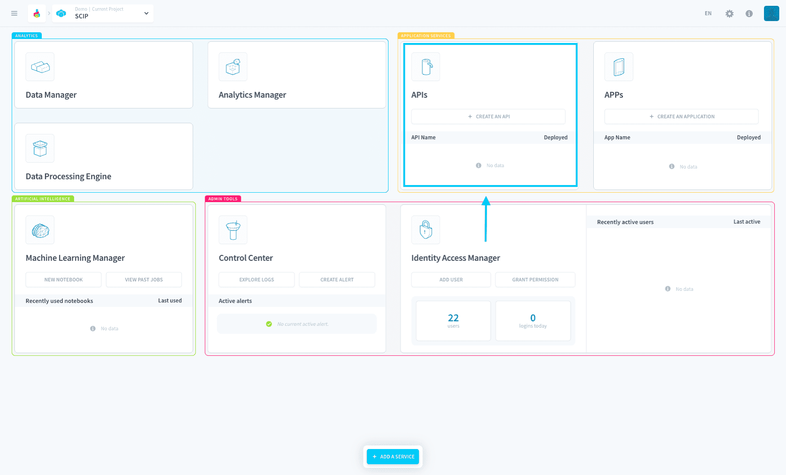

You will be able to choose between **an existing API template** from the internal [*the platform Store*](/en/product/dataplant/marketplace), or to **import your own code** by linking a Git repository.

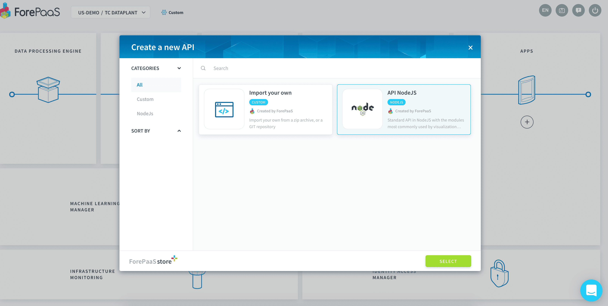

Choose a name for your API, and enable the option **auto build**. This will download the source code of your API and automatically build it for you. You can also activate auto-deploy right away, or check out down below how to deploy your API manually.

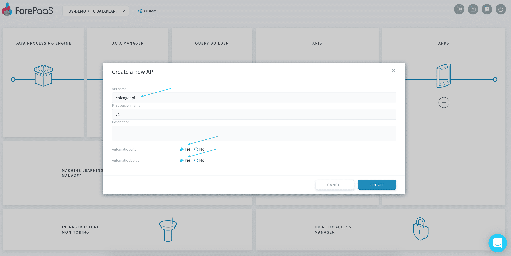

From there, give it a couple of seconds as the creation of the API may take a moment. 

>the Platform uses a **[blue-green](https://en.wikipedia.org/wiki/Blue-green_deployment) deployment methodology** ensuring 100% availability of your data. You can therefore seamlessly create & deploy new versions of your API without risking any downtime!

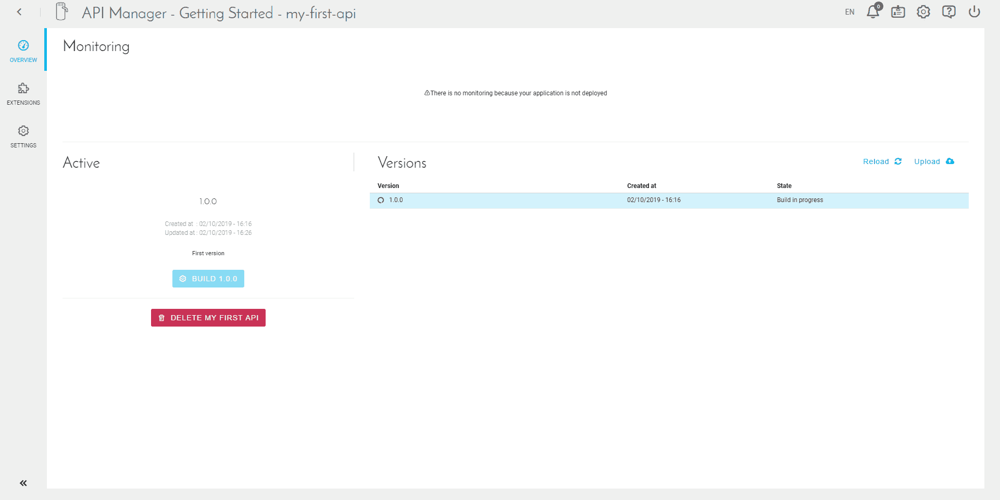

On the home page of your API, you'll find three parts:
* __Monitoring__: status of your API once it has been deployed
* __Active__: status of your "active" version, that is to say, the one you are currently working on
* __Versions__: list of all the versions (also called tags) available in your API

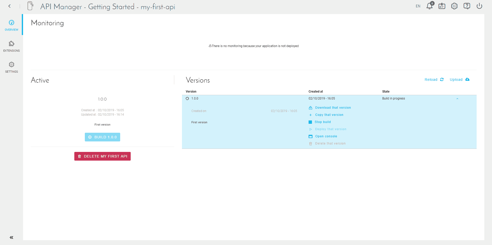
You can see more details about the version you just created using the arrow on the right of it.

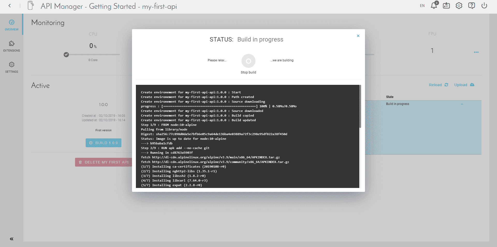
Check the activity log by clicking on "Open Console". Since you have activated the auto-build when creating the API, it has already started. 

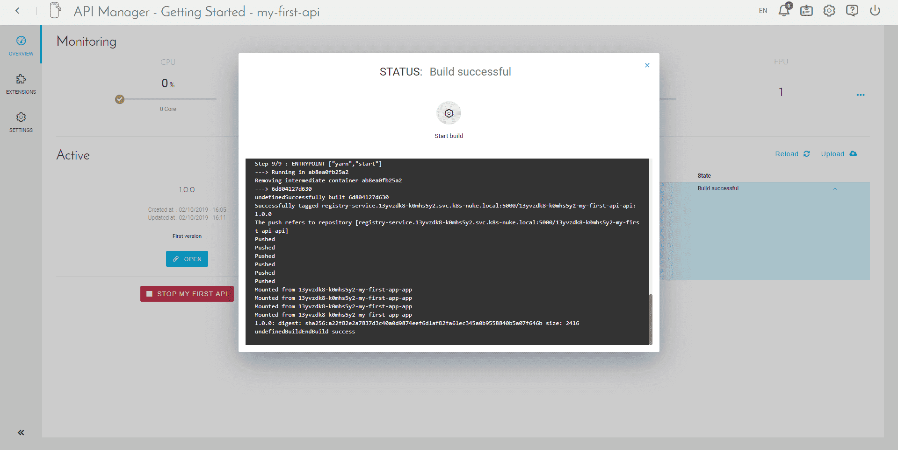
When it is done, you should see a last log "EndBuild success".

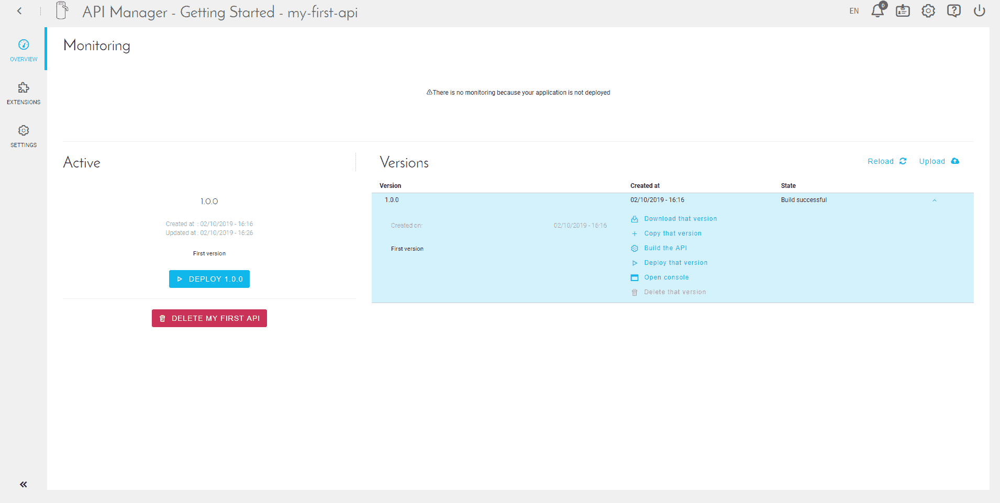
To start the deployment, please click on "Deploy".

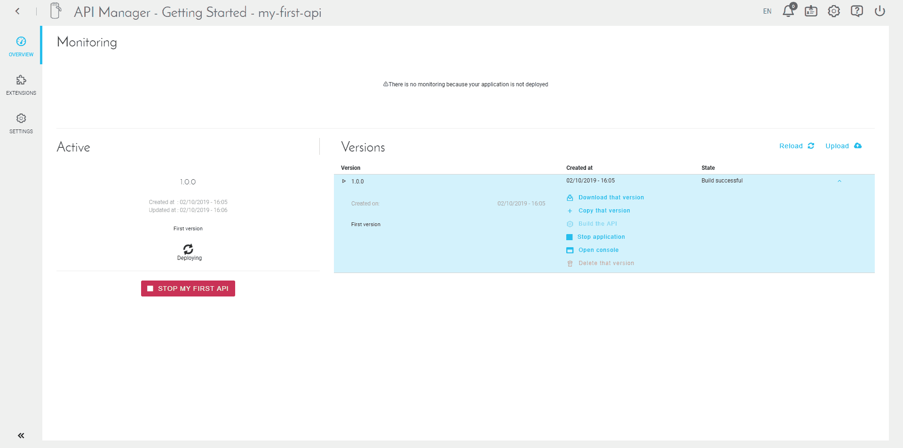
Deployment starts, and may take a few minutes.

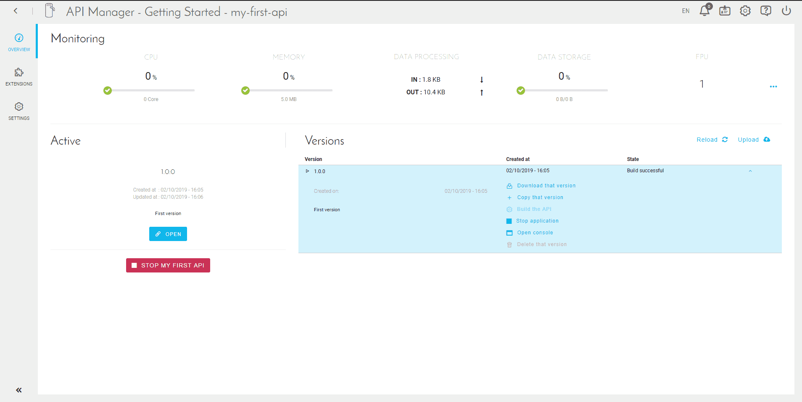
When the deployment is complete, the "Open" button appears.

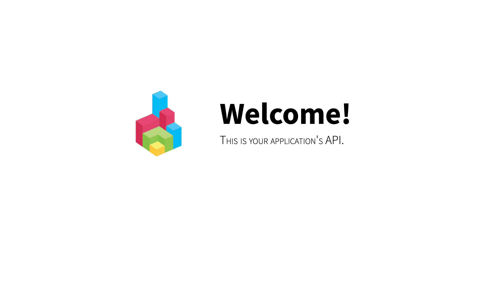
When you open your API, you now land on this screen.

To access your API, simply install an application and connect it to the API. You can also use its endpoints live.