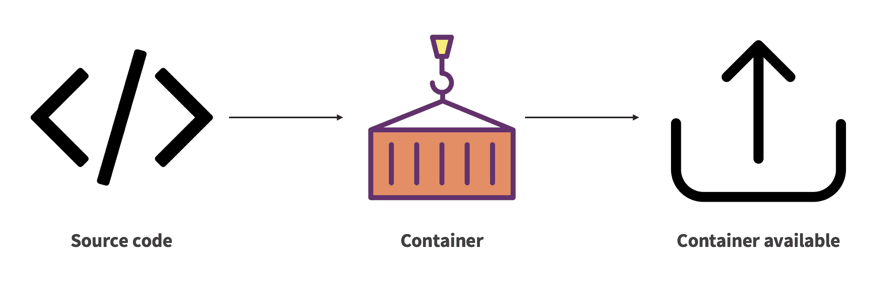
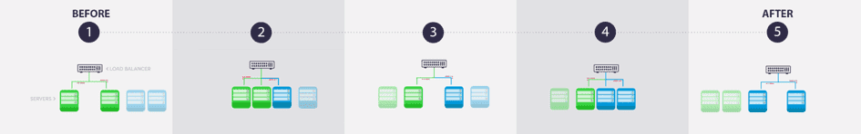

# API Manager

The API Manager allows you to create and deploy **secure APIs** to access to data collected and stored in your Project.

All [the platform applications](/en/product/app-manager/index) must be linked to a deployed API, so that the app knows which API to call to execute queries.  
All deployed APIs are also fully integrated with the [Analytics Manager](/en/product/am/index). As such, you can pass on queries to the latter directly from [your applications](/en/product/app-manager/index) (via the APIs), or access any [query](/en/product/am/queries/index) saved in the Analytics Manager. The API ensures user authentication.

?> The query syntax offered in the Analytics Manager can be used to carry out analytics on the fly without worrying about the type of databases. At the same time, the databases will remain secure because as they won't be exposed directly.

---
## Create an API

You can easily deploy a new API to expose your Project's data, either:
* From the point-and-click templates offered by ForePaaS
* Or by developing your own using the [SDK](/en/technical/sdk/api/index) - *Software Development Kit* - in NodeJS

{How to create a new API}(#/en/product/api-manager/deploy)

---
## Design philosophy

As the Platform enables the full implementation of analytics applications, the creation of APIs and Applications requires the construction of artifacts and a deployment. Indeed, to be able to get the changes made in production, you have to build and deploy.

### Construction of the artifact

The construction of the artifact is made possible by the automatic preparation of a dedicated container image that will host the component (API, Application, Machine Learning API ...). Deployment allows to create a container from this image and thus make accessible the modifications made to the analytics application.

 
*Figure 1 : Building an artefact on ForePaaS*

### Deployment and management of the artifact

the Platform uses a Blue/Green deployment mode (see Figure 2). This technique reduces downtime and risk by running 2 identical production environments, Blue and Green. At any time, only one of the environments is live, with the live environment serving all production traffic. 

*Figure 2 : Diagram of a Blue/Green deployment*

Once the API has been deployed, it is possible to add or delete nodes, each of which is a container running an instance of the created artifact. These nodes are represented by green and blue servers in Figure 2. This node management makes it possible to accelerate the performance of the API: this is called horizontal scalability.

!> Stopping an API resets its [DPU](/en/product/billing/resources/index) size to 1. Make sure to update the allocated resources accordingly every time you stop and start an API.

### Interface of the API editor

Our low-code environment allows you to version, build and deploy APIs easily.

{Learn more about the interface}(#/en/product/api-manager/interface)

---

###  Need help? 🆘

> At any step, you can create a ticket to raise an incident or if you need support at the [OVHcloud Help Centre](https://help.ovhcloud.com/csm/fr-home?id=csm_index). Additionally, you can ask for support by reaching out to us on the Data Platform Channel within the [Discord Server](https://discord.com/channels/850031577277792286/1163465539981672559). There is a step-by-step guide in the [support](/en/support/index.md) section.