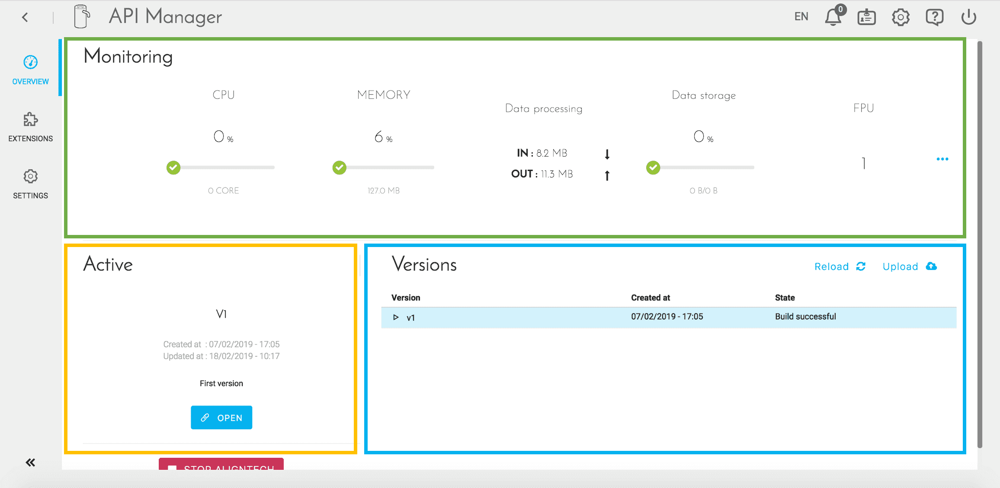
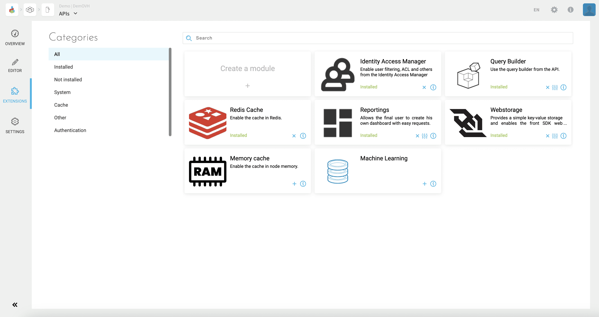
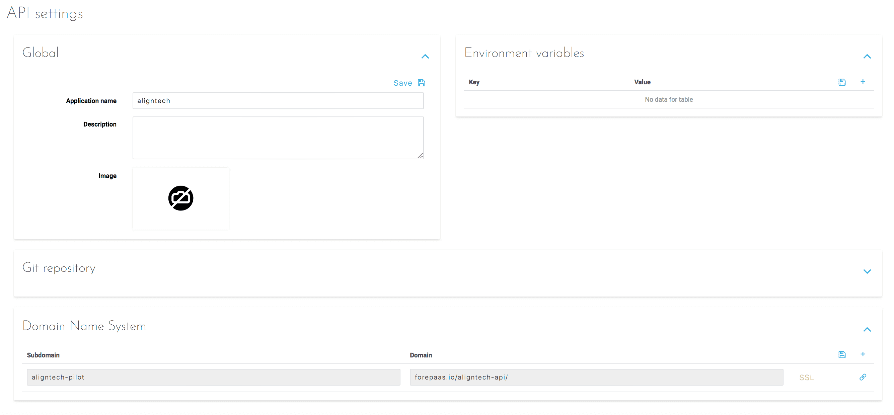

# API Manager Interface

Once an API has been created, you will be able to access its management interface. The *Overview* tab allows you to easily manage the whole life cycle of your API.

The screen is divided into 3 parts:
* The top block (green) shows some **indicators related to the resources used by the API**. These indicators make it possible, for example, to know if it is necessary to increase the number of instances.

!> Stopping an API resets its [DPU](/en/product/billing/resources/index) size to 1. Make sure to update the allocated resources accordingly every time you stop and start an API.

* The left block (yellow) indicates **the status of the active version** (in production). Some shortcuts are proposed by buttons according to the state (New / Built / Deployed) of the version.

* The right block (blue) lists the **different versions of the API**. The active version is displayed in blue. Different actions are possible for each version:
    * Synchronize / Download - action depending on the type of code source (ZIP file or GIT repository)
    * Duplicate version
    * Build the artifact of this version
    * Deploy / Stop version
    * Open the building console
    * Remove version - requires that the version has not been deployed

---
## Configuring extensions

When creating an API through the Marketplace, the latter is created with a set of default extensions that can be viewed in the *Extensions* tab.

{Go to the extensions list}(#/en/product/api-manager/extensions-list.md)
 
This screen lets you visualize the different libraries organized by categories with the possibility to:
* Remove extensions which are already installed
* Add new extensions which are not yet installed on the API
* Configure the package of an extension
* Access additional information about libraries
* Import an open source or proprietary extension, specific to a Project or an organization

!> Adding an extension requires you to reload your API (on the Overview page) in order to be able to build it.

---
## Settings

Three types of API settings are configurable in the *Settings* tab.

 
* **Global**: Refers to global API information such as its name, description, and main image.

* **Environment Variables**: Defines the variables that the API needs in order to work. Those necessary for the smooth functioning of the API and its various extensions are filled in automatically. Only the variables specific to a business need are presented here.

* **Domain Name System**: Allows you to add one or more URLs allowing access to the API, in addition to the one generated by default. These URLs have the domain "eu.dataplatform.ovh.net" unless you have added another domain at the organization level.