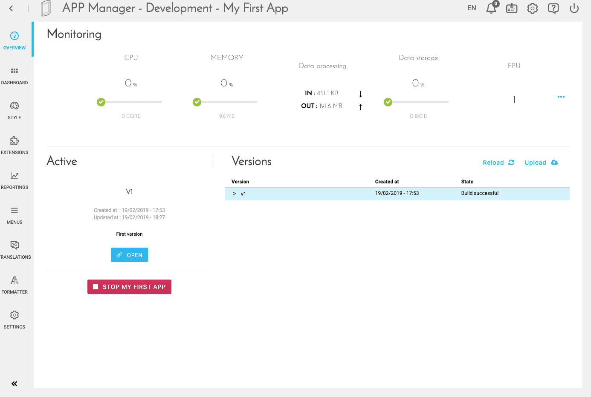
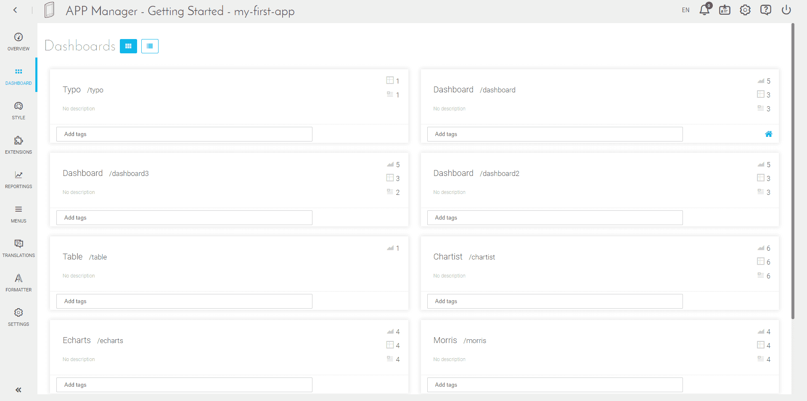
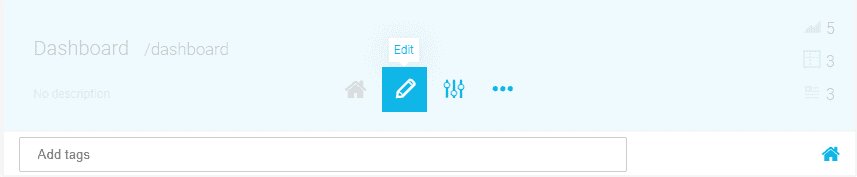
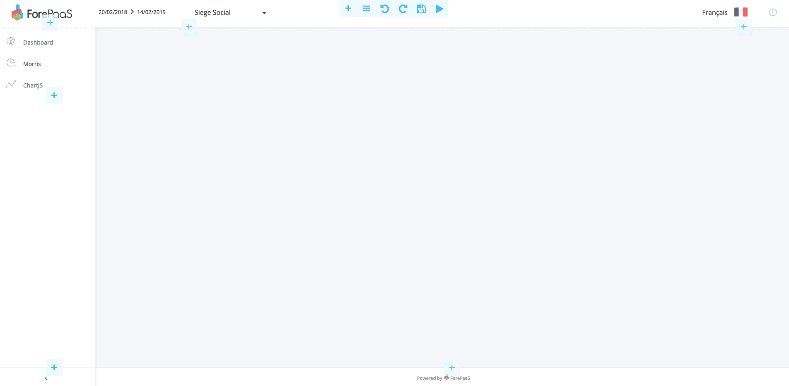
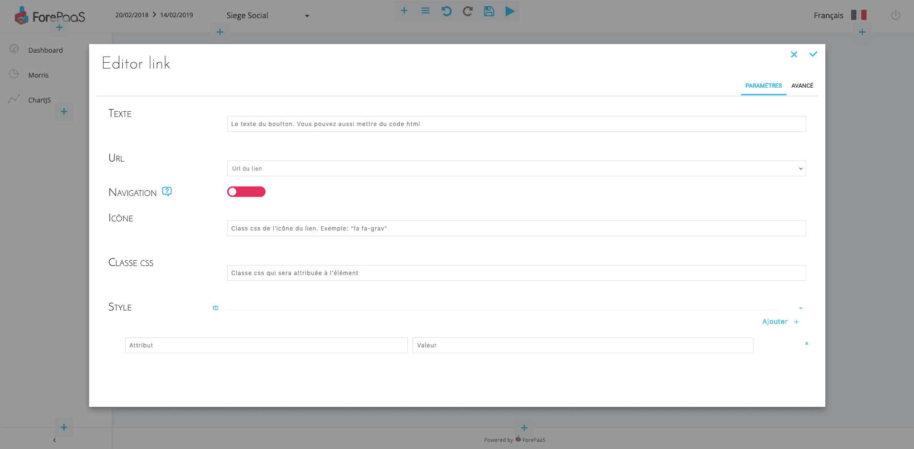
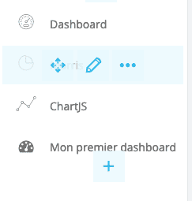
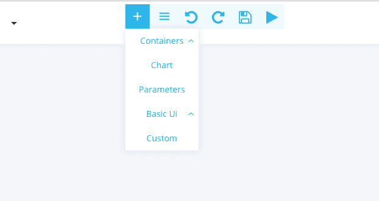
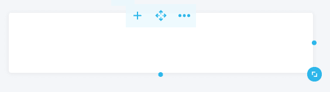
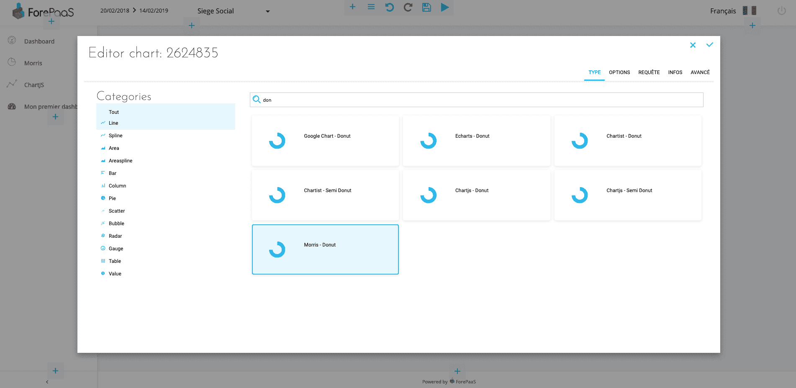

# Creating your first dashboard (in point & click)

Before you begin, you must first have an application already deployed.  
To do this, you can start from the ReactJS - Dashlab application, for example, and use automatic build and deployment.  
In this example, the screenshots were made from the same application theme.

---
## Main screen and dashboard creation

To get started, go to the Overview screen of your application.  

From this screen, select "Dashboard"

From this screen, you will be able to create new dashboards, delete them, edit them, etc.
For the moment we will focus on creating a new dashboard.

1. Select "New Dashboard" on your screen.
2. Give it a name, for example: "My first dashboard".

The url of this dashboard (visible in the url once the application in production), will be filled automatically.
You can edit it, just kept in mind that it must be unique, two dashboards cannot have the same url.
The description field is optional and will allow you to better document your applications.

We will not (intentionally) go through the "advanced" mode, it is an option to modify the default behavior of the dashboard. This default mode is perfect for a first time, so we don't have to change it.

---
## Edit your new dashboard

### Add a link to your dashboard

Once the dashboard is created, you can enter the editor mode by hovering over the new block and clicking on "Edit".

You have a "Full Screen" mode available at the top right of the page, all screenshots will be made from this mode for the next steps of this tutorial.

Your dashboard is empty! and more importantly, if you were not already on the page, there is no link to get to that dashboard.

So first, we need to create a link in the menu to go to the dashboard.

To do this, use the "+" button, in the left column. Select "Basic UI" and then "Link".
You will then arrive on a link editor.

You can enter a text (which will be displayed on the screen), in our example: "My first dashboard".  
In the url field, if you did not change it in the previous step, select: "my-first-dashboard".  
Also select "Navigation" to switch to active, this allows the link to change color, when it is the active page.  
The rest of the fields are optional but let you customize further your link. In this example we will just add "fa fa-dashboard" in "Icon", this corresponds to an icon of the library [Font Awesome 4] (https://fontawesome.com/v4.7.0/icons/).

Once validated, your link will appear in the menu on the left!

### Add a chart to your dashboard

Your page is still empty: your first thought could be to add a graphic, and you would be right... but in order to make everything "prettier" we will start by adding a "panel".
This will allow us to have our charts on a white background, instead of the "gray" background of the application.
To do this, click on the "+" at the top of the screen.

Select "Container" and then "Panel".
Then expand your "panel" via the arrows available when hovering your mouse over it.

Select the "+" of this panel, then "Chart" to add your first graph inside this "panel".

### Configuring a chart

#### Type
You will then come to a chart editor.
You first need to select a chart type.

For our example, we will select "Morris - Donut"
> Morris is an open source library, the donut it provides is pretty good, but the customization of it is low.

#### Options
A new tab has just appeared! This is the "Options" tab. This tab is not always present, some libraries do not always offer (yet) click customization.

In this tab, we can customize our donut's colors. The default template being colorful enough, modify the colors if you wish, but it is not necessary. 

#### Queries

In this tab, we will be able to link our graph to a query made in our Query Builder.
If you've ever tried to do this, click on "Select a Query".

If not, choose "Custom Query" and create a query directly via the interface.

To display a "nice donut", the ideal would be a single "Data", and a single "Scale".
In my example, I want to reduce a turnover.

#### Infos

In this section, we will be able to give a name and description to our chart (optional).
Enter for example: "My first chart", in the field name.

You will also find "Linked Dynamic Parameter".
This configuration will allow you soon to connect your graph to a datepicker or a selectbox, so as to dynamically filter the data displayed by the graph.

#### Advanced mode

This advanced mode allows you to directly edit the configuration JSON file of your chart.
All previously used screens are related to this JSON, and we do not yet have an interface to perform all possible configurations via this JSON.
To better understand this JSON, you can refer to the technical documentation of the graphs: JSON configuration of a Chart

Validate, and your graph will be displayed!