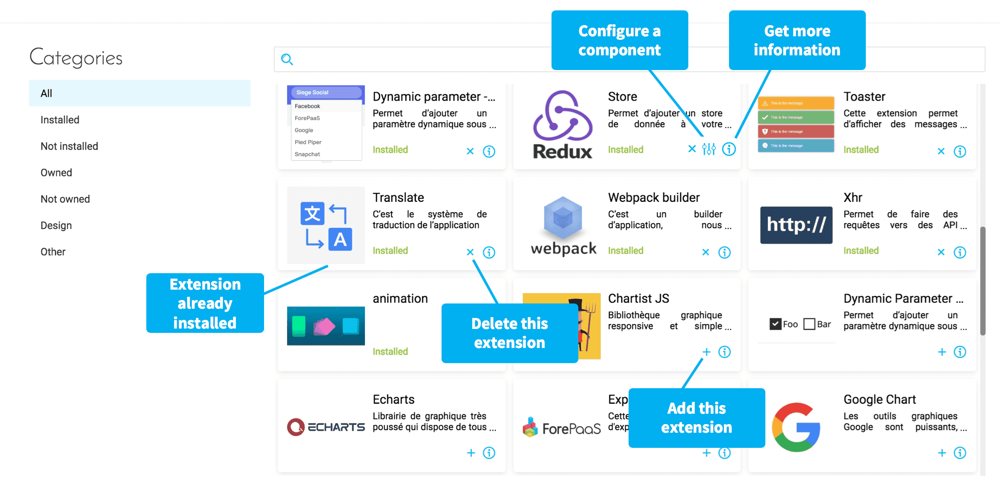

# Extensions

Extensions are a list of packages, accessible through the extensions tab, which can provide your application with additional features, such as a third-party chart software, translation services, or dynamic parameters. 
 
{Check the list of extensions available}(#/en/product/app-manager/extensions/list)

---
## Manage your extensions

The *Extensions* tab of the APP Manager lets you view and manage the different supported libraries: 

* **Add** extensions that you need for your Project
* **Configure** Global settings for the extension, where applicable
* **Delete** extensions that are already installed if they are not necessary, or if you need a new version of the library.
* **Get more information** concerning extensions linked to external libraries.
* **Import** an open-source or proprietary Project-specific or organization-specific extension

!> Adding an extension requires you to reload your app (on the Overview page) in order to be able to build it.

---
## Customize the extensions

Each extension within the ForePaaS marketplace has its own specific configuration in a JSON file that you can edit and customize.

{Hands-on tutorial on configuring extensions}(#/en/getting-further/app-dev/extension.md)

---
Ready to move on? Discover the next tab of the APP component:

{Next article: Menu}(#/en/product/app-manager/menu)

