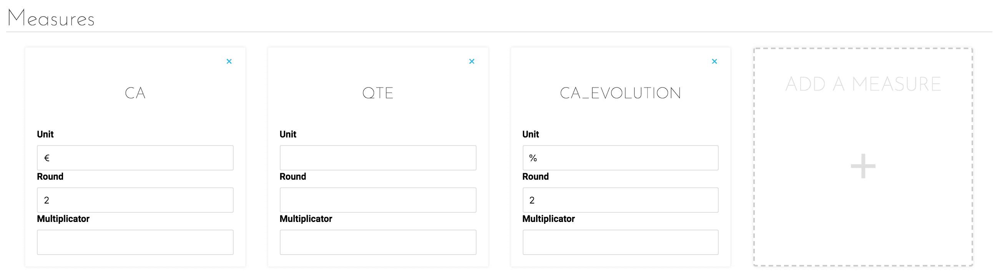
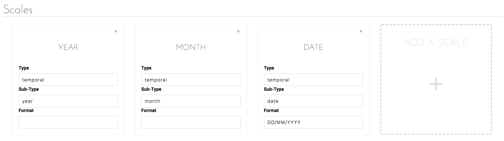
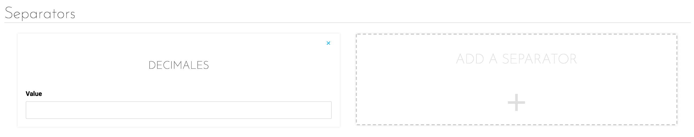

# Formatter

Data displayed in the different dashboards of an application are often very different, coming from various sources.
This sometimes implies that some data, that should be displayed together, do not have the same order of magnitude or the same unit. To overcome this, it is possible to manage, field by field:
* The unit
* The multiplying factor
* Decimal or thousands separators
* How many decimal places the value is shown too

Furthermore, for scales, it is possible to indicate the temporality of the data. All of this is configurable in the *Formatter* tab of an application.

---
## Interface

The Formatter tab is divided into 3 parts corresponding to the 2 types of data used (*Measures and Scales*) and an essential element to the visualization of encrypted data: *Separators*.

  
*Figure 1 : Editing a measure*

In this tab, a measure is the name of one of the fields available in the Lakehouse Manager. These fields each represent a value. The editing panel shown in Figure 1 allows you to modify:

* **Unit**: The unit of measure for this data (euros, hours, kilometers, etc.)
* **Round**: The desired number of digits after the decimal point
* **Multiplier**: The multiplier lets you dynamically modify the data. This multiplier is particularly relevant when the data is a percentage in the form of a number between 0 and 1, which must therefore be multiplied by 100.

  
*Figure 2 : Editing a scale*

Unlike measures that represent a value, scales are fields that allow data grouping and segmentation. The most common scales are time dimensions, such as dates, months or years. The editing panel shown in Figure 2 allows you to edit:

* Type of scale (e.g. : temporal)
* Sub-type, giving a bit more detail of the type. Indeed, temporal data can be a given day, month, year, etc. 
* Display format

  
*Figure 3 : Editing a separator*

Finally, there are two types of separators:
* Decimals
* Thousands

These separators can be any character and will be inserted to make the value more readable.
{Learn more about formatters}(#/en/technical/sdk/app/formatter)

{Next article: Settings}(#/en/product/app-manager/settings/index)
