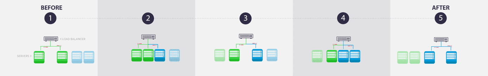

# APP Manager

The APP manager component provides features to **facilitate and accelerate the creation and deployment of applications**.
It allows you to build a dashboard or other application from a template or SDK without having to manage deployments, configurations, and basic features of applications. The goal is to focus on your specific needs and ultimate business value rather than technical constraints.

The creation of an application can be done:
- From the low-code environment offered by the Platform
- Or by using the SDK (*Software Development Kit*)

This documentation will cover the following:

* [Create an application](#create-an-application)
* [Edit and manage an application through the interface](/en/product/app-manager/overview)
* [Design philosophy of the APP manager](#design-philosophy)

---
## Create an application

Generally speaking, the steps to create and deploy an application are as follows:
1. Choosing a template from the Marketplace or importing an existing code
2. Choosing extensions, including data visualization libraries
3. Building dashboards
4. Adapting organization/navigation
5. Adapting design and style (optional)
6. Formatting data and translating labels (optional)
7. Managing versions and deployment

Initiate your application by clicking on the **+** sign of the App Manager.  

You will be able to choose between **an existing API template** from the internal [*the platform Store*](/en/product/project/marketplace), or to **import your own code** by linking a Git repository.

Fill in the different fields as shown in the screenshot below and press **Confirm**.

Click on **Confirm**, your app will automatically build and deploy. The whole process should take a couple of minutes.

From the APP manager component, you can then edit your app and manage its versions and deployments.

{Learn more about the APP Manager interface}(#/en/product/app-manager/overview.md)

---
## Design philosophy

As the platform has been designed to manage the end-to-end implementation of analytics applications, the creation of Applications requires the construction of artifacts and deployment. Indeed, to be able to get the changes made in production, you have to build and deploy.

### Construction of the artifact

The construction of the artifact is done by the automatic preparation of a dedicated container image that will host the component (API, Application, Machine Learning API ...) The deployment allows to create a container from this image and make changes applied to the application accessible.

 
*Figure 1: Building an artifact on the Platform*

### Deployment and management of the artifact

the Platform uses a Blue/Green deployment mode (see Figure 2). This technique reduces downtime and risk by running 2 identical production environments, Blue and Green. At any time, only one of the environments is live, with the live environment serving all production traffic. 

 
*Figure 2: Blue/Green Deployment*

Once the application has been deployed, it is possible to add or delete nodes, each of which is a container running an instance of the created artifact. These nodes are represented by green and blue servers in Figure 2. This node management makes it possible to accelerate the performance of the Application: this is called horizontal scalability.

!> Stopping an application resets its [DPU](/en/product/billing/resources/index) size to 1. Make sure to update the allocated resources accordingly every time you stop and start an app.

---
###  Need help? 🆘

> At any step, you can create a ticket to raise an incident or if you need support at the [OVHcloud Help Centre](https://help.ovhcloud.com/csm/fr-home?id=csm_index). Additionally, you can ask for support by reaching out to us on the Data Platform Channel within the [Discord Server](https://discord.com/channels/850031577277792286/1163465539981672559). There is a step-by-step guide in the [support](/en/support/index.md) section.