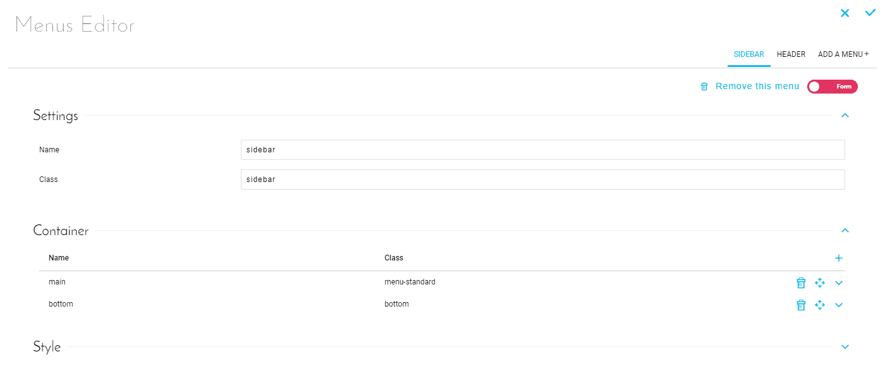
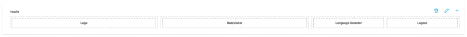
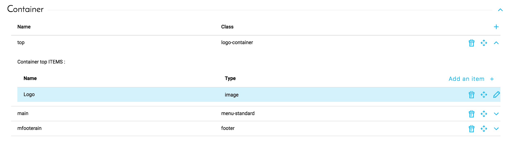

# Menus

The Platform makes it possible and simple to build complex analytics applications - with multiple pages, redirects, multiple dashboards and performance indicators - via Drag & Drop options and ease of use.

A menu allows you to structure the application and its basic chapters. The management of this navigation is centralized in the Menus tab of an application. This tab is used to define one or more navigation menus, as well as the containers and blocks that compose them.

A container corresponds to a subsection of a menu. A container can be used to display a logo, a set of tabs, a disconnect button, and so on.

A block is an element of the container, such as:
* A redirection link to an application dashboard or an external URL
* Static text
* An image, to display a logo for example
* A block displaying the name of the active user
* A dynamic parameter that can be linked to graphs in the dashboards to make the displayed data interactive.
* A custom block, available in the Marketplace or developed specifically for this application.

---
## Interface

To access the menu interface, either select the menu tab from the *App-editor sidebar*, or , if you are actively editing your app, the main toolbar (top-middle) contains a menu icon that will also open the interface.

*Figure 1 : Menu editor interface*  

From this interface, you can add new menus and menu elements, edit existing ones, and remove redundant components. 

The different menus of the application are represented below each other like this:

  
*Figure 2 : Menu example*

Each menu is divided into light gray dotted containers which themselves contain different dark gray dotted elements. Each of these containers are editable, movable and deletable, just like the elements that compose it.

  
*Figure 3 : Editing a container*

!> **Warning**: Adding a menu does not automatically add it to the application interface. The theme of the application must have a space dedicated to the reception of each menu. According to the theme, the name of a menu can have a lot of importance on its visual rendering.

{Next articles: Translations}(#/en/product/app-manager/translation)