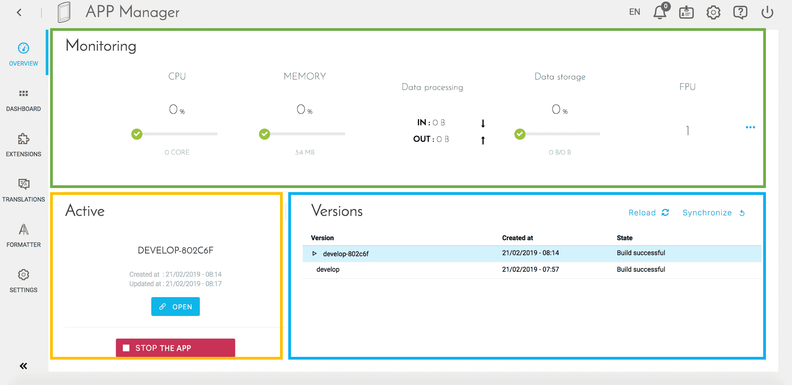
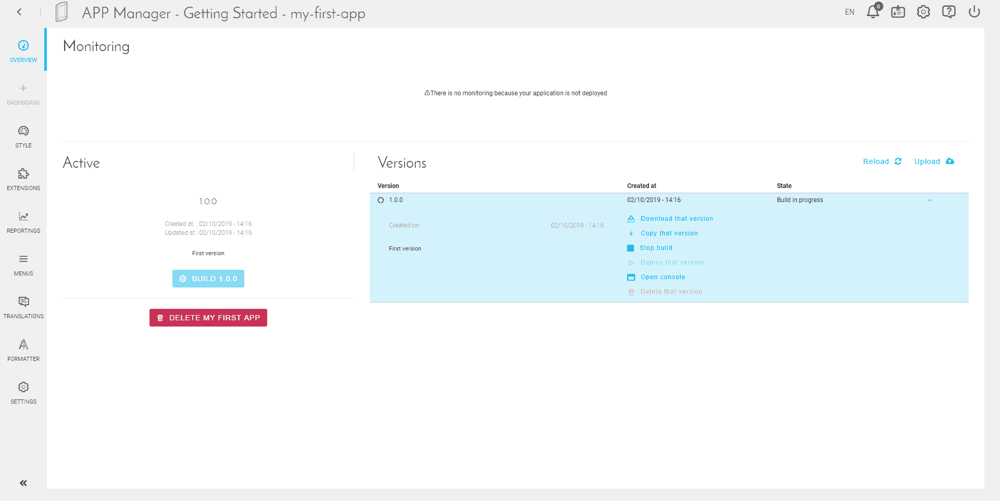
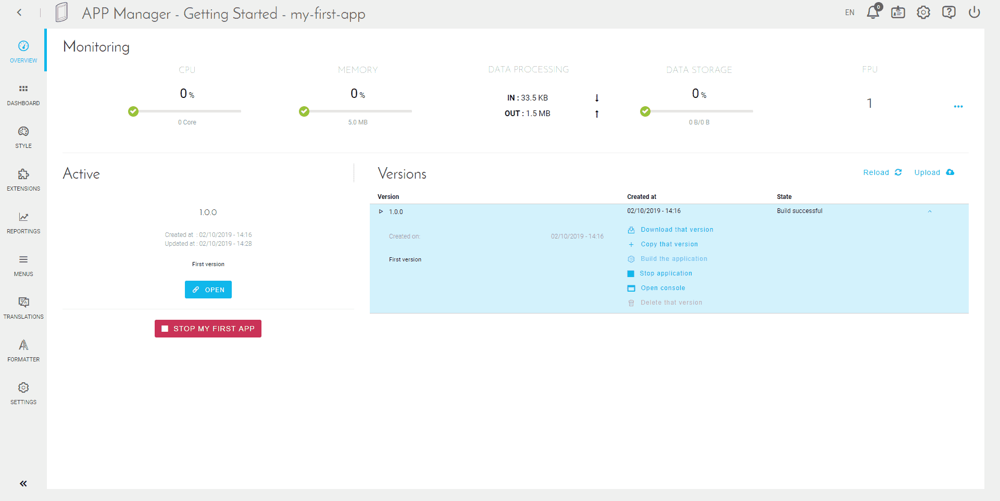
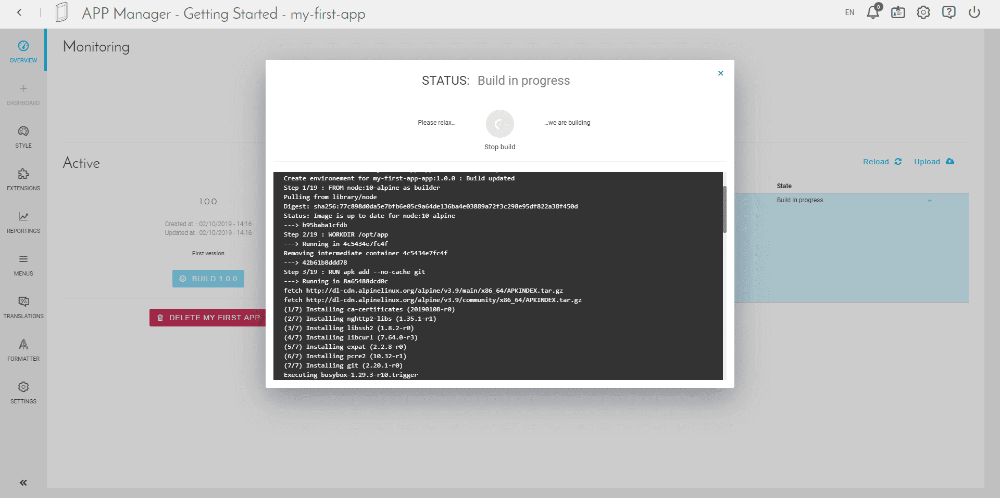
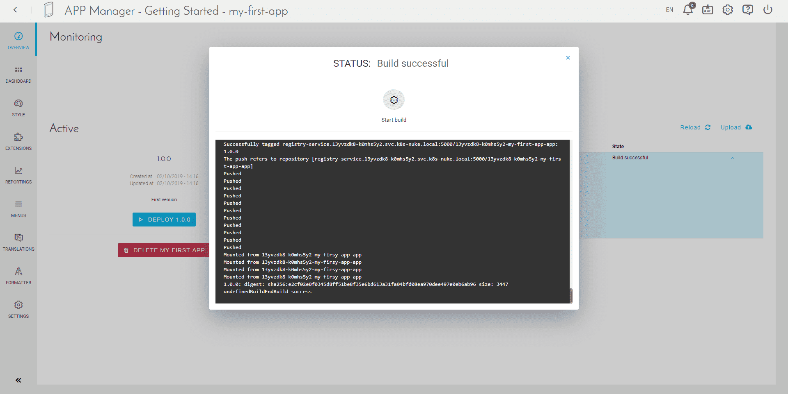
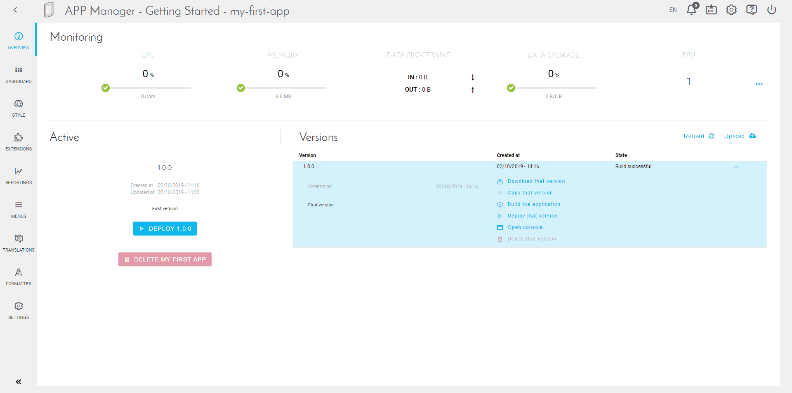
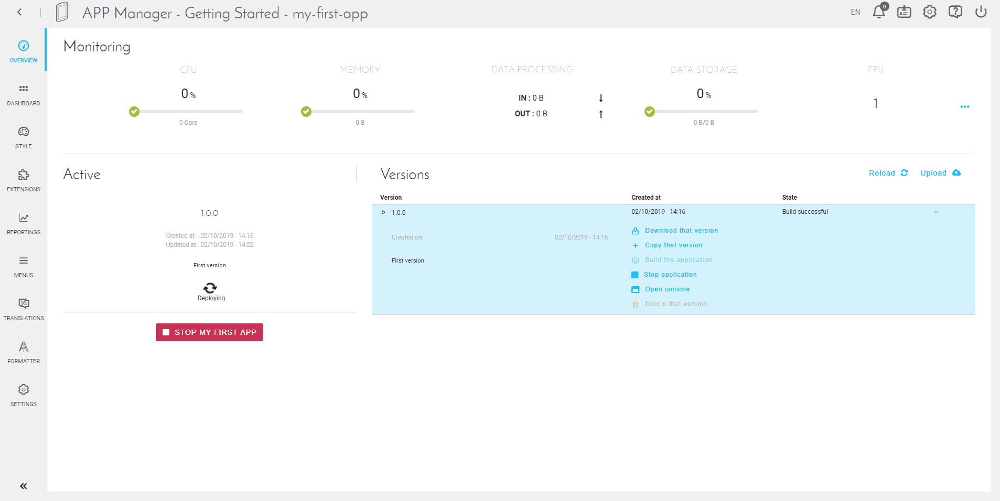
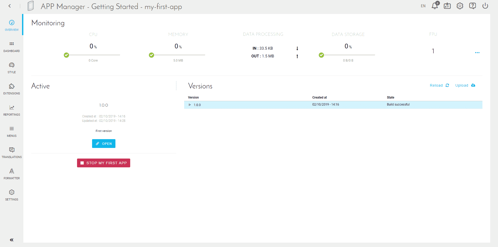
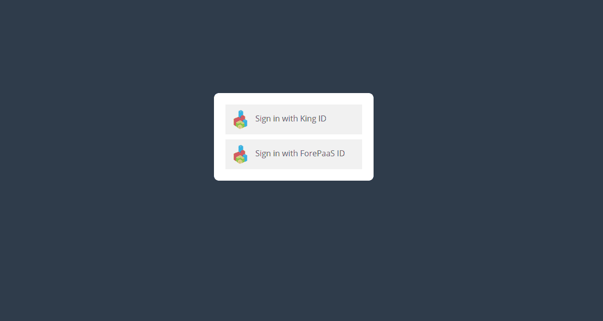

# APP Manager Interface

---

## Dashboard

In the management interface of an application, the *Preview* tab allows to monitor the life cycle of an application in an easy way.

The screen is divided into 3 parts:
* The top block (green) shows some **indicators related to the resources used by the application**. These indicators are useful, for example, to know if it is necessary to increase the number of instances.

!> Stopping an application resets its [DPU](/en/product/billing/resources/index) size to 1. Make sure to update the allocated resources accordingly every time you stop and start an app.

* The left block (yellow) indicates **the status of the active version** (in production). Some shortcuts are possible according to the state (New / Constructed / Deployed) of the version.

* The right block (blue) displays **different versions of the application**. The active version is displayed in blue. Different actions are possible for each version:
    * Synchronize / Download - action depending on the type of code source (ZIP file or GIT repository)
    * Duplicate version
    * Build this version
    * Deploy / Stop version
    * Open the building console
    * Remove version - requires the version not to be deployed

---

## Manage versions & deployments

You will arrive on the "Dashboard" of your application.
Here are three elements:
* __Summary__: status of your application once it has been deployed
* __Active__: status of your "active" version, that is to say, the one you are currently working on
* __Tags__: list of all the versions available in your application

You can see more details about the version you just created using the arrow on the right of it.

Since you activated auto-build, it has already started. You can check the activity log by clicking on "Open Console".

When it is done, you should see a last log "EndBuild success".

To start the deployment, please click on "Deploy 1.0.0".

Deployment starts and may take some time.

When the deployment is complete, the "Open" button appears. If you open your application, you should see this screen.

You can now login with your "King" account or with a "ForePaaSID" account created directly within your IAM.

---

Your app is deployed? It's time to start building it and modifying it live! Check-out how to create beautiful applications with the *dashboard builder* tab.

{Next article: Dashboard}(#/en/product/app-manager/dashboard/index)