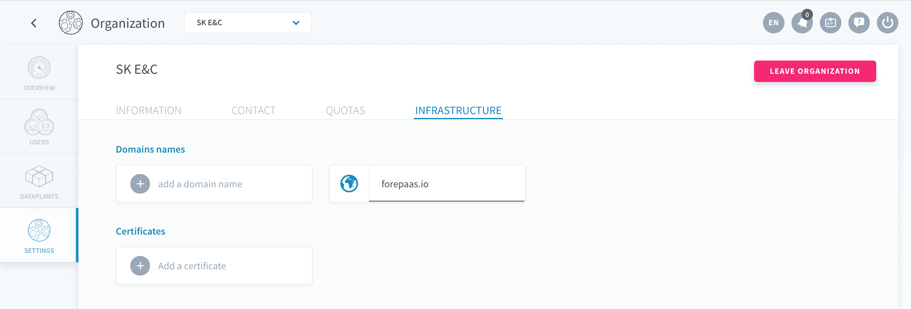
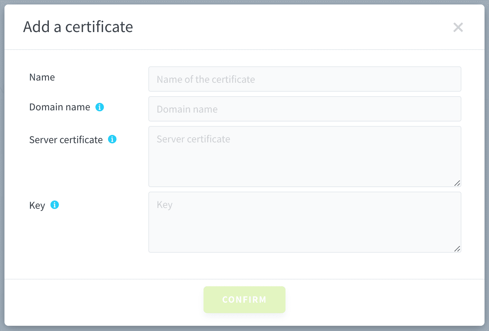
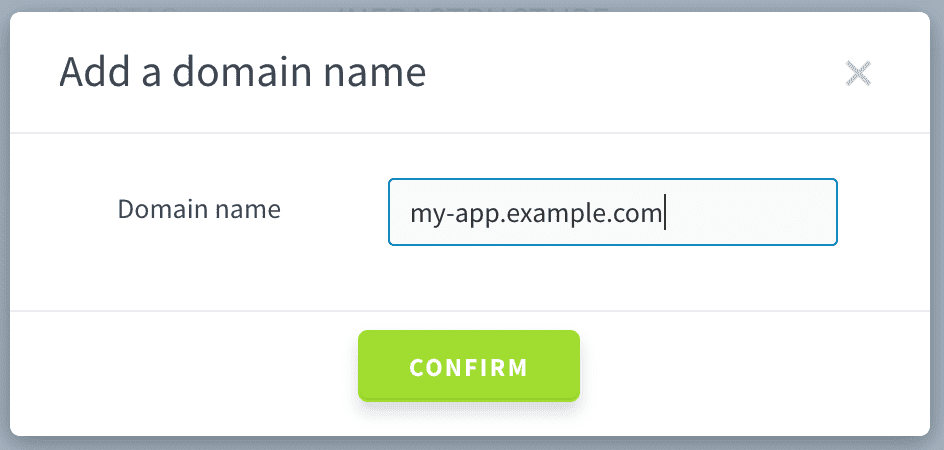
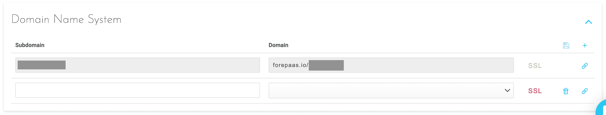

# Configure a custom domain for your application

**Why would you want to create your own domain?** Now, let's imagine that you have a DataPlant with a new application that is accessible from the following URL:
```
https://my-dataplant.forepaas.io/my-app/
```

It is easy to change your application's subdomains by changing its global settings but it'll always be followed by the domain `forepaas.io` such as for instance:
```
https://my-app-on-my-dataplant.forepaas.io/
```

**What if you would like to get rid of the `forepaas.io` domain entirely?**. You would like to completely white label the final product you are building. Your application ULR could look like anything you fancy as long as its available, such as:
```
https://my-app.example.com/
```

Let's check-out how to do this with the following steps:
1. [Generate a private Key and .csr file](en/product/app-manager/settings/custom-domain?id=generate-a-private-key-and-a-csr-file)
2. [Obtaining .pem file using your private key](en/product/app-manager/settings/custom-domain?id=obtaining-a-crt-amp-pem-file)
3. [Register your domain name at organization level](en/product/app-manager/settings/custom-domain?id=register-domain-for-your-organization)
4. [Register your new application domain name](en/product/app-manager/settings/custom-domain?id=register-domain-for-your-application)

---

## Requirements

To attempt following the steps indicated in this article, we highly recommend that you already know about:
* How to install & use [OpenSSL](https://www.openssl.org/) tools
* How to generate a valid [SSL Certificate](https://en.wikipedia.org/wiki/Transport_Layer_Security)
* How to add a [hostname](https://en.wikipedia.org/wiki/Hostname) to your domain

!> Please note that the following steps also assumes that you **own an existing Domain**. If that's note the case, make sure to first create your own domain so you can use it to for your application.

If you do not have an existing domain, check out online to learn how to do so, there are many available options such as the [Google Domains](https://domains.google/) tool.

If you fulfill all the above criteria, we'll need to go through one last step before setting up our application's custom domain, that is *generate a private key and CSR file*. See the following section to do that.

---

## Generate a Private Key and a CSR file

### Required Information

To generate a CSR (Certificate Signed Request), you will need to provide following informations:

| Parameter | Description |
|:----------|:------------|
| **C** (Country Name) | Use the two-letter code without punctuation for country. *Example: US or CA* |
| **ST** (State or Province) | Spell out the state completely; do not abbreviate the state or province name. *Example: California* |
| **L** (Locality or City) | The Locality field is the city or town name, for example: Berkeley. Do not abbreviate. *Example: Saint Louis, not St. Louis* |
| **O** (Company) | If the company or department has an &, @, or any other symbol using the shift key in its name, the symbol must be spelled out or omitted, in order to enroll. *Example: XY & Z Corporation would be XYZ Corporation or XY and Z Corporation* |
| **OU** (Organizational Unit) | The Organizational Unit (OU) field is the name of the department or organization unit making the request. To skip the OU field, press Enter on the keyboard. |
| **CN** (Common Name) | The Common Name is the Host + Domain Name. It looks like "www.company.com" or "company.com". |
| **emailAddress** | E-mail address of a real contact for the domain name |

Open a simple text editor and create a new **my-app.txt** file with the following structure:

```txt
[req]
default_bits = 2048
prompt = no
default_md = sha256
req_extensions = req_ext
distinguished_name = dn

[ dn ]
C=FR
ST=Hauts-de-Seine
L=Neuilly-sur-Seine
O=MyCompany
OU=MyCompany
emailAddress=contact@example.com
CN=my-app.example.com
```
!> Obviously replace the parameters as described in the table above with your own information.

### Creating files using OpenSSL

In your personal command line environment execute the following bash commands:
```bash
openssl req -new -sha256 -nodes -out my-app.csr -newkey rsa:2048 -keyout my-app.key -config my-app.txt
```

That will create 2 separate files:
* **my-app.csr** that you will be need to provide to SSL Certification Authority
* **my-app.key** that is your personal private key which you should keep securely and not communicate

!> If you are new to creating custom domain, make sure to keep the application key secret! Read-more about [OpenSSL Essentials in this article from Digital Ocean](https://www.digitalocean.com/community/tutorials/openssl-essentials-working-with-ssl-certificates-private-keys-and-csrs#private-keys).

---

## Obtaining a CRT & PEM file

Now that we have the `.csr` file, we will be able to use it to obtain a Certificate (CRT) & Privacy Enhanced Mail (PEM) file. To do that, you should simply provide the my-app.csr file to your favorite SSL Certification Authority which will provide you a valid `.crt` & `.pem` file.

Before using the `.pem`file let's make sure that it's valid. To do that you can run the following commands which should all yield the same output.

```bash
openssl rsa -noout -modulus -in my-app.key | openssl md5
openssl req -noout -modulus -in my-app.csr | openssl md5
openssl x509 -noout -modulus -in my-app.pem | openssl md5
```

---

## Register the new domain to your organization & application

To use the new domain we'll first need to register it at the **Organization** level so every DataPlant or applications inside the DataPlant can leverage it. We will then need to head to the **applications** themselves to set-it up individually.

### Register domain for your organization

Head over to the *Organization* information, access the *Settings* section and navigate to the *Infrastructure* tab.



Click on **Add a Certificate**. In the new certification window, enter your information:
* *Name*: a descriptive name for your own usage (has no incidence on the actual certificate name)
* *Domain name*: the hostname associates with the SSL certificate that you generated
* *Server certificate*: copy the content of the `.pem`file provided by your SSL Certification Authority
* *Key*: copy the content of the `.key`file that you created using OpenSSL



Confirm the creation of your name certificate and then click on **Add a Domain**. In the new domain window, make sure to give the same domain as the one for your certificate.



That's it! You're good to go. Your SSL certificate is now set up for your organization. **All you DataPlants and applications deployed within can use this new domain.** Let's head to the application settings to set-up this custom DNS.

### Register domain for your application

Navigate to the DataPlant and edit the application that you would like to change the DNS for. Head to the *Settings* tab and go the *Domain Name System* section.

Following our example, create a DNS entry for `my-app.example.com` as a CNAME to `my-dataplant.forepaas.io`, where:
* `my-app.example.com`is the hostname you provided an SSL certificate for
* `my-dataplant.forepaas.io` is the DataPlant's main URL

If you've reached the part of the article, **congrats** 🏆, you application should now be available at a brand new URL like https://my-app.example.com/



---
## Struggling to set it up by yourself?

That's fine, tell us how we can help. Get in touch on our support portal or reach out at support@forepaas.com.

{Send your questions on the support portal❓}(mailto:support@forepaas.com)
