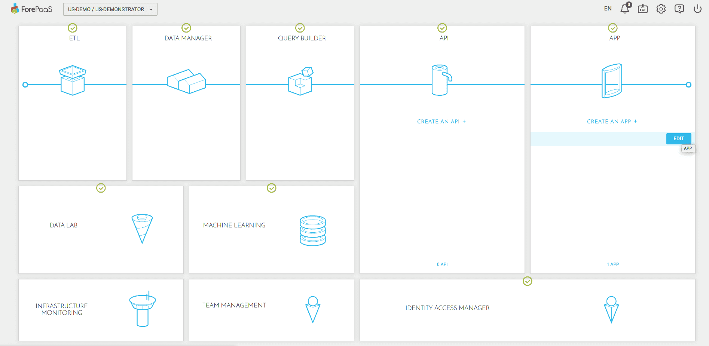
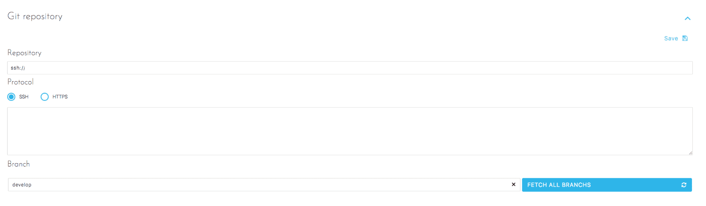
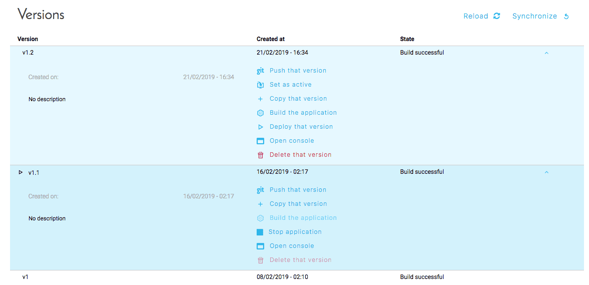
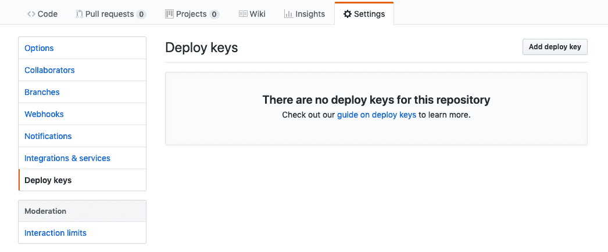

# Link your app with a GIT repository 

?> Good to know: this tutorial also works for your APIs. 

---
## Pre-requisites

### Access rights definition

In this tutorial, we will explain how to give the read / write privileges on the GIT repository for your application.

### Repository configuration

If you already know GIT, and if you have a repository ready to use, go straight to the next step. 
Other wise, here is a list of repository providers:
- [Github](https://github.com)
- [Gitlab](https://gitlab.com)
- [Bitbucket](https://bitbucket.org)

Creating a first repository is quite simple, just be careful not to create a public repository if you want to store a confidential application. 

---
## What to do

Once you've set up your repository, go to your app interface in order to link them. 

Go to your APP Manager and click on Edit on the app you want to link.  

On the left-hand side menu, go to your Settings. Now you have you fill in the following fields:

__Repository__: this is your repository's address. This is provided by your repository provider, and you can often find it on its homepage. This address can be either an HTTP URL, or a SSH address (depending on the connection mode you chose)

__SSH__: if you wish to use an SSH address, you have to copy the "Public Key" displayed on your screen in your remote repositories and accounts, in addition to the address entered above. The SSH key is automatically generated by your APP Manager, you don't need to generate one yourself. 

__HTTPS__:  this is the HTTPS address of your repository. Clone's URLS https:// are availabel on all repositories, public or private. In the case of private repository, each interaction with the repository requires you to enter a user name and a password, 

__Branch__: when you have completed the previous configurations, you can synchronize the remote branches via this button, then select one before saving.

Once the configuration is over, you can perform 2 new actions from the Overview screen:

__Push that version__: This lets you create a new branch on your GIT repository, from this version. This is the first step to initialize your deposit.

__Synchronize__: This allows you to download the content of the previously selected branch, and automatically create a new version within your ForePaaS environment.

### Setting up a repository with SSH authentication

When configuring your Application, if you select SSH as the connection mode, the required SSH key is automatically provided by your Application Manager.
This key must be copied / pasted into your GIT repository. According to the providers, the screens to perform this action may change.

Let's take Github as an example, which is one of the most common providers.
To add SSH keys to a repository, you need to go to its "Settings".  
  

Select "Deploy Keys", then click on "Add deploy key".  
Here you can paste your SSH key (provided by your APP Manager), give it a name, for example: ForePaaS - MyFirstProject.  
Remember to check "Allow write Access" in order to be able to use synchronization in both directions. This option is necessary for the "Push the version" function that we discussed in the previous point.

### Setting up a repository with HTTPS authentication

#### Private authentication
Regarding the creation of an HTTPS authentication, you just need to fill in the fields "username" and password of your account (who has access to the repository). At each synchronization, the password will be asked again, we do not store it in your DataPlant.

#### Public authentication
Regarding the public authentication, it is not necessary to fill in information. 

Congrats, you're done syncing your app!

