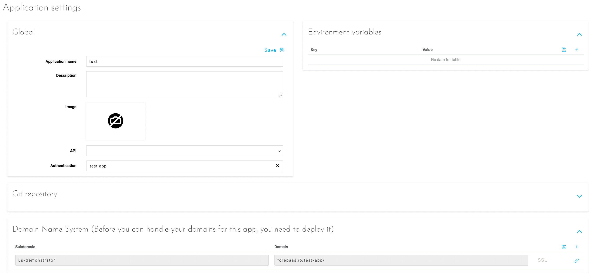

# Settings

Inside the settings of a deployed application you will be able to configure the following options:
* [Global settings](#global)
* [Environment variables](#environment-variables)
* [Git repository integration](#git-repository)
* [Domain name systems](#domain-name-system)

---

## Global

The global information of the application such as its name, description and main image.

---

## Environment Variables

The variables that the application will need to work. Those necessary for the proper functioning of the application and its various extensions are filled in automatically. Only the variables specific to a business need are presented here.

---

## Git Repository

{Link an external Git repo to your application}(#/en/product/app-manager/settings/git-integration.md)

---

## Domain Name System

Allows you to add one or more URLs allowing access to the application, in addition to the one generated by default. These URLs have the domain "eu.dataplatform.ovh.net" unless you have set another domain at the organization level.

{Configure a custom domain for your application}(#/en/product/app-manager/settings/custom-domain.md)

---

## Still not satisfied? 😒

> At any step, you can create a ticket to raise an incident or if you need support at the [OVHcloud Help Centre](https://help.ovhcloud.com/csm/fr-home?id=csm_index). Additionally, you can ask for support by reaching out to us on the Data Platform Channel within the [Discord Server](https://discord.com/channels/850031577277792286/1163465539981672559). There is a step-by-step guide in the [support](#en/support/index.md) section.