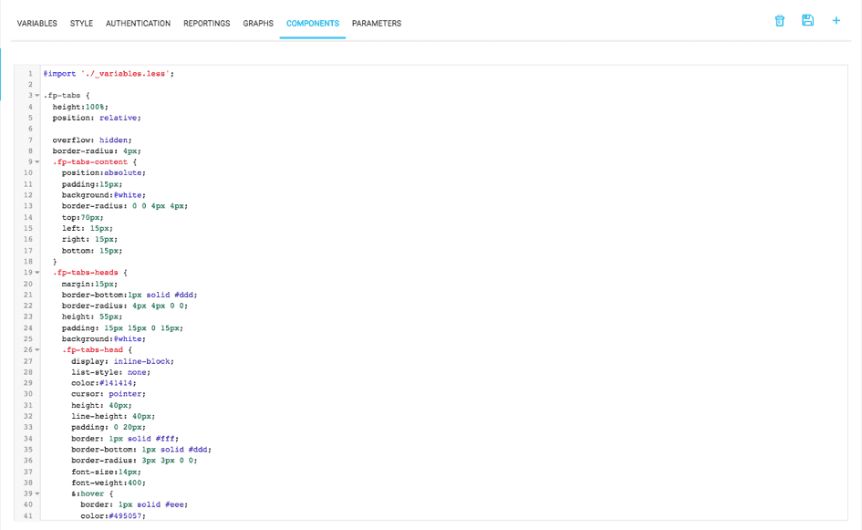

## Style

Within an application, the Platform allows to modify the style and design. The definition of the graphic chart to apply to the application is centralized in the *Style* tab. These changes in CSS / LESS can be applied in different files as in the image below:

Changes to the application's style require rebuilding the artifact as well as redeploying it.

{Next article: Extensions}(#/en/product/app-manager/extensions/index)