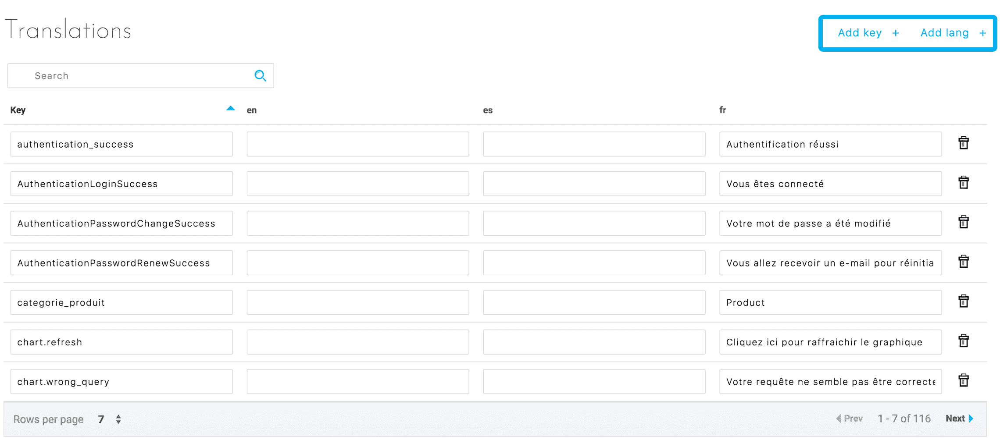
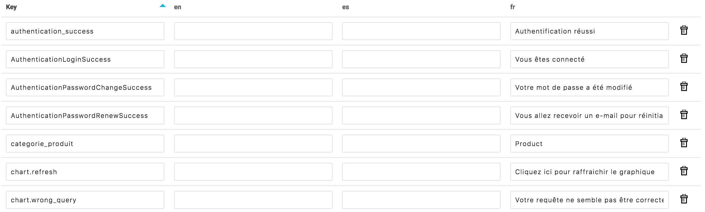

# Translations

Applications created on the Platform are multilingual by nature. The fields to translate as well as the languages ​​available for the application can be found in the Translations tab.

This tab allows you to:
* Add languages
* List all the expressions requiring a translation
* Add or edit the translation of these expressions in all added languages

The themes offered in the Marketplace have a number of translations to allow the application to work properly. It will therefore only be necessary to add translations when the expressions used are not included in the theme, such as the name of the data fields. Similarly, if an application is only built from the SDK, the majority of translations will have to be added.

## Interface
Figure 1 illustrates the translation editor interface, which allows you to:
* Add a language
* Add a translation key
* Save translations

  
*Figure 1 : Main actions*

When adding a new translation key, a new line will be created allowing you to enter the translations of these keys in each language (see Figure 2).

Adding a language only requires the language code (fr, en, es, etc.). This will create a new column where the translation can be entered (see Figure 2). Each translation key can then be modified directly or deleted.

  
*Figure 2: List of translations for an app*


## App Integration

### In charts
Many predefined charts provide a simple translating system.
#### Translate an axis
```
"site" : "Site"  
```
site will be replaced by "Site" in all charts

#### Translate a value
To translate an axis value, you need to use a combination of axis name and value
```
"site-2" : "New York" 
```
Instead of "2", all the charts will display "New York" for an axis "site"


{Next article: Formatter}(#/en/product/app-manager/formatter)