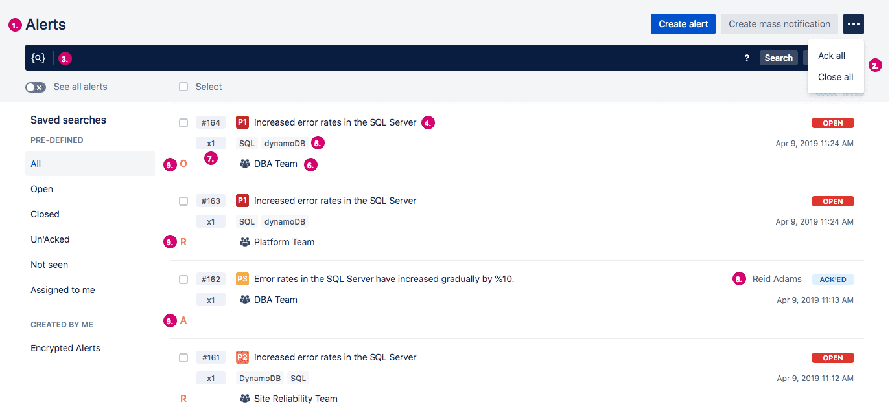
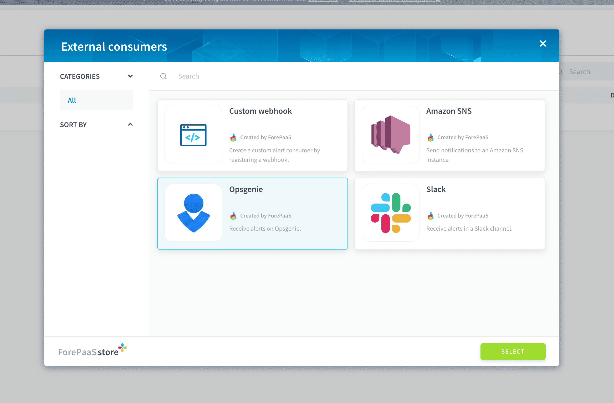
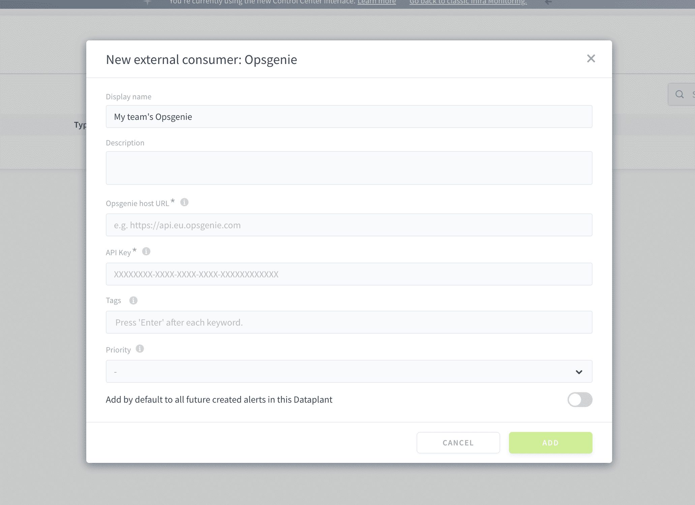
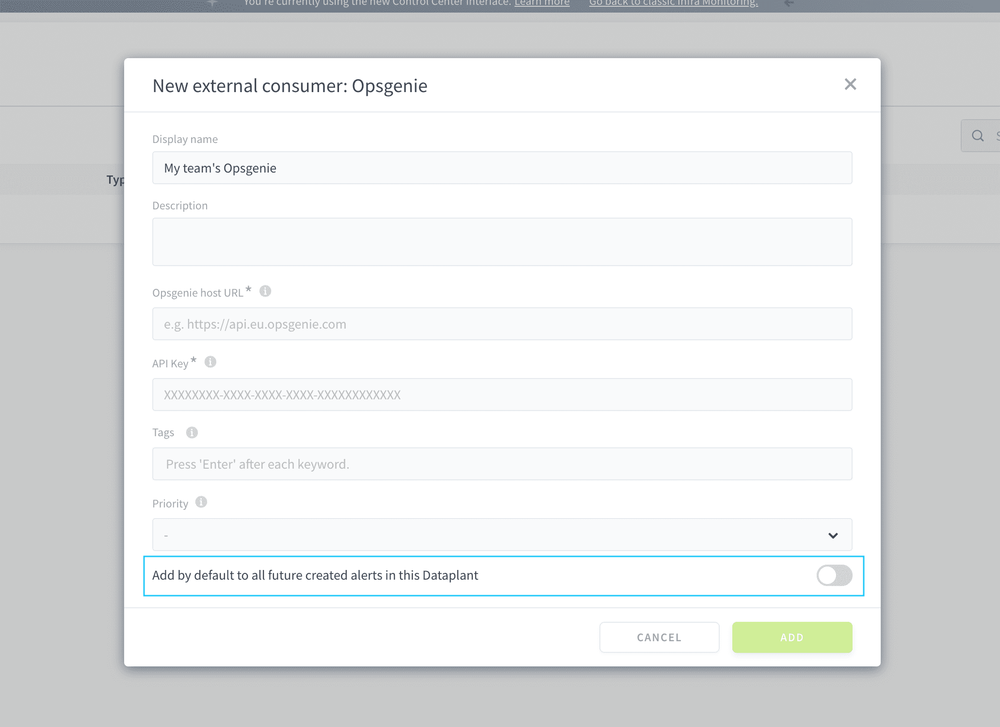

# Send ForePaaS alerts to Opsgenie

Is the alerting system of the rest of your stack already plugged to Opsgenie? If you want to push ForePaaS alerts directly there too, this guide is for you.

The configuration is done in two parts. First you need to [retrieve credentials on Opsgenie](/en/product/cc/alerting/consumers/opsgenie?id=configuration-on-opsgenie), and then [configure the external consumer on ForePaaS](/en/product/cc/alerting/consumers/opsgenie?id=configuration-on-forepaas).

---
## Configuration on Opsgenie

### Host URL

Retrieve the URL for your environment corresponding to the Opsgenie region that you are located in. It should have the following format: *https://api.{your-opsgenie-region}.opsgenie.com*. 

> For example, if your Opsgenie environment is in the region `eu` (Europe), this URL will be *https://api.eu.opsgenie.com*.

### API key

In your Opsgenie environment, open **Teams** then **Integrations**, and add an *API* integration. 

Configure it, then write down its **API key**. You will need it for later.

---
## Configuration on ForePaaS

If you haven't done so already, start adding a new external consumer by clicking on **Add external consumer** from an alert's preferences page or directly from the Control Center's Settings page.

Select *Opsgenie* and press **Confirm**

You will need to enter the following information:
- **Opsgenie host URL**: enter the regional URL for the Opsgenie server obtained [at this step](/en/product/cc/alerting/consumers/opsgenie?id=host-url)
- **API key**: enter the API key of the *API* integration you added to Opsgenie, obtained [at this step](/en/product/cc/alerting/consumers/opsgenie?id=api-key)
- **Tags** *(optional)*: enter tags to associate with your alert notification on Opsgenie. Used to help sort out alerts
- **Priority level** *(optional)*: enter the [priority level](https://support.atlassian.com/opsgenie/docs/what-is-the-priority-level-of-integration/) of the alert notification on Opsgenie. Used to help sort out alerts

To save time, it is possible to configure this consumer to be automatically linked by default to all the alerts that will be created in the future. This will not affect alerts that were created before the consumer (you will have to manually add the new consumer to them).

After confirming the creation of the new consumer, you can find and manage it in the **Settings** of the Control Center.

---
## Struggling to set it up by yourself❓

That's fine, tell us how we can help! Get in touch on our support portal or reach out at support@forepaas.com.