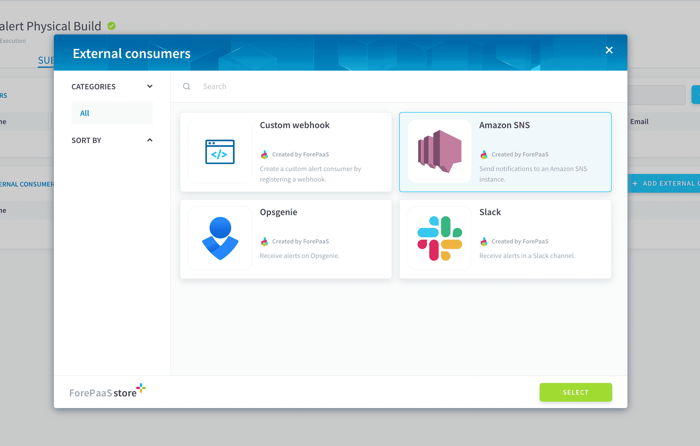
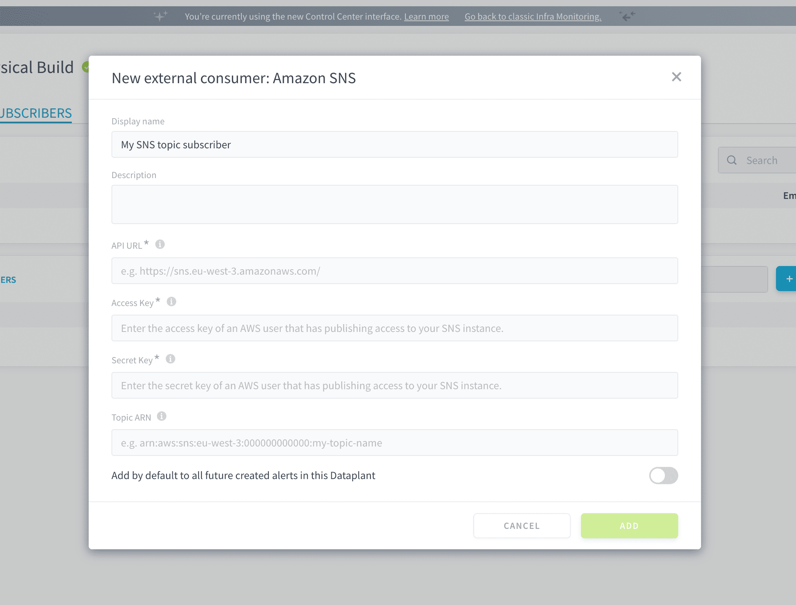
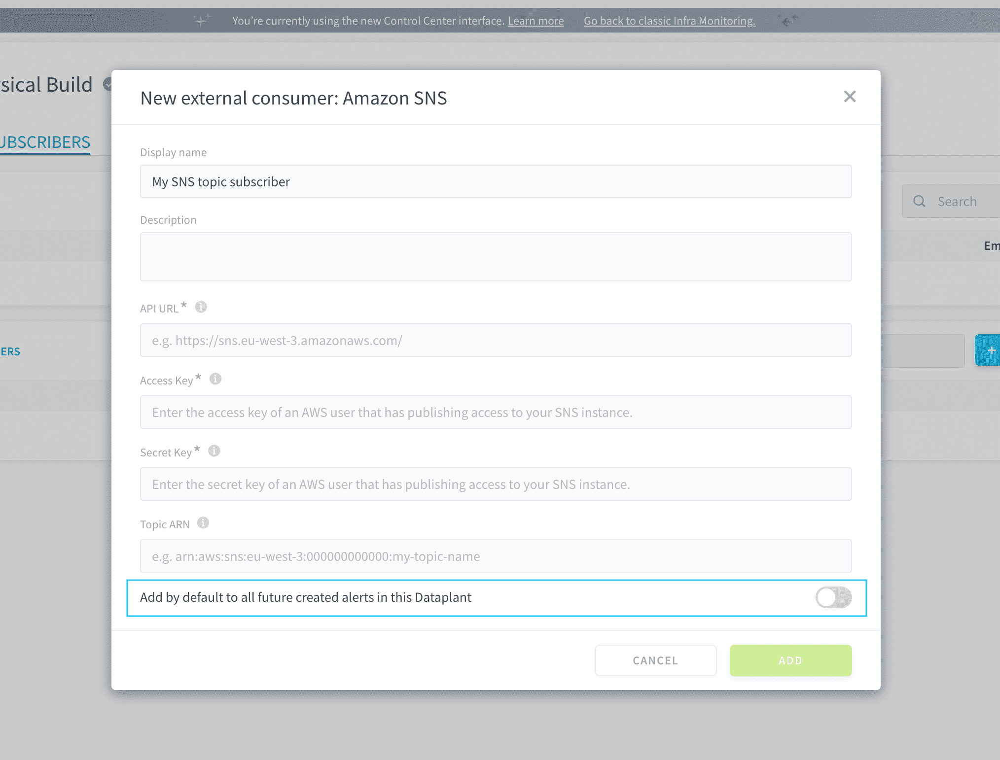

# Send ForePaaS alerts to Amazon SNS

[Amazon Simple Notification Service](https://aws.amazon.com/sns/) is a managed messaging service for either application-to-application or application-to-person communication. If you want to push ForePaaS alerts directly into an SNS topic, this guide is for you.

The configuration is done in two parts. First you need to [retrieve credentials on AWS](/en/product/cc/alerting/consumers/sns?id=configuration-on-amazon-sns), and then [configure the external consumer on ForePaaS](/en/product/cc/alerting/consumers/sns?id=configuration-on-forepaas).

---
## Configuration on Amazon SNS

You need to have an active and ready-to-use **SNS topic** to push ForePaaS alerts to. To learn how to do this, please follow [this guide written by Amazon](https://docs.aws.amazon.com/sns/latest/dg/sns-getting-started.html).

#### API URL
Retrieve the URL for SNS corresponding to the Amazon region that you are located in. It should have the following format: *https://sns.{your-aws-region}.amazonaws.com/*. 

> For example, if your SNS instance is in the region `eu-west-3`, this URL will be *https://sns.eu-west-3.amazonaws.com/*

### Topic ARN
Open SNS in the AWS console, and find your topic to retrieve the *Topic ARN*. It should have the following format: *arn:aws:sns:eu-west-3:000000000000:my-topic-name*. 

#### API and secret key
You will also need to generate an AWS user in the AWS IAM that has permissions to write into your SNS topic. 

Once this is done, retrieve the *access key* and *secret key* associated to the user. You will need them for later.

---
## Configuration on ForePaaS

If you haven't done so already, start adding a new external consumer by clicking on **Add external consumer** from an alert's preferences page or directly from the Control Center's Settings page.

Select *Slack* and press **Confirm**

You will need to enter the following information:
- **API URL**: enter the regional URL for the SNS service obtained [at this step](/en/product/cc/alerting/consumers/sns?id=api-url)
- **Access key**: enter the access key for the AWS user with permissions on your SNS topic, obtained [at this step](/en/product/cc/alerting/consumers/sns?id=api-and-secret-key)
- **Secret key**: enter the secret key for the AWS user with permissions on your SNS topic, obtained [at this step](/en/product/cc/alerting/consumers/sns?id=api-and-secret-key)
- **Topic ARN**: enter the ARN of the topic to send ForePaaS alerts to, obtained [at this step](/en/product/cc/alerting/consumers/sns?id=topic-arn)

To save time, it is possible to configure this consumer to be automatically linked by default to all the alerts that will be created in the future. This will not affect alerts that were created before the consumer (you will have to manually add the new consumer to them).

After confirming the creation of the new consumer, you can find and manage it in the **Settings** of the Control Center.

---
## Struggling to set it up by yourself❓

That's fine, tell us how we can help! Get in touch on our support portal or reach out at support@forepaas.com.