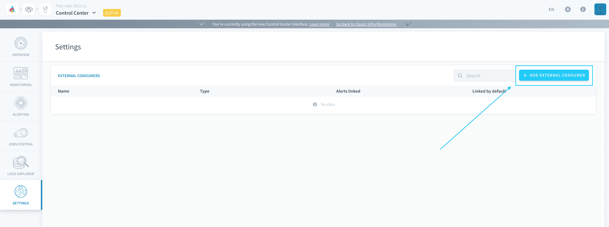
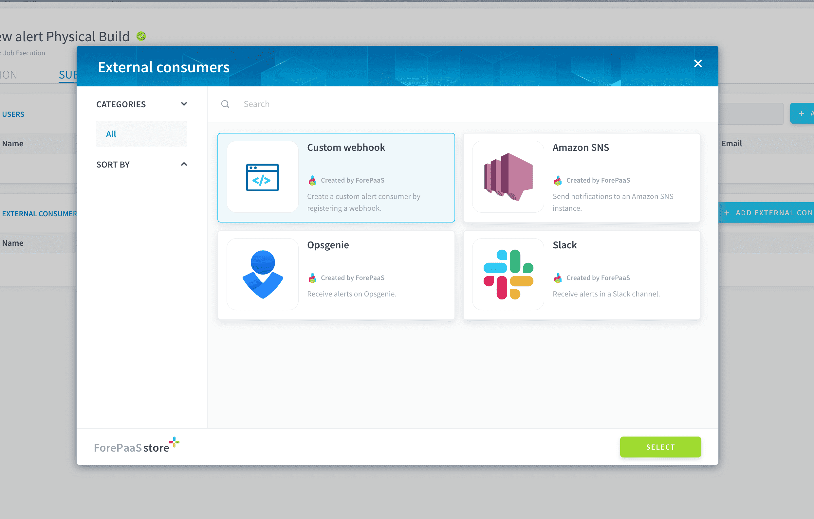
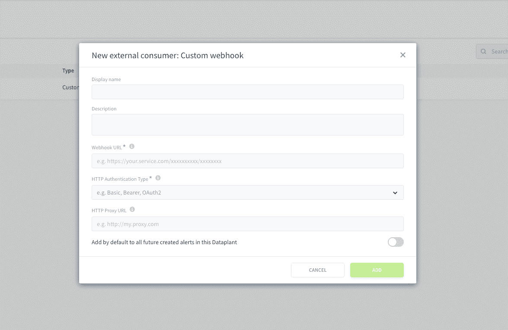
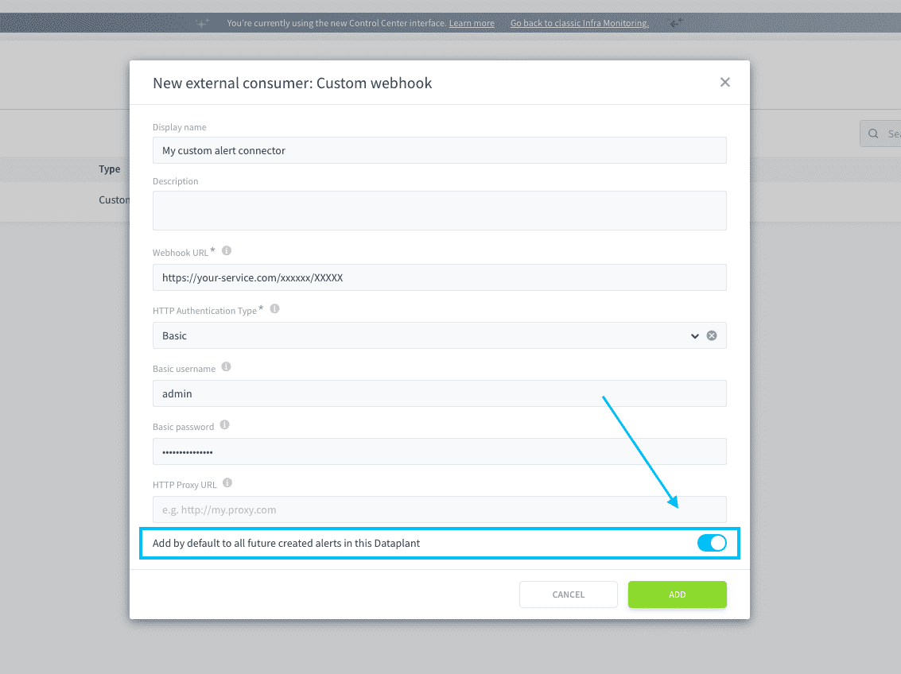
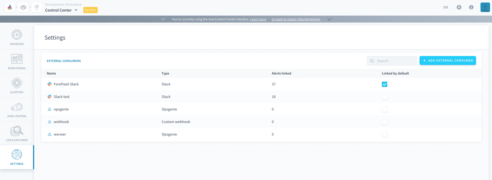

# Subscribe a custom webhook to ForePaaS alerts

The *Custom webhook* consumer lets you register a generic external consumer by inputing an endpoint that the ForePaaS Control Center will make HTTP POST requests to. 

This consumer makes it possible to connect integrations not yet natively supported by ForePaaS, such as:
- **messaging softwares**: Discord, DingTalk, Rocket.Chat, Signal, Telegram bot, Zoom, etc.
- **productivity tools**: Asana, GitLab, JIRAlert, etc.
- **observability and incident management platforms**: Better Stack, Canopsis, Icinga, iLert, Ansible, Squadcast, xMatters, Zenduty

To use it, start adding a new external consumer by clicking on **Add external consumer** from an alert's preferences page or directly from the Control Center's Settings page.

Select *Custom webhook* and press **Confirm**

You will need to enter several fields:
- **Webhook URL**: enter the URL for your custom webhook
- **HTTP Authentication Type**: choose either *Basic* for a basic user/password authentication, *Bearer* to pass on authentication credentials or *OAuth2* for OAuth 2.0 authentication using the client credentials grant type
- If Authentication type = Basic
  - **Basic username**: enter the username for a basic authentication
  - **Basic password**: enter the password for a basic authentication
- If Authentication type = Bearer
  - **Authentication credentials**: enter the credentials to set on the authorization header
- If Authentication type = OAuth2
  - **Client ID**: enter the ID to authenticate the client
  - **Client secret**: enter the secret to authenticate the client
  - **OAuth 2 scopes**: if your service supports different scopes for the client credentials grant, enter the scopes needed here
  - **Token URL**: enter the URL and endpoint to call which will grant the temporary access token to your webhook using the ID and secret above
- **HTTP Proxy URL** *(optional)*: use an optional HTTP URL for a proxy if your system requires the message to go through it, for example because of a firewall.

To save time, it is possible to configure this consumer to be automatically linked by default to all the alerts that will be created in the future. This will not affect alerts that were created before the consumer (you will have to manually add the new consumer to them).

After confirming the creation of the new consumer, you can find and manage it in the **Settings** of the Control Center.

---
## Struggling to set it up by yourself❓

That's fine, tell us how we can help! Get in touch on our support portal or reach out at support@forepaas.com.