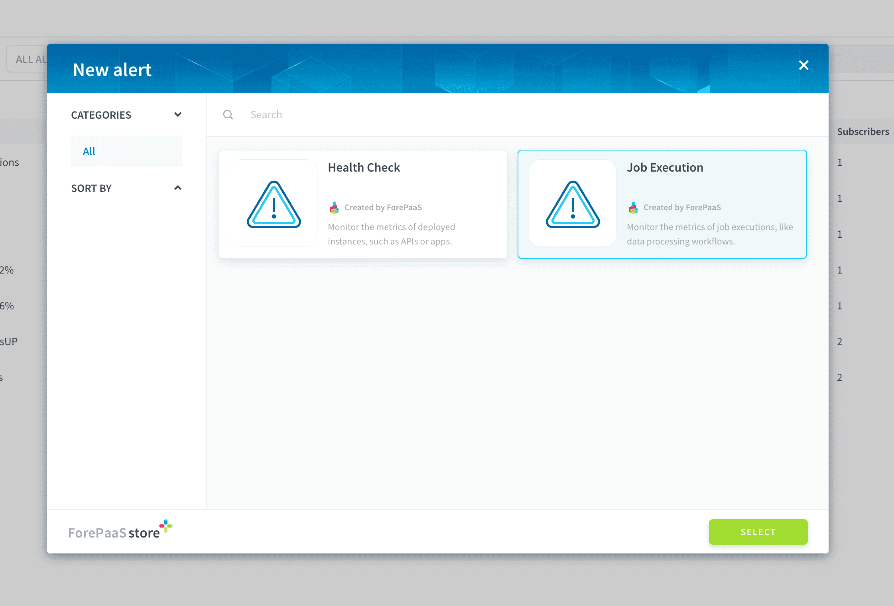
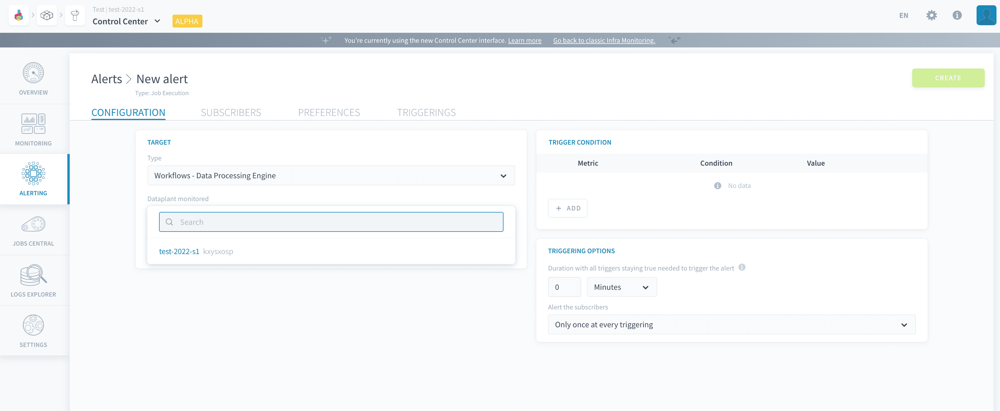
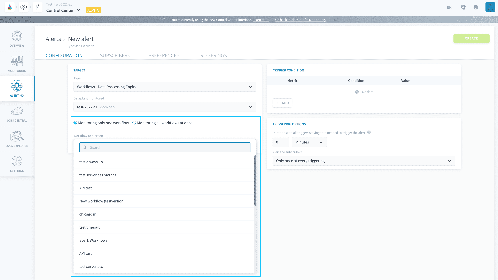
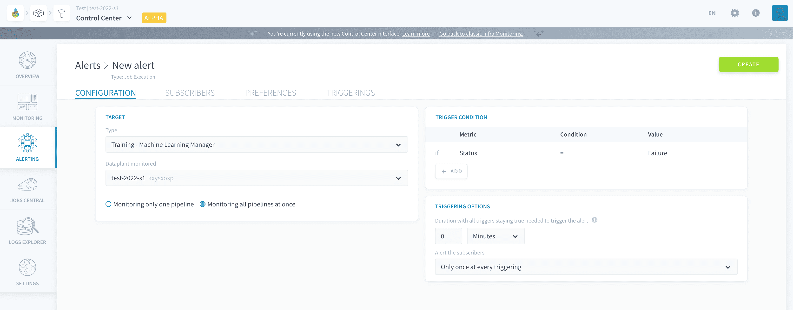
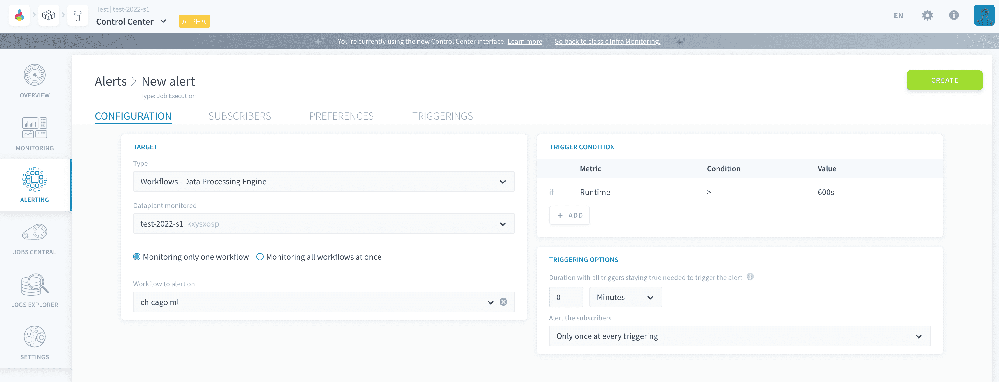
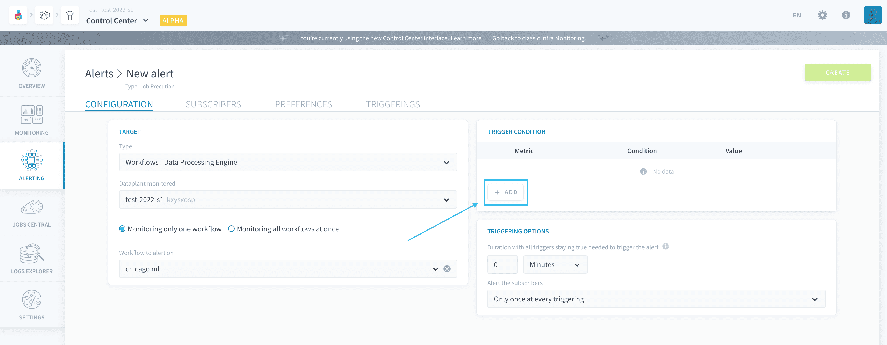
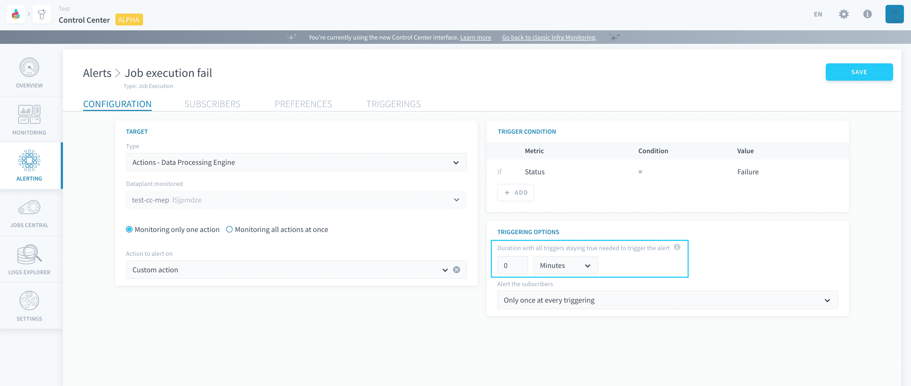

# Configure a job execution alert

Alerts can be set to monitor **job execution metrics** on the Platform, such as the status of the job execution or the average CPU usage during it.

A job execution alert is configured by specifying a [target](#configure-the-target-of-the-alert) as well as [trigger conditions](#configure-the-trigger-conditions-of-the-alert) and [triggering options](#configure-the-triggering-options-of-the-alert).

---
## Configure the target of the alert

When creating a new job execution alert, it is necessary to choose the type of job to monitor. The following types are available:
- [Data Processing Engine actions](/en/product/dpe/actions/index) job executions
- [Data Processing Engine workflows](/en/product/dpe/workflows/index) job executions
- [Machine Learning dataset generation](/en/product/ml/pipelines/execute/index?id=dataset-generation-jobs) jobs
- [Machine Learning training](/en/product/ml/pipelines/execute/index?id=training-jobs) jobs
- [Machine Learning testing](/en/product/ml/pipelines/execute/index?id=testing-jobs) jobs
- [Lakehouse Manager physical build](/en/product/lakehouse-manager/tables/table_interactions?id=build-table) jobs

If not done already, you also need to choose the Project in which to create the alert.

Except for alerts set on *Lakehouse Manager physical build* jobs, it is possible to either target one specific object (workflow, ML pipeline, etc..) or set the alert to monitor all of them at once.

If you choose to monitor all of them at once, the alert will be triggered **every time** a job execution of the aforementioned type matches the [trigger conditions](#configure-the-trigger-conditions-of-the-alert).  
For example in the screenshot below, the alert will be triggered every time any [ML training job](/en/product/ml/pipelines/execute/index?id=training-jobs) fails.

If you choose to monitor one specific object, the alert will only be triggered if the job execution of that object meets the trigger conditions.  
For example in the screenshot below, the alert will only be triggered if the execution of workflow "chicago ml" lasts for more than 10 minutes (600s).

Finally, it is possible to set the alert to be triggered only if the *trigger condition* is met during a [CRON-scheduled](/en/product/dpe/actions/settings/index?id=time-based-trigger) execution of the job. This is useful to manually test your actions/workflows/pipelines while developing without receiving an alert every time.

---
## Configure the trigger conditions of the alert

A trigger condition on an alert is a logical statement made of a *metric*, an *operator*, and a *value*. Multiple conditions can be added to the same alert: in that case, they will be combined with an *AND* condition. At each evaluation loop - occurring every minute - the Platform runs the expression defined in each alert trigger. The alert's status is thus changed to *active* if **all trigger conditions are and stay true** for longer than the [waiting period of the alert](#configure-the-triggering-options-of-the-alert) (configurable downstream in the process).

To add a new trigger condition, press **Add** in the corresponding panel.

Triggers can be set on the following metrics for job execution:

- **Status**: note that failure and timeout are two different values: an execution that times out will not trigger an alert set on *status = failure*
- **Maximum CPU usage** (in %)
- **Average CPU usage** (in %)
- **Maximum RAM usage** (in %)
- **Average RAM usage** (in %)
- **Runtime** (in s)
- **Log detection** (*coming soon!*)

---
## Configure the triggering options of the alert

The triggering options are used to specify how exactly is the alert triggered, based on the trigger set above, and how are notifications sent to subscribers.

### Specify the waiting period for the alert

The *waiting period* is the **duration during which the alert's [triggers](/en/product/cc/alerting/health?id=configure-the-trigger-conditions-of-the-alert) must stay true** for the alert to be effectively triggered.

This optional parameter causes the Platform to wait for a certain duration between first meeting the trigger condition of the alert (like a failed execution) and counting the alert as *active*. 

If this duration is 0 (default value), the alert will immediately be triggered to an *active* status as soon as an execution validating the trigger conditions finishes.  
If it is higher than 0, the alert will stay in *watching* status for the whole duration after the first execution. If all executions occurring in this timeframe validate the trigger condition, the alert will be triggered to an *active* status

?> Since the Platform only evaluates trigger conditions every minute, it may take a few more seconds (up to one minute) of delay on top of the waiting duration before the system effectively acknowledges the alert has being triggered.

> Let's take the example of a workflow, which is scheduled to run every 15 minutes. You set an alert on it with a waiting duration of 1 hour. On the first execution that matches the trigger condition, the alert won't be activated but a silent countdown of 60 minutes will begin. If all executions within the 1-hour timeframe validate the condition, the alert will be triggered. In other words, you essentially allow the execution to match the trigger conditions 3 times in a row, before transitioning the alert to **active** at the 4th execution if it still matches the conditions.

### Specify the notification frequency

For each alert, it is possible to either:
- notify the subscribers **only once at the moment of triggering** (when the alert transitions to *active* state). Subscribers won't be notified again until the alert is resolved and triggered again.
- notify the subscribers regularly **as long as the alert is active**. You can set the frequency of notification per alert. 

It is also possible to activate resolution notifications. This will send a notification to all subscribers when the alert is resolved - which happens automatically as soon as the evaluated trigger condition is no longer verified.

---
## Need help? 🆘

> At any step, you can create a ticket to raise an incident or if you need support at the [OVHcloud Help Centre](https://help.ovhcloud.com/csm/fr-home?id=csm_index). Additionally, you can ask for support by reaching out to us on the Data Platform Channel within the [Discord Server](https://discord.com/channels/850031577277792286/1163465539981672559). There is a step-by-step guide in the [support](/en/support/index.md) section.