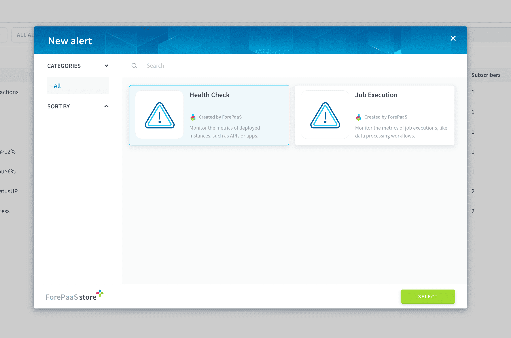
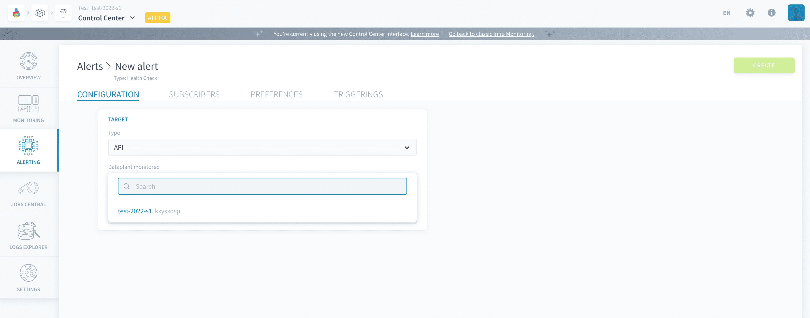
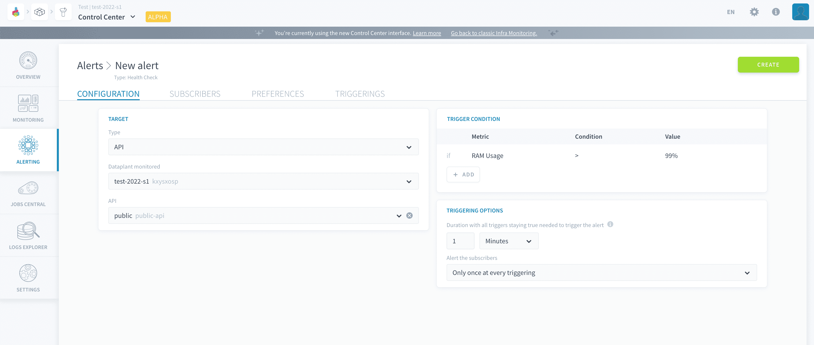
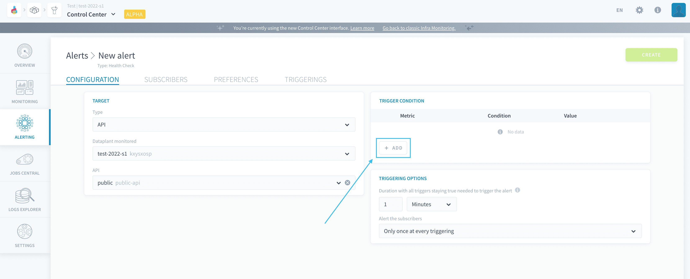
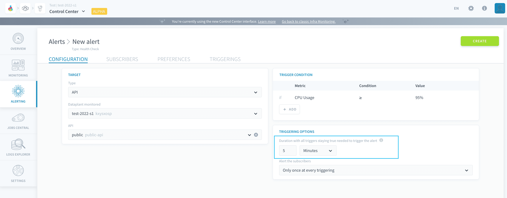

# Configure a health check alert

Alerts can be set to monitor **metrics of deployed instances** on the Platform, such as the status of APIs or the CPU usage of a query engine. They are called *health check alerts* on the Platform.

A health check alert is configured by specifying a [target](#configure-the-target-of-the-alert) as well as [trigger conditions](#configure-the-trigger-conditions-of-the-alert) and [triggering options](#configure-the-triggering-options-of-the-alert).

---
## Configure the target of the alert

When creating a new health check alert, it is necessary to choose the type of deployment to monitor. The following types are available:
- [Always-up deployments in the Data Processing Engine](/en/product/dpe/actions/settings/index?id=always-up)
- [APIs](/en/product/api-manager/index)
- [Applications](/en/product/app-manager/index) 
- [Model APIs](/en/product/ml/pipelines/configure/deployment/index) 
- [Query engines](/en/product/am/resources) 

If not done already, you also need to choose the Project in which to create the alert.

If you choose to monitor one specific object (app, API, etc..), the alert will only be triggered if that specific instance meets the trigger conditions.  
For example in the screenshot below, the alert will only be triggered if API "public" uses more than 99% of its RAM for more than 1 minute.

---
## Configure the trigger conditions of the alert

A trigger condition on an alert is a logical statement made of a *metric*, an *operator*, and a *value*. Multiple conditions can be added to the same alert: in that case, they will be combined with an *AND* condition. At each evaluation loop - occurring every minute - the Platform runs the expression defined in each alert trigger. The alert's status is thus changed to *active* if **all trigger conditions are and stay true** for longer than the [waiting period of the alert](#specify-the-waiting-period-for-the-alert) (configurable downstream in the process).

To add a new trigger condition, press **Add** in the corresponding panel.

Triggers can be set on the following metrics for deployed instances:

- **Status**: an alert will be raised if the monitored target is unavailable (for value *DOWN*). 
  - Note that status *DOWN* will not raise an alert if the monitored target is stopped/rebooted manually by a user
- **CPU usage** (in %): an alert will be raised if the CPU used by the monitored target goes above/below a certain threshold
- **RAM usage** (in %): an alert will be raised if the memory used by the monitored target goes above/below a certain threshold
- **Log detection** (*coming soon!*)

---
## Configure the triggering options of the alert

The triggering options are used to specify how exactly is the alert triggered, based on the trigger set above, and how are notifications sent to subscribers.

### Specify the waiting period for the alert

The *waiting period* is the **duration during which the alert's [triggers](#configure-the-trigger-conditions-of-the-alert) must stay true** for the alert to be effectively triggered.

This optional parameter causes the Platform to wait for a certain duration between first meeting the trigger condition of the alert (like an instance with a high CPU usage) and counting the alert as *active*. 

If this duration is 0 (default value), the alert will immediately be triggered to an *active* status as soon as the trigger conditions are all true.  
If it is higher than 0, the alert will stay in *watching* status until enough evaluation loops that keep validating the trigger condition are performed by the Platform to reach this waiting duration, after which it will be triggered to an *active* status

> Let's take the example of an alert on CPU usage > 99% for an API, where such duration is set to 5 minutes. The first time that the CPU goes above the threshold of 99%, an invisible countdown of 5 minutes will begin. If the CPU stays above 99% for more than 5 minutes, then the alert will transition to **active**.

?> Since the Platform only evaluates trigger conditions every minute, it may take a few more seconds (up to one minute) of delay on top of the waiting duration before the system effectively acknowledges the alert has being triggered.

### Specify the notification frequency

For each alert, it is possible to either:
- notify the subscribers **only once at the moment of triggering** (when the alert transitions to *active* state). Subscribers won't be notified again until the alert is resolved and triggered again.
- notify the subscribers regularly **as long as the alert is active**. You can set the frequency of notification per alert.

It is also possible to activate resolution notifications. This will send a notification to all subscribers when the alert is resolved - which happens automatically as soon as the evaluated trigger condition is no longer verified.

---
## Need help? 🆘

> At any step, you can create a ticket to raise an incident or if you need support at the [OVHcloud Help Centre](https://help.ovhcloud.com/csm/fr-home?id=csm_index). Additionally, you can ask for support by reaching out to us on the Data Platform Channel within the [Discord Server](https://discord.com/channels/850031577277792286/1163465539981672559). There is a step-by-step guide in the [support](/en/support/index.md) section.