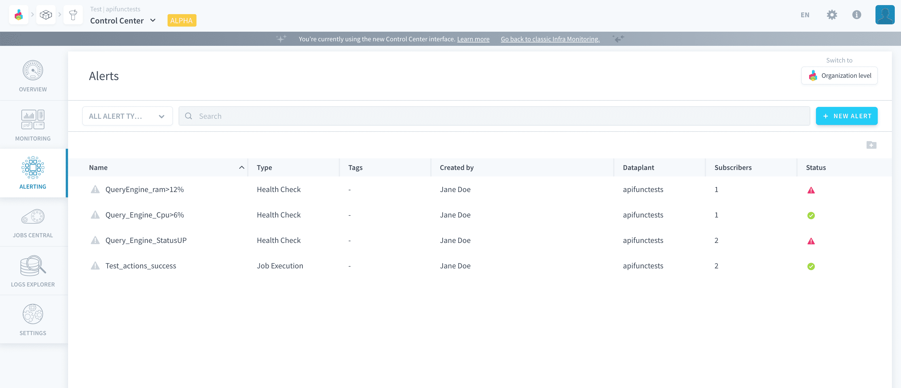
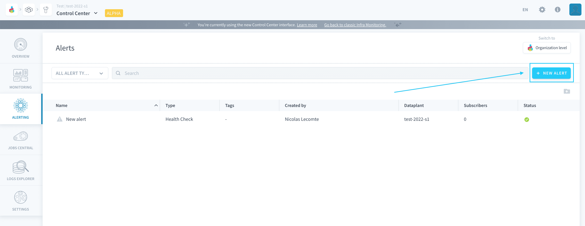
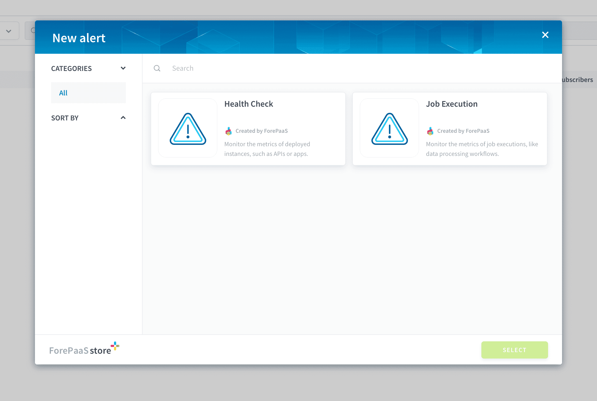
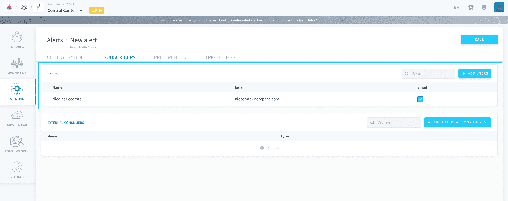
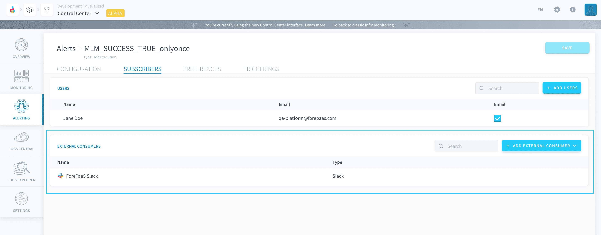

# Alerts

Alerts on the Platform can be set on either the execution of jobs (like [Data Processing Engine workflows](/en/product/dpe/workflows/index)), or on long-running deployments (like [apps](/en/product/app-manager/index) or [APIs](/en/product/api-manager/index)). 

Alerts on the Platform follow a simple behavior. They are automatically triggered once a **trigger condition on a target**, evaluated every minute by the Platform, has been met for a certain duration (which can be configured per alert). This logs a **triggering** of the corresponding alert, at which moment it will send a notification to all **linked subscribers**. Alerts stay active until their resolution, which happens automatically as soon as the evaluated trigger condition is no longer verified: this stops the triggering and reverts the alert to its dormant watching state.

Alerts can thus take three possible statuses:
- `watching`: this is the default status of a created alert, that is currently monitoring its target. The triggers haven't been met for long enough to fire the alert
- `active`: this is the status of the alert when it is firing: the trigger conditions have been met for the specified waiting duration
- `error`: the alert's status has failed to be retrieved

Creating alerts on the Platform is a two-step process: first, the alert needs to be created with a monitored target and triggers. Then, subscribers (who will receive the notifications) must be linked to the alert.

- [Create an alert](#create-an-alert)
- [Add subscribers to an alert](#add-subscribers-to-an-alert)
  -  [Subscribe individual users to an alert](#subscribe-individual-users-to-an-alert)
  -  [Subscribe external consumers](#subscribe-external-consumers)

---
## Create an alert

To create an alert from the Control Center, click on **New alert** in the top right.

Select the type of alert in the store:
- **Job execution**: set an alert on the execution metrics (status, max RAM, etc.) of a job
- **Health check**: set an alert on the status or metrics of a deployment (uptime, CPU usage, etc.)

> After you create an alert, it may take up to a couple of minutes before it is completely operational.

Learn how to configure an alert's target and triggering conditions in the articles below: 

{Configure a job execution alert}(#/en/product/cc/alerting/execution)
{Configure a health check alert}(#/en/product/cc/alerting/health)

---
## Add subscribers to an alert

Subscribers are the receivers of the alert notifications sent when the trigger conditions (and triggering options) of the alert are met. They can be either [individual users](#subscribe-individual-users-to-an-alert) or [external consumers](#subscribe-external-consumers).

### Subscribe individual users to an alert

In the Subscribers tab of the alert, find the panel *Users*. This table lists all the users in your organization that are currently subscribed to the alert - meaning they will be notified of the alert on their [account](/en/product/organisations/profile.md)'s email address.

To link a new user, click on **Add users** in the top right. 

You can either add existing users from your organization, or whole new users. If you add a new user, they will automatically be added in your organization as simple users with no permission. Don't forget to [grant them access to the Projects](/en/product/organisations/organization-invite-user?id=manage-member-permissions-in-your-organization) if you want them to access the alert's page on the Platform after receiving alert emails.

!> New subscribed users won't be able to receive notifications until they verify their email address.

### Subscribe external consumers

In the Subscribers tab of the alert, find the panel *External Consumers*. This table lists all the connected consumers (like Slack or MS Teams channels) that receive notifications whenever your alert is triggered.

External consumers **can be reused from one alert to another** within the same Project. You can manage the list of registered external consumers in the **Settings** page of the Control Center. 

The following consumers are currently available:
- [Slack](#subscribe-a-slack-channel-to-an-alert)
- [Microsoft Teams](#subscribe-a-microsoft-teams-channel-to-an-alert)
- [AWS SNS](#subscribe-an-aws-sns-topic-to-an-alert)
- [Opsgenie](#subscribe-opsgenie-to-an-alert)
- [Custom webhook](#subscribe-a-custom-webhook-to-an-alert)

To create an external consumer, either click on **Add external consumer** from an alert's preferences page or directly from the Settings page.

#### Subscribe a Slack channel to an alert
Use this integration to send alert notifications to a Slack channel.

{Subscribe a Slack channel}(#/en/product/cc/alerting/consumers/slack)

#### Subscribe a Microsoft Teams channel to an alert
?> This integration is coming soon!

#### Subscribe an AWS SNS topic to an alert
Use this integration to send alert notifications to an AWS SNS topic.

{Subscribe an SNS topic}(#/en/product/cc/alerting/consumers/sns)

#### Subscribe Opsgenie to an alert
Use this integration to send alert notifications to Opsgenie.

{Subscribe an Opsgenie team}(#/en/product/cc/alerting/consumers/opsgenie)

#### Subscribe a custom webhook to an alert
Use a custom webhook subscriber to register generic external alert consumers that are not yet natively supported by ForePaaS.

{Subscribe a custom webhook}(#/en/product/cc/alerting/consumers/webhook)

---
## Need help? 🆘

> At any step, you can create a ticket to raise an incident or if you need support at the [OVHcloud Help Centre](https://help.ovhcloud.com/csm/fr-home?id=csm_index). Additionally, you can ask for support by reaching out to us on the Data Platform Channel within the [Discord Server](https://discord.com/channels/850031577277792286/1163465539981672559). There is a step-by-step guide in the [support](/en/support/index.md) section.