# Logs Explorer

The Logs Explorer is a comprehensive tool to **query and export logs from job executions and live deployments** on the ForePaaS Platform.

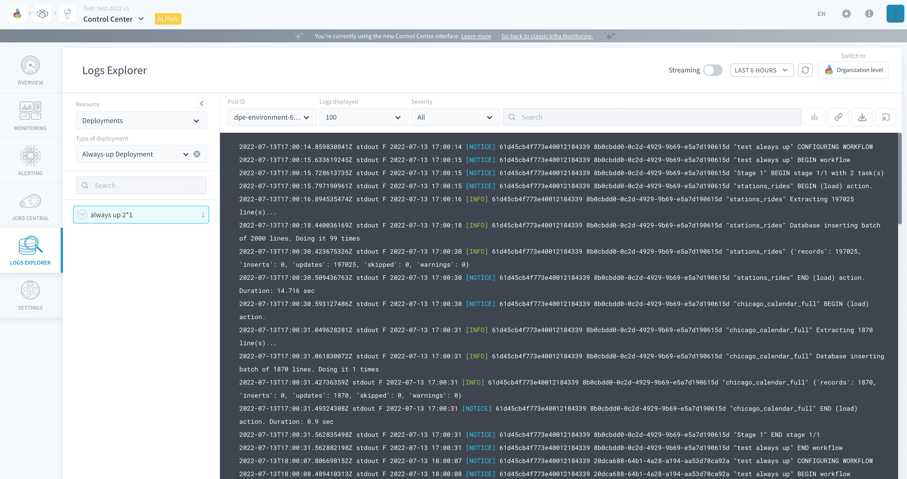

Like all subcomponents in the Control Center, the Logs Explorer can be opened at the level of the organization. However, logs exploration will only be possible inside a specific Project. If the Logs Explorer is opened at the level of one Project, then this field cannot be edited.

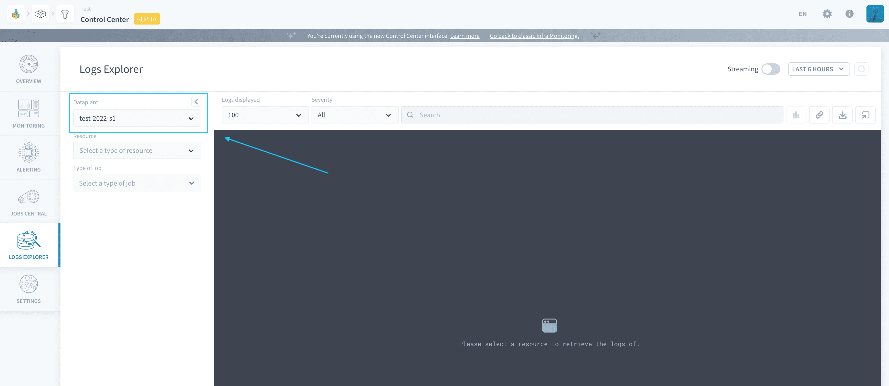

- [Get logs](/en/product/cc/logs/index?id=get-logs)
  - [Get logs of past job executions](/en/product/cc/logs/index?id=get-logs-of-past-job-executions)
  - [Get logs of deployments](/en/product/cc/logs/index?id=get-logs-of-deployments)
  - [Use the streaming mode](/en/product/cc/logs/index?id=use-the-streaming-mode)
- [Filter logs](/en/product/cc/logs/index?id=filter-logs)
  - [Search in logs](/en/product/cc/logs/index?id=search-in-logs)
  - [Severity](/en/product/cc/logs/index?id=severity)
  - [Timestamp](/en/product/cc/logs/index?id=timestamp)
- [Share logs](/en/product/cc/logs/index?id=share-logs)
  - [Share an Explorer link](/en/product/cc/logs/index?id=share-an-explorer-link)
  - [Export a log file](/en/product/cc/logs/index?id=export-a-log-file)

---
## Get logs
### Get logs of past job executions

The Logs Explorer allows you to check the logs of:

- [Data Processing Engine actions](/en/product/dpe/actions/index) job executions
- [Data Processing Engine workflows](/en/product/dpe/workflows/index) job executions
- [Machine Learning dataset generation](/en/product/ml/pipelines/execute/index?id=dataset-generation-jobs) jobs
- [Machine Learning training](/en/product/ml/pipelines/execute/index?id=training-jobs) jobs
- [Machine Learning testing](/en/product/ml/pipelines/execute/index?id=testing-jobs) jobs
- [Data Manager metadata extract](/en/product/data-manager/analyzer/extract-metadata) jobs
- [Data Manager physical build](/en/product/data-manager/tables/table_interactions?id=build-table) jobs

Choose *Jobs* as the **Resource** on the left column.

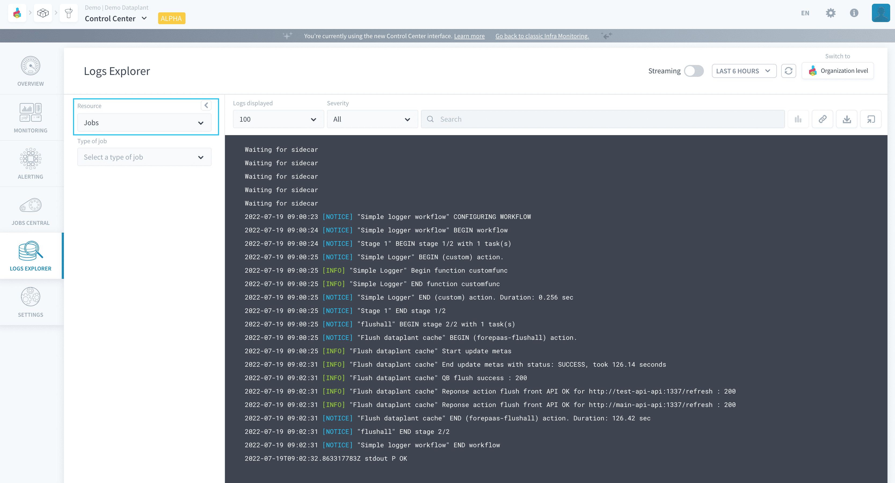

Choose the **type of jobs** to explore.

By default, the Logs Explorer will display the logs for all jobs matching this type. You can drill-down on a specific object in the bottom left list - ranked by number of executions.

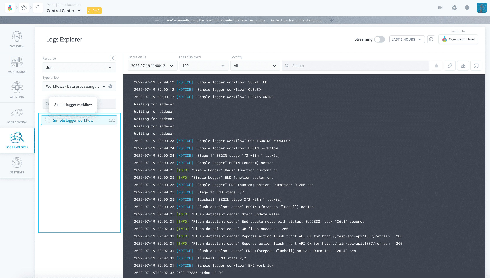

You can drill-down further by filtering on a specific **execution ID** or a specific time-range above the display.

!> Make sure that the execution that you want to display is contained in the time-range that you are filtered on.

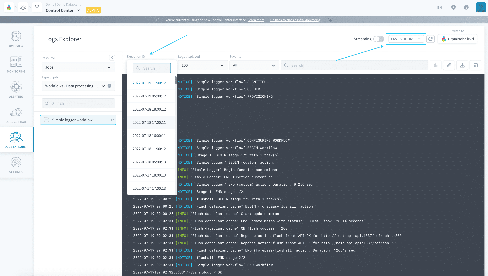

> Note that logs will be queried by successive batches of at most 250 logs. Scroll down in the console to load more logs.

### Get logs of deployments

The Logs Explorer also allows you to check the logs of:

- [APIs](/en/product/api-manager/index)
- [Applications](/en/product/app-manager/index) 
- [Model APIs](/en/product/ml/pipelines/configure/deployment/index) 
- [Notebooks](en/product/ml/notebooks/index)
- [Always-up deployments in the Data Processing Engine](/en/product/dpe/actions/settings/index?id=always-up)
- [Query engines](/en/product/am/resources) 
- The *App Service* component: an infrastructure service to control APIs and apps

Choose *Deployments* as the **Resource** on the left column.

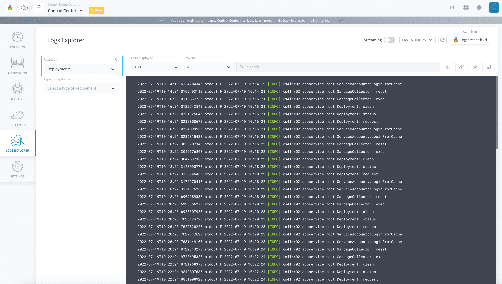

Choose the **type of deployment** to explore.

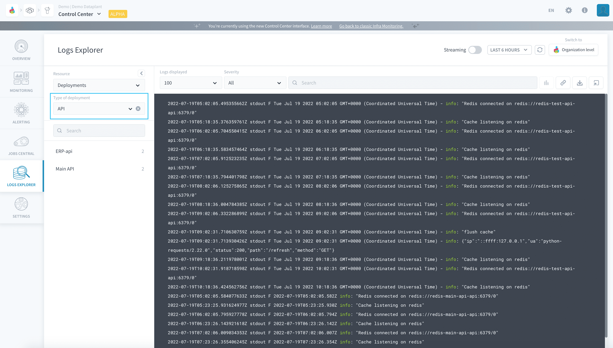

By default, the Logs Explorer will display the logs for all deployments matching this type. You can drill-down on a specific object in the bottom left list - ranked by number of active workers. By default, the logs of all workers for that deployed object are aggregated altogether in the display.

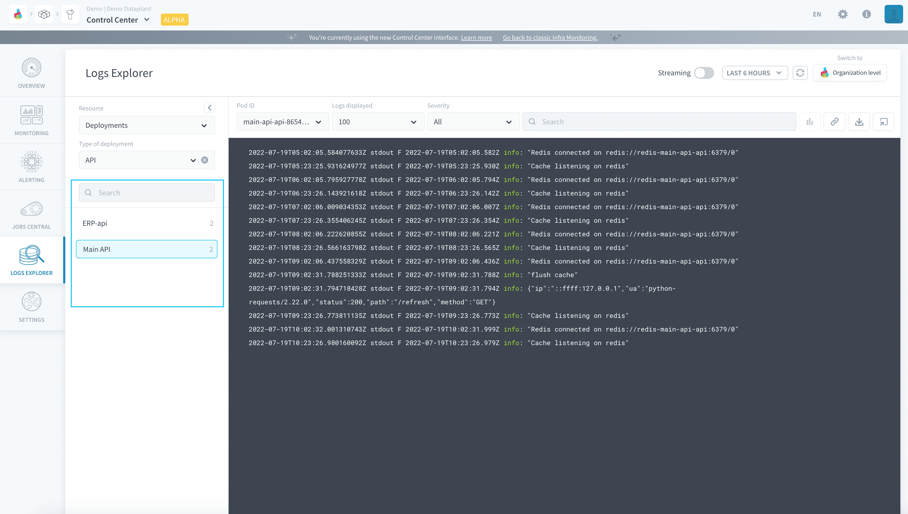

You can drill-down further by filtering on a specific **worker ID** or a specific time-range above the display.

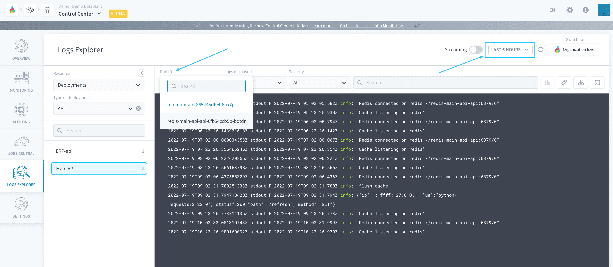

> Note that logs will be queried by successive batches of at most 250 logs. Scroll down in the console to load more logs.

### Use the streaming mode

By default, the Logs Explorer must be refreshed manually to display new logs.

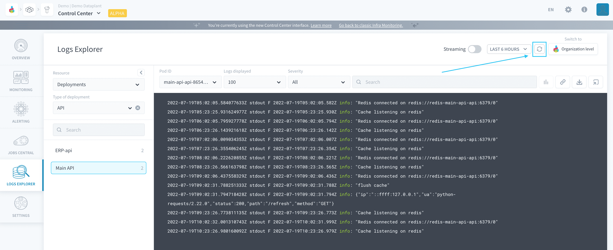

Activate the **streaming mode** to receive the latest logs in real time.

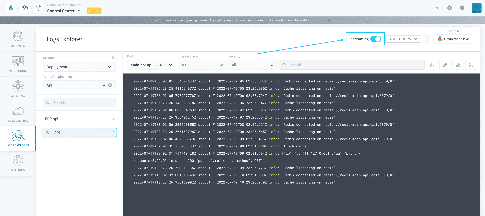

---
## Filter logs
### Search in logs
To filter down your log result, it is possible to either search for an exact substring or to match to a [regular expression (Regex)](https://en.wikipedia.org/wiki/Regular_expression) using the search bar above the console. Searching something in the searchbar will **run a new log query on the whole timeframe** and return the logs matching the search filters.

By default, simply typing text in the searchbar will search for all logs containing this substring, ignoring lowercase/capital letters.  

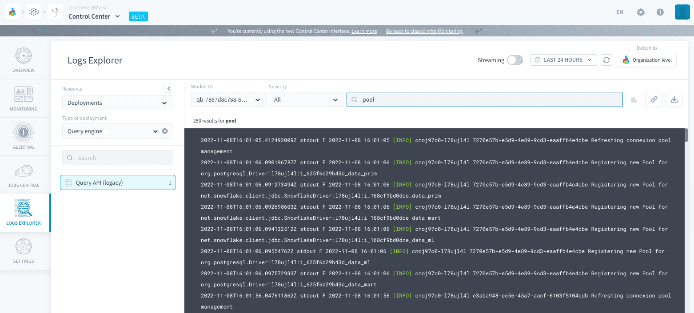

Alternatively, it is possible to start your search with any of the following operators:
- `=` followed by text: search for all logs containing this substring (case sensitive)
- `!=` followed by text: search for all logs not containing this substring (case sensitive)
- `~` followed by a regex: search for all logs matching the regular expression
- `!~` followed by a regex: search for all logs that don't match the regular expression

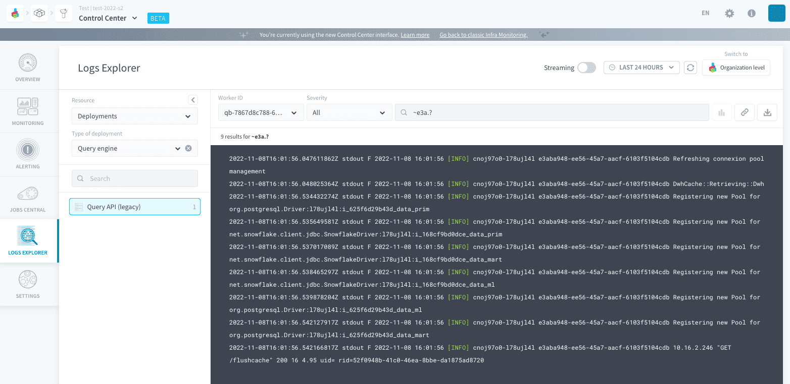

### Severity

Logs have different level of severity - ranged from *INFO* to *CRITICAL* - to filter on.

> If you don't see all the levels that you should be seeing, make sure your jobs are [configured to export the correct level](/en/product/dpe/actions/settings/index?id=logs-level) of logs.

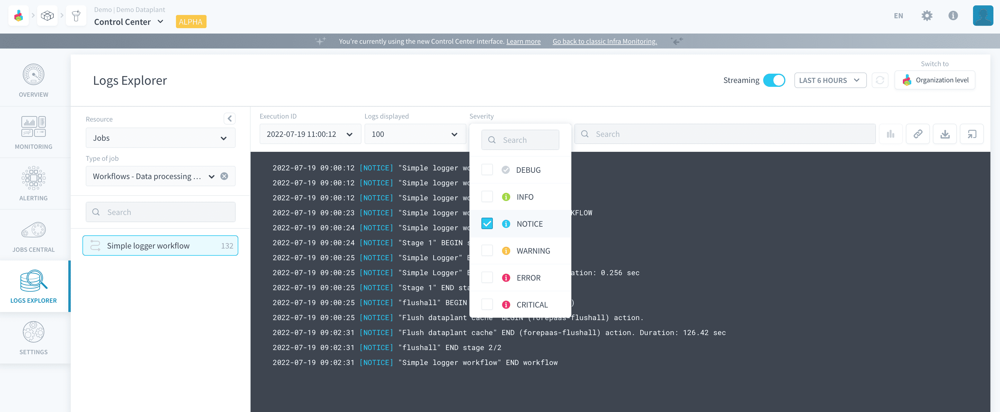

### Timestamp

As mentioned above, logs are all associated to a specific timestamp, so they can be filtered on a time-range. For jobs execution logs, it is also possible to filter on one specific execution.

---
## Share logs
Logs can be shared in one of two ways: by sharing the link to the Logs Explorer or by exporting a text file containing the logs.

### Share an Explorer link
Click on the **link** icon to get a link for the page with the current filter configuration.

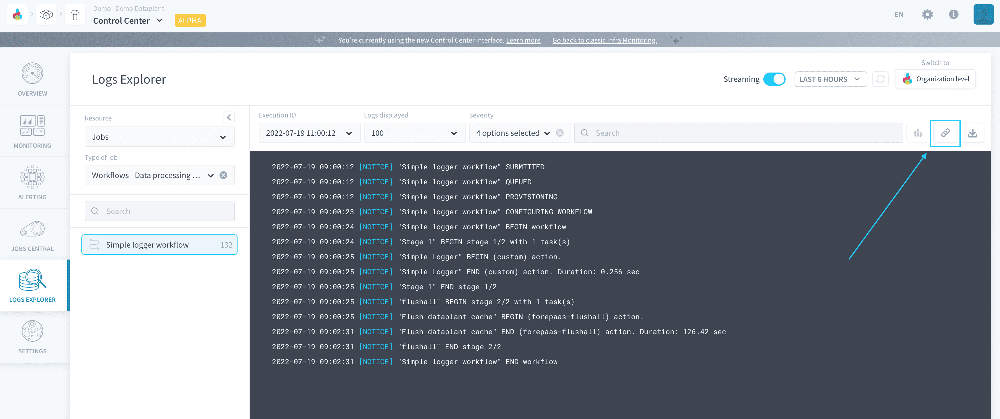

### Export a log file
Click on the **export** icon to download a .log file containing the logs currently displayed in the UI.

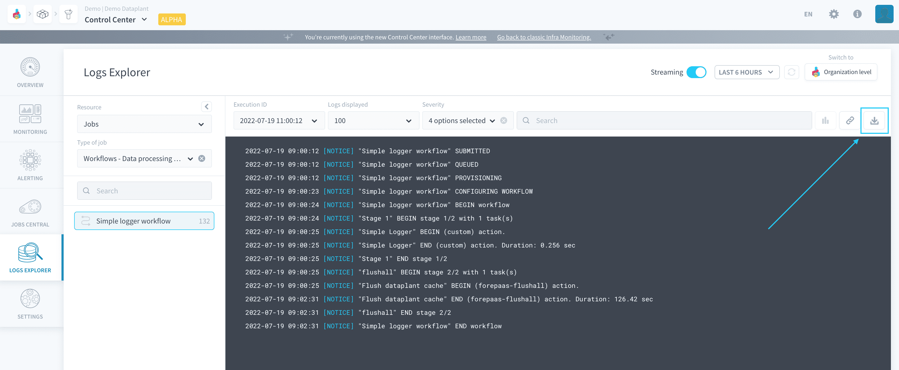

?> Share those log files to the ForePaaS Support team whenever you need help debugging a Project on ForePaaS.

---
## Need help? 🆘

> Feel free to reach out to us by sending us a request via *Support* on the ForePaaS Platform and we'll make sure to help you out with the best solution 😊  

{You can even send your questions directly by clicking here 👨🏻‍💻}(mailto:support.forepaas.com)