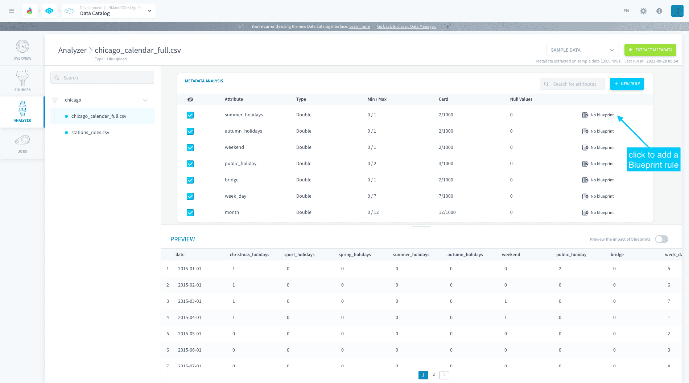
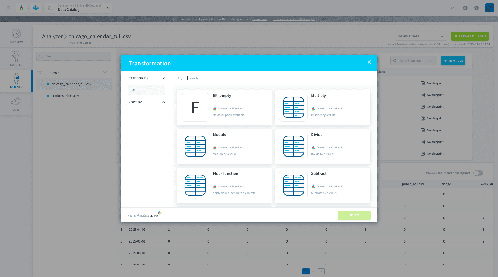
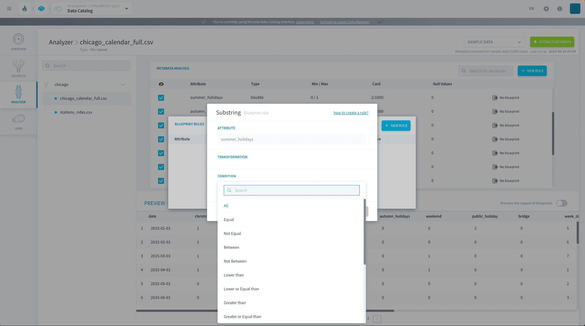
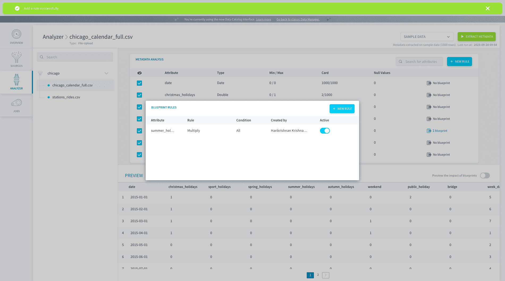

# Add blueprint rules to a source

the Platform provides default "blueprint rules" which consist of simple cleaning logic (like dates formatting, thousands of separators, etc.) to help users run simple data preparation. You can choose from available transformations in the Platform store and apply them if the applied condition is met.

It is not mandatory to use blueprint rules when using the platform. If used, the rules will be added automatically to the [Data Processing Engine Load actions](/en/product/dpe/actions/load/index) you will define to ingest the data inside your [storage engine](/en/product/project/storage-engine/index).

* [Configuring blueprint rules](#configuring-blueprint-rules)
* [Transformations](#transformations)
* [Conditions](#conditions)

---

## Configuring blueprint rules

Rules require 3 steps to be configured:
1. **Information:** Name of the attribute
2. **Transformation:** If the condition is confirmed, which transformation action to apply to the data (can be chosen from the Platform store)
3. **Condition:** which rule to apply for the condition

To add a rule on an attribute, on the relevant field, click on the following button: 

---

## Transformations

Different **transformations** are available in the Platform store: 

* *Replace by*: Replaced values by a single value

* *Substring*: Values will be truncated

* *Date format*: Replace date formats  

* *Keep line*: Keep matching values

* *Skip line*: Skip matching values 

* *Throw error*: Matching values will trigger an error

* *Replace substring*: Replace matching substrings   

* *Apply regexp*: A new regexp will be applied to matching values

* *Stop workflow*: Stop the ongoing workflow

---

## Conditions

Different **conditions** are available:

The Platform provides you a variety of Conditions you can apply to your chosen transformation. The list includes the following –

*Equal*, *Not Equal*, *Between*, *Not Between*, *Lower than*, *Lower or Equal than*, *Greater than*, *Greater or Equal than*, *REGEXP*, *NOT REGEXP*, *Is a number*, *Is not a number*, *Is a date*, *Is not a date*, *Is null*, *Is not null*

?> Once the transformation and condition are set, the rule will be applied to the selected attribute. 🙌🏻

{Learn more about blueprint rules}(#/en/product/data-catalog/analyzer/more-about-blueprints.md)