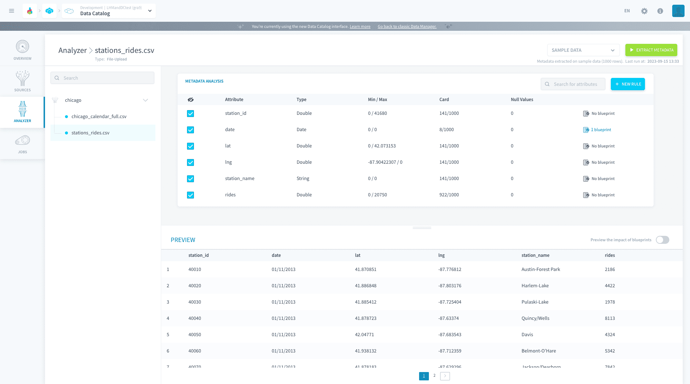
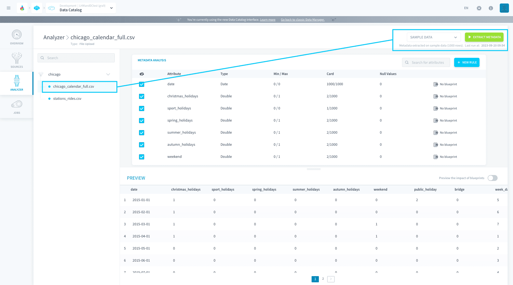
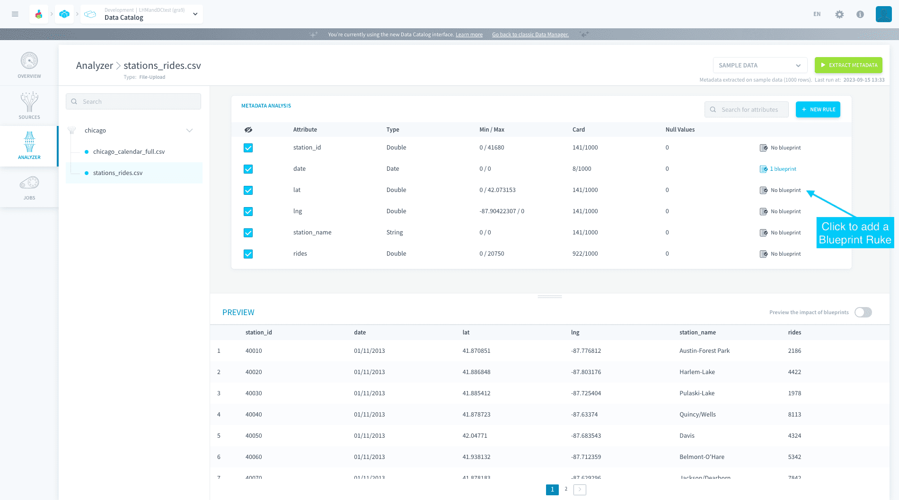

# Extract the metadata of a source

To extract the metadata of a source for the first time, simply select a source object on the left-hand panel. This will parse a sample of 1,000 rows from the source to obtain the following information:
- attribute names
- attribute types
- attribute minimum and maximum values
- attribute card., i.e. the number of unique values in the sample
- attribute null values

To extract the metadata of a source again, you can click on the **Extract Metadata** button at the top right. Further, choose *Sample data* or *Complete data* to extract on the first 1,000 rows or on the entire table respectively. 

> A *complete* metadata extraction can take a while depending on the size of the selected table 💡

!> If your metadata extraction fails, investigate why by checking out the **logs in the Jobs tab** in the Data Catalog.

Once the meta are extracted, you can start working to set standard structure formats for your data by adding blueprint rules to any attribute.

{Learn how to add blueprint rules}(#/en/product/data-catalog/analyzer/add-blueprint-rules)
