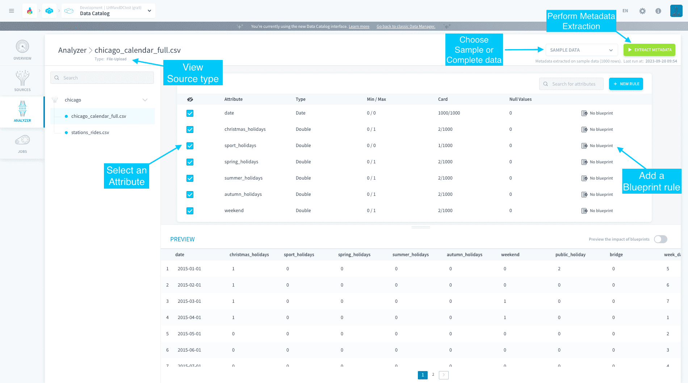

# Analyzer

The Analyzer carries out the first step of **data quality and control** on your sources before the data is even loaded in your Platform databases.

The Analyzer allows you to perform the following tasks:

* **Metadata Extraction:** Metadata are structured sets of data providing information on your actual source data. 

* **Blueprint Rules Management:** The Blueprints correspond to a set of cleaning rules that can be applied to a data source, in order to set structure standards for your data.

{Learn how to extract metadata}(#/en/product/data-catalog/analyzer/extract-metadata)

{Learn how to add blueprint rules}(#/en/product/data-catalog/analyzer/add-blueprint-rules)

---
###  Need help? 🆘

> At any step, you can ask for support by reaching out to us on the Data Platform Channel within the [Discord Server](https://discord.com/channels/850031577277792286/1163465539981672559). you can also find a step by step guide towards joining our discord server in the [support](#en/support/index.md) section.