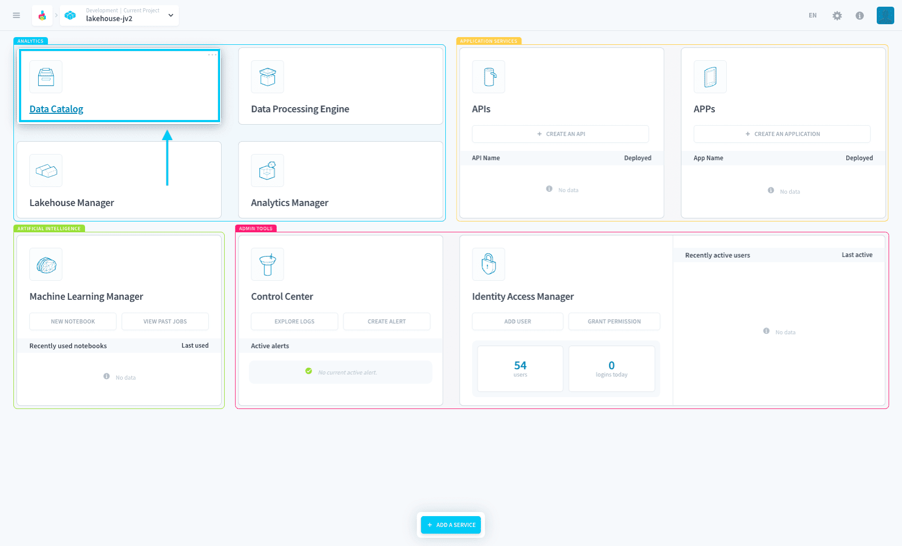

# Data Catalog

The Data Catalog is the **central repository for all your Project's data Sources**.

It allows you to manage all your sources by letting you connect to your [data sources](en/product/data-catalog/sources/index), [analyze](en/product/data-catalog/analyzer/index) them, and add [blueprint rules](en/product/data-catalog/analyzer/add-blueprint-rules) for setting formatting standards.

As the Data Catalog is one of the main components and has vast features, it can be a little difficult for first-timers to understand its full usage well. 

Fortunately, we have prepared a detailed tutorial explaining each sub-component!

{Check-out the Data Catalog's key concepts}(#/en/product/data-catalog/understanding-data-catalog-further)

---

###  Need help? 🆘

> At any step, you can create a ticket to raise an incident or if you need support at the [OVHcloud Help Centre](https://help.ovhcloud.com/csm/fr-home?id=csm_index). Additionally, you can ask for support by reaching out to us on the Data Platform Channel within the [Discord Server](https://discord.com/channels/850031577277792286/1163465539981672559). There is a step-by-step guide in the [support](/en/support/index.md) section.