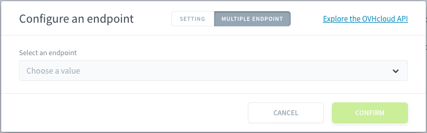

# OVHcloud API

**OVHcloud API** is a RESTful API that enables you to automate your OVH configuration by providing programmatic access to all OVHcloud products and services. With this API, you can manage your services as easily as through the OVH Control Panel.

- [API Overview](#api-overview)
- [Configure your source](#configure-your-source)
   - [API connection details](#api-connection-details)
   - [Authentication setup](#authentication-setup)
- [Specify endpoints to load data](#specify-endpoints-to-load-data)
   - [Single endpoint configuration](#single-endpoint-configuration)
   - [Multiple endpoint configuration](#multiple-endpoint-configuration)
   - [Best practices](#best-practices)
- [API usage guidelines](#api-usage-guidelines)
- [OVH API Console](#ovh-api-console)

---
## API Overview

The OVHcloud API follows REST principles:
* Uses standard HTTP methods (GET, POST, PUT, DELETE)
* Resources are accessed via unique URLs
* Is stateless - each request contains all necessary information

---

## Configure your source

To set up the OVHcloud API source, you'll need to provide the following information:

### API Connection Details
**OVH Region**: Select your OVH region (Europe, US, Canada)  
**Application key**: Your OVH API application key  
**Application secret**: The secret associated with your application  
**Consumer key**: Your consumer key for authentication  

> You can also find the guide here on how to [get started with OVHcloud API](https://help.ovhcloud.com/csm/en-gb-api-getting-started-ovhcloud-api?id=kb_article_view&sysparm_article=KB0042784#advanced-usage-pair-ovhcloud-apis-with-an-application)

To get your credentials:
1. Visit the [OVH API creation page](https://api.ovh.com/createToken/)
2. Sign in with your OVH account
3. Fill in the application name and description
4. Set the validity period
5. Define the required access rights

### Authentication setup

The OVH API uses a 3-key authentication system:

1. **Application Key (AK)**:
   * Identifies your application
   * Public identifier
   * Generated when you register your application

2. **Application Secret**:
   * Private key used to sign requests
   * Must be kept secure
   * Never transmitted in API calls

3. **Consumer Key (CK)**:
   * Similar to an OAuth token
   * Defines your application's permissions
   * Can be revoked without changing your application key/secret

Once you have entered all the details, click on connect to successfully configure your connector.

---
## Specify endpoints to load data from

After configuring your authentication, you'll need to set up the endpoints you want to connect to. Each endpoint will correspond to a data source object that can be loaded into a distinct table.

### Single Endpoint Configuration

To configure an endpoint, you'll need to specify:

1. **Basic Settings**:
   - **Method**: Select the HTTP method (GET, POST, etc.)
   - **Endpoint**: Base endpoint is automatically set based on your selected region during connector setup (e.g., ovh-eu for Europe)
   - **Path**: Specific API path (e.g., `/me/bill`)

2. **Parameter Types**:
   - **Path Parameters**: Path parameters are automatically added to the list when you include them in the path. For example, when you enter `/me/bill/{billId}` into the path, `billId` is automatically added as a parameter below, where you can assign its value.

   - **Query-String Parameters**: Add query parameters to filter or customize your request. For example: Key:`date.from` - Value:`2024` to filter bills from 2024.

   - **Options**: Configure additional settings. For example, set a custom technical name for your source object (e.g., "bill-from-2024").

3. **Examples**: View and use predefined endpoint configurations.
   - Click on any example to automatically populate all relevant fields. Click on the 'Reset" button to clear the filled in example.
   - Available examples include:
     - `GET - /me/bill/{billId}`
     - `GET - /me/bill/{billId}/details`
     - `POST - /me/document`
     - `GET - /allDom/{serviceName}/domain`

### Multiple Endpoint Configuration

The multiple endpoint feature is automatically triggered when you include a path parameter in your endpoint URL (e.g., when you add "{billId}" to your path). This feature enables you to fetch related data across multiple endpoints using the same parameter.

When triggered:
1. The interface will switch to show the **MULTIPLE ENDPOINT** tab
2. You can select previously configured endpoints
3. Map the path parameters between endpoints

> **Note**: For detailed implementation examples of multiple endpoints, particularly for billing scenarios, please refer to our comprehensive [Billing Implementation Guide]() in the documentation. This guide provides step-by-step instructions and real-world examples of how to effectively use multiple endpoints.

### Best Practices

1. **Using Examples**:
   * Browse the EXAMPLES tab for common endpoint patterns
   * Click an example to automatically populate all fields
   * Modify the pre-filled values as needed for your use case

2. **Path Parameters**:
   * Adding curly braces {} around parameters (e.g., {billId}) automatically enables multiple endpoint functionality
   * Ensure parameter names match across related endpoints
   * Test parameters with sample values before confirming

3. **Technical Names**:
   * Choose clear, descriptive names for your source objects
   * Include relevant identifiers (e.g., year, service type)
   * Avoid special characters in technical names

---

## API Usage Guidelines

1. **Security**:
   * Never share your Application Secret
   * Rotate your credentials periodically
   * Use the minimum required permissions for your use case
   * Store credentials securely
   * Use HTTPS for all API calls

2. **Rate Limiting**:
   * Global limit: 20 calls per second
   * Per-API limits may apply for specific endpoints
   * Implement exponential backoff for retries
   * Monitor your API usage through OVH's console

3. **Error Handling**:
   * 400: Bad Request - Check your request parameters
   * 403: Unauthorized - Verify your credentials and permissions
   * 404: Not Found - Verify the resource exists
   * 429: Too Many Requests - Implement rate limiting
   * 500: Internal Server Error - Contact OVH support

---

## OVH API Console

The **[OVH API Console](https://eu.api.ovh.com/console)** is an interactive web-based interface that allows you to explore and test OVHcloud API endpoints without writing code. It provides a user-friendly way to execute API calls, inspect responses, and debug requests.

### Key Features:
- **Browse API Endpoints**: View available OVHcloud API services and their parameters.
- **Execute API Calls**: Test GET, POST, PUT, and DELETE requests directly from the console.
- **Authenticate with Your Account**: Use your **Application Key**, **Application Secret**, and **Consumer Key** to make authenticated requests.
- **Inspect API Responses**: View JSON responses, HTTP status codes, and request details.
- **Generate API Requests**: Copy pre-built API request formats for integration into your applications.

### How to Use the API Console:
1. **Access the Console**: Visit [OVH API Console](https://eu.api.ovh.com/console).
2. **Select an API Endpoint**: Browse the API categories or search for a specific function.
3. **Authenticate**:
   - Click **Authenticate** in the top right corner.
   - Enter your **Application Key** and generate a **Consumer Key** if needed.
4. **Set Request Parameters**: Fill in required fields such as path and query parameters.
5. **Execute the Request**: Click **Run** to send the request and view the response.
6. **Review the Response**: Inspect returned data, error messages, and response headers.

> **Tip**: The API Console is ideal for testing before automating API calls in your application.

---

##  Need help? 🆘

> At any step, you can create a ticket to raise an incident or if you need support at the [OVHcloud Help Centre](https://help.ovhcloud.com/csm/fr-home?id=csm_index). Additionally, you can ask for support by reaching out to us on the Data Platform Channel within the [Discord Server](https://discord.com/channels/850031577277792286/1163465539981672559). There is a step-by-step guide in the [support](/en/support/index.md) section.