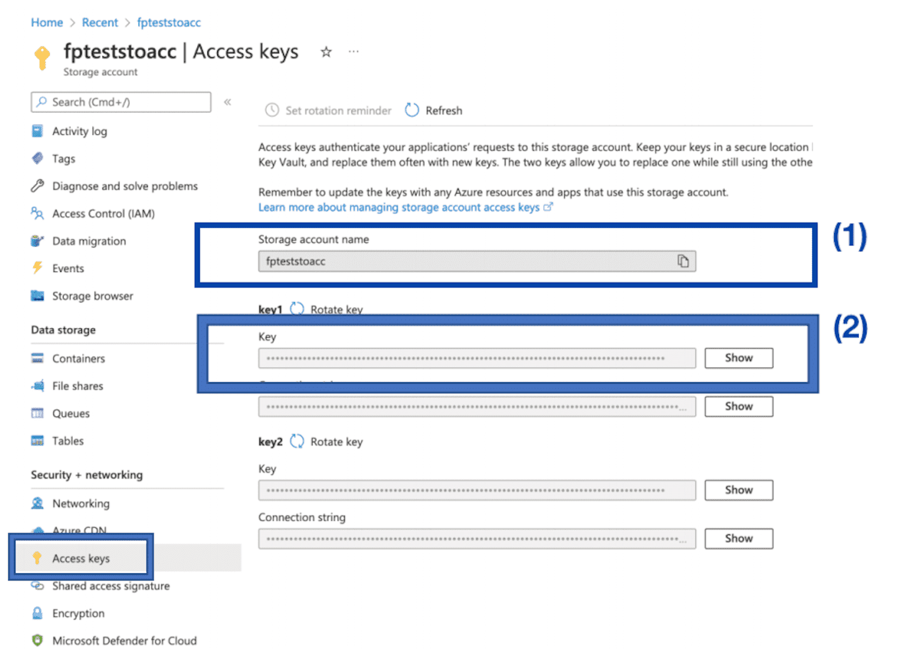

# Microsoft Azure Blob Storage

The Microsoft Azure Blob Storage connector lets you retrieve files stored in Microsoft Azure's object storage system: [Azure Blob Storage](https://azure.microsoft.com/en-us/services/storage/blobs/). 

* [Get your access credentials from Azure](#get-your-access-credentials-from-azure)
  * [Get your storage account name and key](#-your-storage-account-name-and-key)
    * [Create a new storage account](#create-a-new-storage-account)
  * [Get your blob container name](#get-your-blob-container-name)
    * [Create a new blob container](#create-a-new-blob-container)
* [Add a Microsoft Azure Blob Storage source on the Platform](#add-a-microsoft-azure-blob-storage-source-on-the-platform)
  * [Configuration screen overview](#configuration-screen-overview)
  * [Configuring your source](#configuring-your-source)
    * [Connect to Microsoft Azure Blob Storage](#connect-to-microsoft-azure-blob-storage)

---
## Get your access credentials from Azure

You need to obtain the following information from Azure:
- the name of the Azure storage account to connect to
- a key for this storage account
- the name of the blob container to connect to

### Get your storage account name and key

On the Microsoft Azure console, open the **storage account** that you want to connect to and open the *Access keys* tab.

Retrieve the following information:
- *storage account name*
- *key*

!> If you are on a [Dedicated plan](/en/product/billing/plans/add-subscription) with a self-hosted cluster, you shouldn't connect to the resource group/storage account dedicated to the Platform resources. 

If you don't have a separate storage account yet, use the below documentation to create one.

#### Create a new storage account

To create a new [Microsoft Azure storage account](https://docs.microsoft.com/en-us/azure/storage/common/storage-account-overview?toc=%2Fazure%2Fstorage%2Fblobs%2Ftoc.json) from the Microsoft Azure console, select *Storage accounts* and click on **Create**.

Follow the steps to add a storage account filling in the required fields and custom settings. The *storage account name* will be needed to connect from the Platform.

!> If you are on a [Dedicated plan](/en/product/billing/plans/add-subscription) with a self-hosted cluster, you shouldn't use the resource group dedicated to the Platform resources. 

Once your storage account is created, go back to the first steps up above to retrieve its name and key.

### Get your blob container name

In the Microsoft Azure console, open the *Storage browser* tab.

In the service account you just used, open the section *Blob containers*.

If you have an existing container that you want to use, retrieve its *name* at this step. Else, create a new container.

#### Create a new blob container

Click on **Add container**. The *name* you fill in will be needed to connect from the Platform. 

---
## Add a Microsoft Azure Blob Storage source on the Platform

### Configuration screen overview

Once you have found *Microsoft Azure Blob Storage* in the **Platform store**, click on *Select* and you will be able to see the configuration screen as shown below:

### Configuring your source

#### Connect to Microsoft Azure Blob Storage

When creating the source, you will be required to input the following information :

- **Account name**: the name of the storage account obtained [here](#get-your-storage-account-name-and-key)
- **Account key**: the key for this storage account obtained [here](#get-your-storage-account-name-and-key)
- **Container name**: the name of the blob container obtained [here](#get-your-blob-container-name)
- **Path of files** *(optional)*: the full path of a specific folder or file to connect to

Once you add the above details click on **Connect** to establish a connection with Microsoft Azure Blob Storage. 

?> If everything works successfully, you should see the list of parsed files appearing on the page. This may take up to a few seconds.

To finish, click on the **Create** button on the top right-hand corner.

!> Don't forget to name your source before creating it. The technical name cannot be changed after creating the source and will be used when trying to access the source using the [SDK](/en/technical/sdk/dpe/index).

---
##  Need help? 🆘

> At any step, you can create a ticket to raise an incident or if you need support at the [OVHcloud Help Centre](https://help.ovhcloud.com/csm/fr-home?id=csm_index). Additionally, you can ask for support by reaching out to us on the Data Platform Channel within the [Discord Server](https://discord.com/channels/850031577277792286/1163465539981672559). There is a step-by-step guide in the [support](/en/support/index.md) section.
