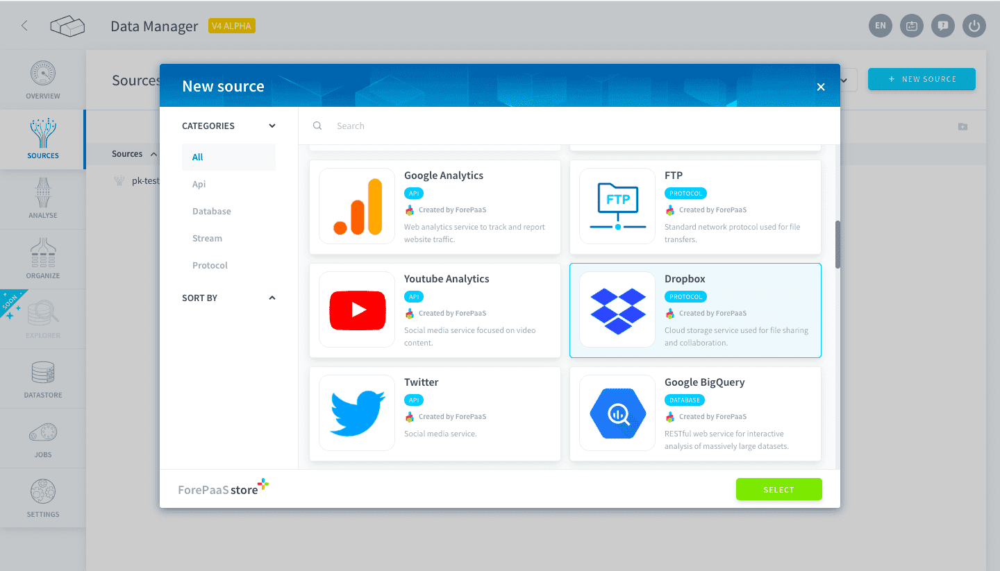
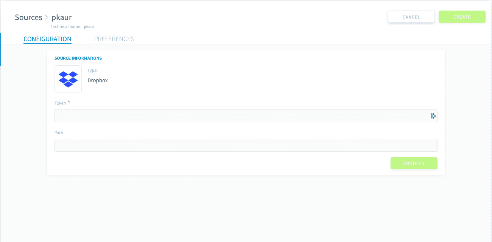
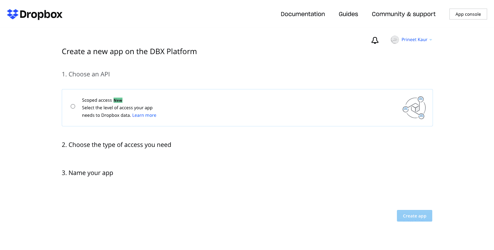
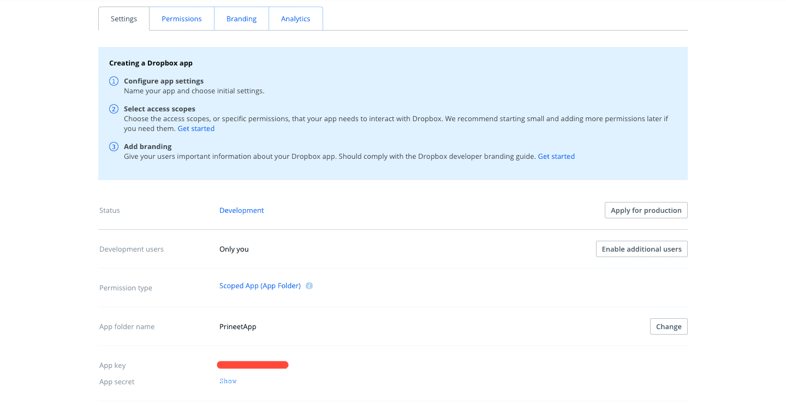
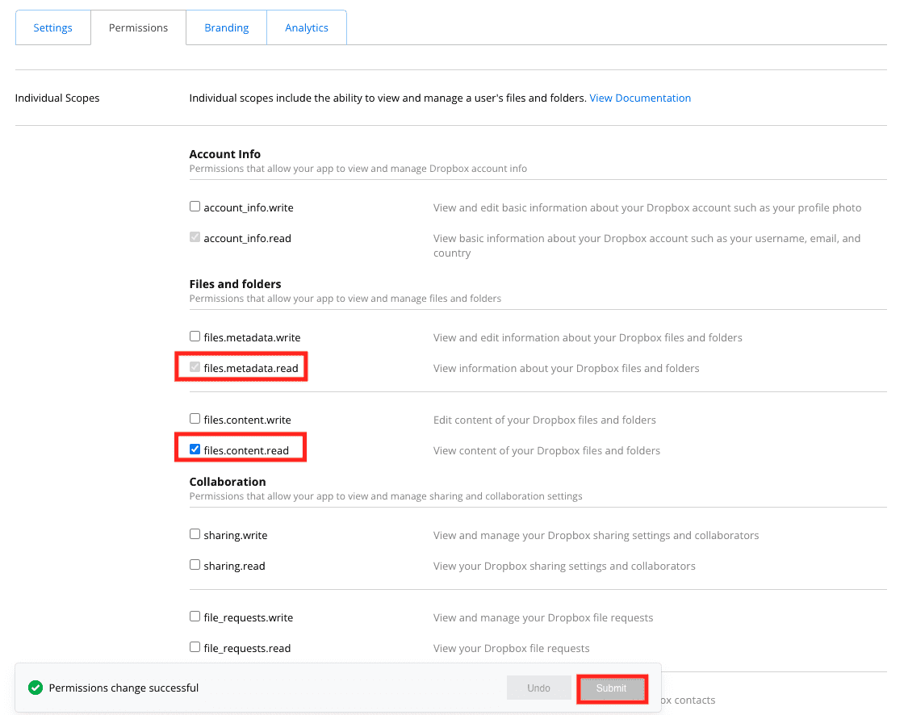
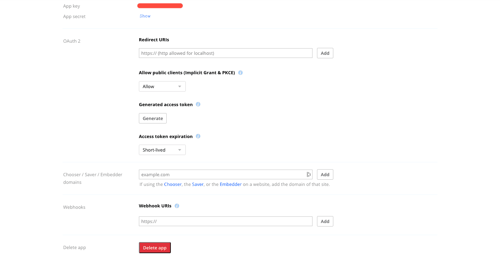

# Dropbox

Dropbox is a cloud storage service used for file sharing and collaborative work. The Platform allows you to collect data you stored on Dropbox and import it directly into your platform. 

* [Add a Dropbox source on the Platform](#add-a-dropbox-source-on-the-platform)
  * [Configuration screen overview](#configuration-screen-overview)
  * [Learn how to get a Dropbox token](#learn-how-to-get-a-dropbox-token)
  * [Configuring your source](#configuring-your-source)

---

## Add a Dropbox source on the Platform 

### Configuration screen overview

Once you have found *Dropbox* in the **Platform store**, click on *Select* and you will be able to see the configuration screen as shown below -

 

### Learn how to get a Dropbox token

* Go to https://www.dropbox.com/developers/apps/create

You will see the below screen to Create an App –

* Do the following steps –

   1. Choose an `API`

   2. Choose the type of access you need - `App Folder` or `Full Dropbox` 

   3. Give your app a `Name`

   4. Click on `Create app` 
 

* Once your application has been created, you will be redirected to the settings page – 

* Go into the `Permissions` tab, then make sure `files.metadata.read` and `files.content.read` permissions are enabled. Then click on Submit.

* Going back to `Settings` tb Click on `Generate` under `Generated access token` 

* Set `Access token expiration` to `No expiration`

* Copy your `token` 

### Configuring your source

When creating the source, you will be required to input the following information :

- Token: The access key to your app (generated in the previous step).
- Path: The path to the folder.

?> If the token is an application token linked to a folder, you don't need to put anything in the Path field 💡

Once you add the above details click on *Connect* and then on the *Create* button on the top right-hand corner.

!> Don't forget to name your source before creating it. The technical name cannot be changed after creating the source and will be used when trying to open the source using the [SDK](/en/technical/sdk/dpe/index).

---
##  Need help? 🆘

> At any step, you can create a ticket to raise an incident or if you need support at the [OVHcloud Help Centre](https://help.ovhcloud.com/csm/fr-home?id=csm_index). Additionally, you can ask for support by reaching out to us on the Data Platform Channel within the [Discord Server](https://discord.com/channels/850031577277792286/1163465539981672559). There is a step-by-step guide in the [support](/en/support/index.md) section.

