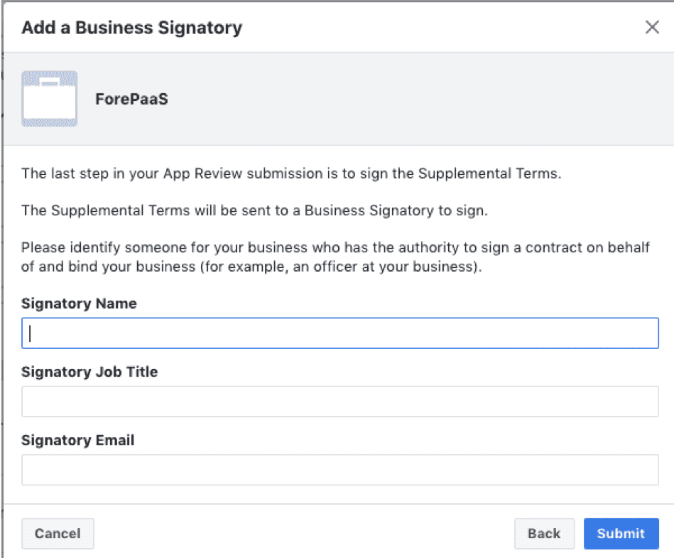

# Facebook

!> Uh oh! This article is outdated and needs to be rewritten. Please contact Support if you need help setting up this connector.

The Facebook connector lets you collect data and insights from a Facebook page into the ForePaaS Platform, such as likes, views and comments.


* [Get your access credentials](#get-your-access-credentials)
  * [Learn how to get a Facebook Developer app token](#learn-how-to-get-a-facebook-developer-app-token)
    * [Pre-requisites](#pre-requisites-app-token)
    * [Procedure](#procedure-app-token)
  * [Learn how to find your Facebook page ID](#learn-how-to-find-your-facebook-page-id)
    * [Pre-requisites](#pre-requisites-page-id)
    * [Procedure](#procedure-page-id)
* [Add a Facebook source on ForePaaS](#add-a-facebook-source-on-forepaas)
  * [Configuration screen overview](#configuration-screen-overview)
  * [Configuring your source](#configuring-your-source)
    * [Connect to Facebook](#connect-to-facebook)
    * [Add the Accounts and Endpoints](#add-the-accounts-and-endpoints)


---

## Get your access credentials

### Learn how to get a Facebook Developer app token

The following steps will guide you through the procedure of creating an app token on the Facebook Developer user interface.

#### Pre-requisites: app token

- Log into your Facebook account that has all the **Admin** permissions on the Pages you want the access tokens for.  
` If you are not the page's admin, ask your admin to grant you Analyst access to the page.`

- Please note that if the account that granted access to the tokens doesn’t own the admin or analyst role for the page anymore, the access token will be revoked.

#### Procedure: app token

##### Step 1. Create your Facebook Developer app

- Go on : https://developers.facebook.com/ and click on `Get Started` at the top right corner.


- Follow the steps in the pop-up window that just opened. It is not mandatory to create a « First App », you can skip this step.


- Go on https://developers.facebook.com. Enter the `My Apps` menu at the top right corner, right next to the search bar. You should now be able to click the `Add a New App` button at the top right corner.


- Fill-in the blanks in the form that just popped up and click on `Create App ID`


##### Step 2. Retrieve your App ID and App Secret

- You will now land on you new App Dashboard. Click on `Settings` on the left and then on `Basic`, right beneath it.


- Just right to the `App Secret` field, click on `Show`.


- You can now copy your App ID and App Secret and paste them in a new text editor window.


#### How to validate your Facebook app

* Go to https://developers.facebook.com/apps. Click on the app you need to review


* Go to your basic settings. Click on "Settings", then "Basic"


* Give your basic settings. Give the following information in order to submit your app.


* Add a platform. At the bottom of the settings page, click on "Add Platform". Then click on Website, enter your company website URL and click on "Save changes", at the bottom right. 


* Begin the app review by simply clicking on "App Review". Then click on "Add items" in the right corner. 


* Then click on "Read_insights" and click on add 1 item. 


* Add details of sumissions. Go back to "App review tab" and click on "Add details" for read_insights. 


* Add details of read_insights submission


* Submit the review. You must read the conditions, click on "I accept..." and then click on "Submit". 

* Conclusion of the review. 
Facebook review can take from 2-3 days, to some weeks in peak periods.
If your review is not accepted : 
If that’s because of the screencast, kindly reajust the screencast in view of the facebook notices
If that’s because of the review text, please reajust the text and gives us feedback about it
If the reason seems more blocking or go in contradiction with the present document, you can contact the
 ForePaaS Team and we will do our best to help.

* Business creation. In the left menu, click on "Settings", then Advanced. Scroll down until you see "Business Manager", then click on "Get started". 

* Complete and validate the following form. 


* Business verification. Once your app has been verified, you should receive a message in order to verify your business 
Go to App Review, and click on « Provide business details ». Enter them and click on the Next button.  


* You should provide business documents that show the legal name of your business plus at least one of the following which matches the information you just entered :
 * Business Phone Number
 * Address
 * Tax ID


* Provide basic information about you, then "Submit". 



* You will receive an email in order to accept the legal terms
If you haven’t got the email : please check your spam box. 
Or redo the last step and correct your email information, the submission will re-send an email.
Click on the link in order to accept the terms.

* On the terms page, read attentively all the terms,
Then click « I Agree » if you agree with all the terms. 

You're good to move to step 3!

##### Step 3. Generate your app's token

- Go on https://developers.facebook.com/tools/explorer/  

- Click on the `Graph API Explorer`dropdown menu at the top right and select your newly created app (called `ForePaaS Connector` on the following screenshot).


- Now click on the `Get token` button and select `Get User Access Token` from the dropdown menu.


- In the window that just popped up, select the different permissions you need **(don't forget to tick the `read_insights` option)** and click on the `Get Access Token` button.

> Note: as stated above, you need to be logged in to Facebook with an account that has either **Admin** or **Analyst** access for this to work</pre>


- Click on the `Continue as` button. 


- Then on `OK` at the bottom right.


- You just generated a short-term access token. Copy it and paste it in your text editor alongside your App ID and App Secret.


- Now edit the following URL template by replacing **{app_id}**, **{app_secret}** and **{access_token}** with your values. 
> ``` https://graph.facebook.com/v2.12/oauth/access_token?grant_type=fb_exchange_token&client_id={app_id}&client_secret={app_secret}&fb_exchange_token={access_token} ```


- Once done, paste your URL in your web browser. Copy the result and paste it in your text editor.


- Copy this new URL and replace **{access token}** with the content of the `"access_token"` field from last step's result: 
 > ```https://graph.facebook.com/v2.12/me?access_token={access_token}```


- Once again, copy the result from last step in your text editor and replace the **{account_id}** and **{access_token}** with the **id** and **access_token** fields from the previous steps in the following URL template: 
> ```https://graph.facebook.com/v2.12/{account_id}/accounts?access_token={access_token}```


- One last time, paste the URL in your web browser. You can now save the information displayed on your screen to a .json document.


### Learn how to find your Facebook page ID

#### Pre-requisites: page ID

- You need to be the page's Admin to get this information.

#### Procedure: page ID

##### Step 1. Log into your Facebook account that has Admin access to the page.


##### Step 2. Click on the three horizontal dots and select `Edit Page Info` in the dropdown menu.


##### Step 3. Click on `See All Information` at the bottom of the window that just popped up.


##### Step 4. Copy your Page ID from the very bottom of the page.


---
## Add a Facebook source on ForePaaS

### Configuration screen overview

Once you have found *Facebook* in the **ForePaaS store**, click on *Select* and you will be able to see the configuration screen as shown below:


### Configuring your source

#### Connect to Facebook

When creating the source, you will be required to input the following information :

- **Account**: your Facebook Page ID
- **Access Token**: your Facebook Developer app token  
- **Source default schema**: you can use this field to add columns to your data, if necessary. Use the following syntax *{"name":"value"}*, where *name* is the name of your column and *value* is the value to be filled in all rows.

Once you add the above details click on *Connect* to establish a connection with Facebook.

#### Add the Accounts and Endpoints 

Before moving on, you have to add accounts and endpoints.

* [Accounts](#how-to-add-an-account) are Facebook pages referenced by the Page ID - just like in the previous screen - which you want to get data from.
* [Endpoints](#how-to-add-an-endpoint) are the **different types of data** about accounts that ForePaaS will get using the Facebook API. Each endpoint corresponds to a final table, aggregating data for all selected *accounts*.


?> ForePaaS will use the credentials given in the [Connect to Facebook](#connect-to-facebook) step to access the Facebook API but **you can overwrite the credentials** to have multiple accounts and endpoints in the same source. Simply add the different accounts to the Source after the [Connect to Facebook](#connect-to-facebook) step.

##### How to add an account?

To add an account, click on *Add an Account*. This will open the following window:


By default, it is using the same credentials you wrote previously when establishing the connection, which you can overwrite here. The *account name* is the internal display name. 

##### How to add an Endpoint?

On ForePaaS, each registered endpoint will correspond to a data source object, which you will be able to [load](/en/product/dpe/actions/load/index) into a distinct [table](/en/product/lakehouse-manager/tables/index). 

To add an endpoint, click on *Add an Endpoint*. This will open the following window:


Next, select the type of Endpoint you wish to add. The ForePaaS team is always adding new types of Endpoints to the connectors. You can click on the scroll-down list under the *Type* field to see the ones available.  

Most common ones are:
- *page_data*: general data about the page.
- *day_insights*: data about the page sorted by day.
- *post_insights*: data about the page's posts.

Some types require you to add *Insights* to the endpoint, which is just a way of telling the ForePaaS platform which data to get. To add an insight, just start typing inside the Insight field and click *Enter* to select the data insight you want. 


?> Note that you can add more than one insight to the same endpoint.

To finish, click on the *Create* button on the top right-hand corner.

!> Don't forget to name your source before creating it. The technical name cannot be changed after creating the source and will be used when trying to open the source using the [ForePaaS SDK](/en/technical/sdk/dpe/index).


---
##  Need help? 🆘

> Feel free to reach out to us by sending us a request via *support* on the ForePaaS platform and we make sure to help you out with the best solution 😊  

{You can even send your questions directly by clicking here 👨🏻‍💻}(mailto:support.forepaas.com)
