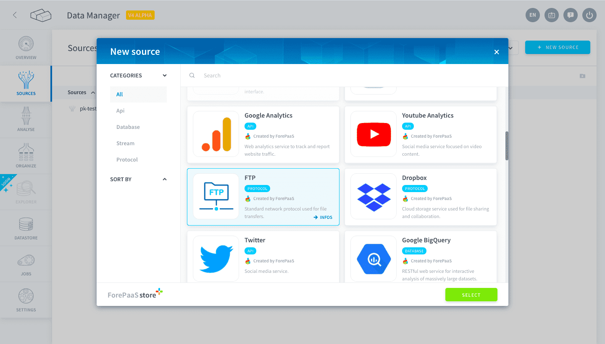
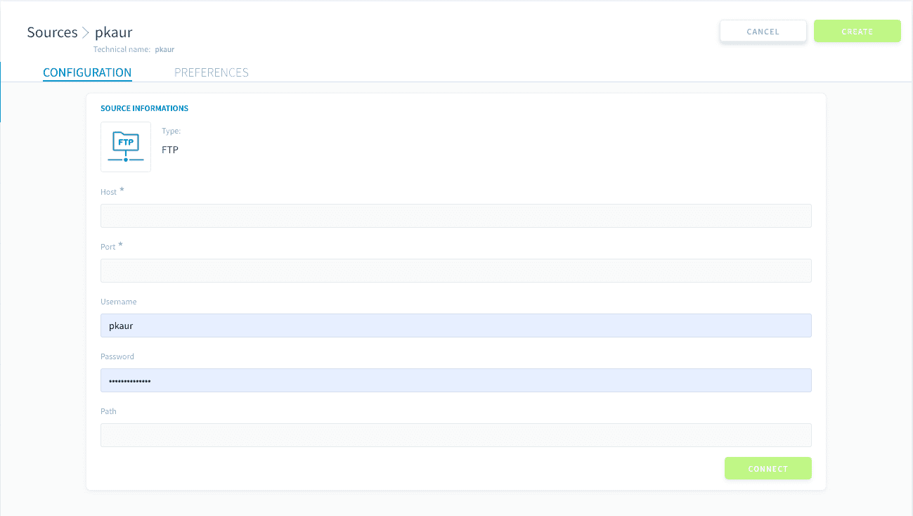

# FTP

The File Transfer Protocol (FTP) is a standard network protocol used for the transfer of computer files between a client and server on a computer network.
The Platform allows you to connect to an FTP server, select your files on it, and import their data directly into your platform.

* [Add a FTP source on the Platform](#add-a-ftp-source-on-the-platform)
  * [Configuration screen overview](#configuration-screen-overview)
  * [Supported files and sizes](#supported-files-and-sizes)
  * [Configuring your source](#configuring-your-source)

---

## Add a FTP source on the Platform 

### Configuration screen overview

Once you have found *FTP* in the **Platform store**, click on *Select* and you will be able to see the configuration screen as shown below -

### Supported files and sizes

Before you proceed with learning how to configure an FTP source, it would be interesting to note that - 

* Even though our FTP connector is able to list every file on your server, keep in mind that meta/data extraction only support the following types: .csv, .xls, .xlsx, .xml, .json, .parquet

* For the Metadata Extraction (see the Analyze part of our data catalog guide), the actual limits of size for a file downloaded by our FTP connector are:
 * Complete Extract: about 900 Mo
 * Sample Extract: about 2.5 Go

### Configuring your source

When creating the source, you will be required to input the following information :

- Host: The URL/IP of the FTP server you want to connect to (ex: 127.0.0.1)
- Port: The port listened to by your FTP server (21 by default for most FTP servers)
- Username: The login used to authenticate
- Password: The password associated
- Path: The path needed to find your files on the server (ex: Documents/data/export_2018.csv)

Once you add the above details click on *Connect* and then on the *Create* button on the top right-hand corner.

!> Don't forget to name your source before creating it. The technical name cannot be changed after creating the source and will be used when trying to open the source using the [SDK](/en/technical/sdk/dpe/index).

---
##  Need help? 🆘

> At any step, you can create a ticket to raise an incident or if you need support at the [OVHcloud Help Centre](https://help.ovhcloud.com/csm/fr-home?id=csm_index). Additionally, you can ask for support by reaching out to us on the Data Platform Channel within the [Discord Server](https://discord.com/channels/850031577277792286/1163465539981672559). There is a step-by-step guide in the [support](/en/support/index.md) section.