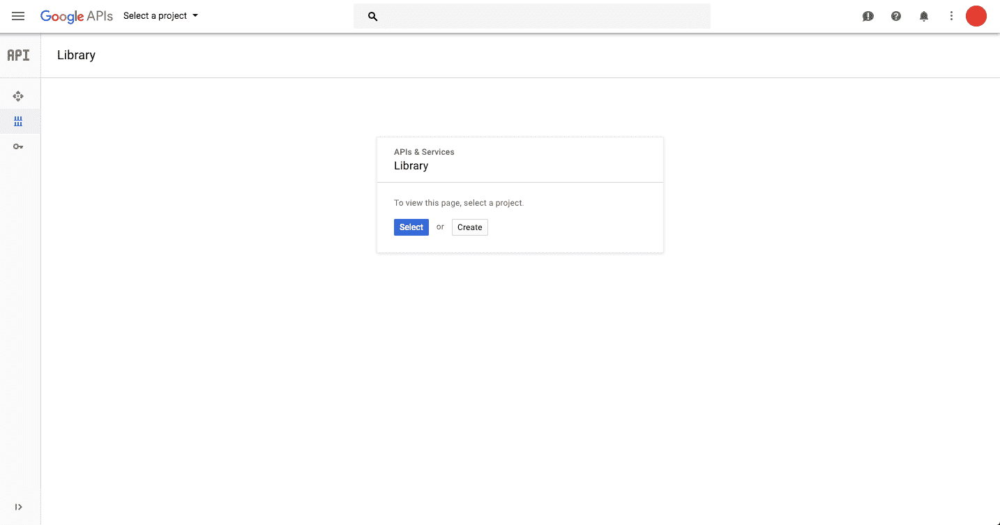
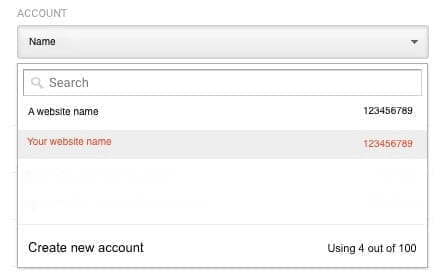

# Google Analytics

Google Analytics is a free website or application audience analysis service to better understand your customers. The Platform lets you integrate it and use those business insights to take valuable action and build powerful and data-driven applications. 

* [Add a Google Analytics source on the Platform](#add-a-ftp-source-on-the-platform)
  * [Configuration screen overview](#configuration-screen-overview)
  * [Learn how to create a Google Service Account](#learn-how-to-create-google-service-account)
   * [Get your View ID](#get-your-view-id)
   * [Generate your Service Account Email and Key](#generate-your-service-account-email-and-key)
  * [Allowing the Platform to read your Google Analytics](#allow-the-platform-to-read-your-google-analytics)
  * [Configuring your source](#configuring-your-source)

---

## Add a Google Analytics source on the Platform 

### Configuration screen overview

Once you have found *Google Analytics* in the **Platform store**, click on *Select* and you will be able to see the configuration screen as shown below -

### Learn how to create Google Service Account

#### Get your View ID
You can obtain your view ID by copy-pasting the ID from Google Analytics, in *Analytics Accounts > Properties & Apps > Views*.

#### Generate your Service Account Email and Key 

Do the following steps –

* Log into https://console.developers.google.com.  
(The console allows to activate/deactivate different services) 

* Click on *ENABLE APIS AND SERVICES*.   This will redirect you to the Google APIs library

* In the search bar, search for *Analytics API* and select it.

 

?> Make sure to select the *Analytics API* and not other API for Google Analytics 🤝

* In the Analytics API overview, click on *ENABLE*. This will allow you to access the API

* *Create* a New Project.
(You may already have some Projects, but for the Service Account, you need to create a new one.)

* Name your Project and click on *Create*. Once done, you’ll be redirected to the Project’s dashboard

* Go on the Credentials tab (on the left menu) and click on *Create credentials*.

* Choose *Service account key*

* Select *New service account*

* *Name* your Service Account and choose the *Project > Viewer* 
 role. (The key type remains in JSON.)

* Click on *Create* to finish the service account creation.

?> Good News! The JSON has been automatically downloaded to your computer. It carries your private key allowing the Platform to access your Google Analytics data. ✨

* **Copy-paste** the JSON content into the *Service Account* field from the Platform data catalog source you are creating. 

!> A private key is strictly confidential and shouldn't be sent through email or message without precaution. Please send your private key in an encrypted zip file and send the zip file's password via SMS to your receiver.  

### Allow the Platform to read your Google Analytics

?> Before proceeding further, make sure you have the email your partner gave you from its Service Account creation, called *Service Account ID* 💡

To authorize the Platform to access your Google Analytics do the following steps -

* Log into https://analytics.google.com 

* Click on the 3 vertical dots, top-right corner of the window: *user settings*

* Select your Account in the dropdown menu 
Column on the left *Account*

* Click on *User Management*

 

* Click on *ADD > Add new users*. (At the top right corner of the screen)

* Enter the *Account Service email* your partner gave you. (For instance in the picture below: *forepaas-Projectname@forepaas.iam.gserviceaccount.com*)

* Allow the permissions *Read & Analyze* and click on *ADD*.   

?> You have granted the Platform the permission to read & analyze your analytics on Google 🚀

### Configuring your source

When creating the source, you will be required to input the following information :

- View ID: The View ID from Google Analytics
- Service account JSON: Your Private key JSON content saved while creating Service Account
- Source default schema: To set your own custom schema

Once you add the above details click on *Connect* and then on the *Create* button on the top right-hand corner.

!> Don't forget to name your source before creating it. The technical name cannot be changed after creating the source and will be used when trying to open the source using the [SDK](/en/technical/sdk/dpe/index).

---
##  Need help? 🆘

> At any step, you can create a ticket to raise an incident or if you need support at the [OVHcloud Help Centre](https://help.ovhcloud.com/csm/fr-home?id=csm_index). Additionally, you can ask for support by reaching out to us on the Data Platform Channel within the [Discord Server](https://discord.com/channels/850031577277792286/1163465539981672559). There is a step-by-step guide in the [support](/en/support/index.md) section.