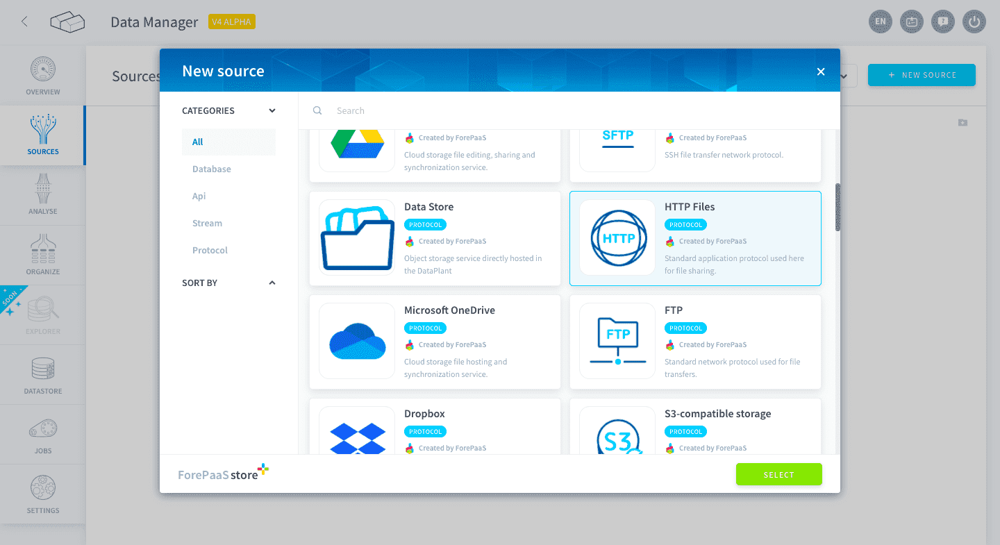
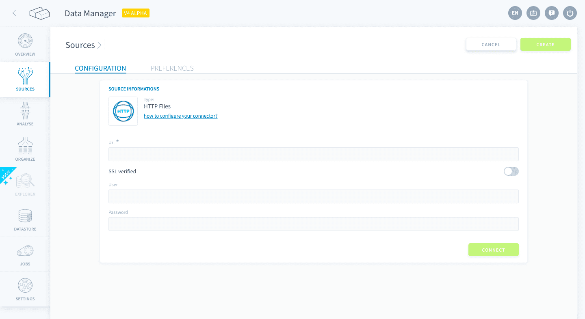
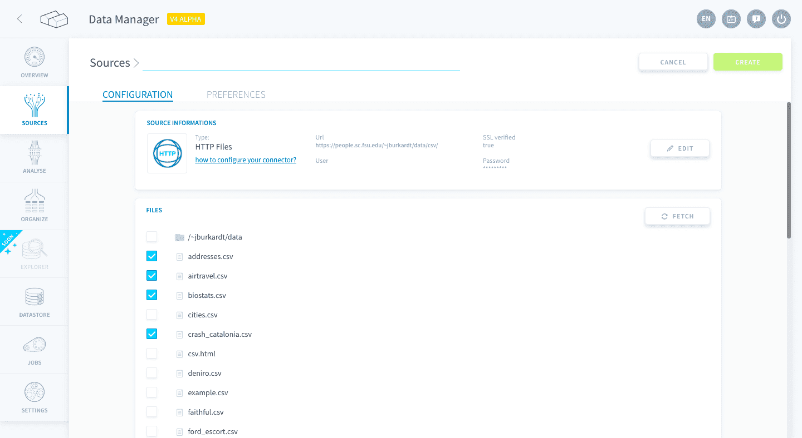

# HTTP Files

*HTTP* is a standard application protocol that allows you to import files from an URL or IP address. 

Please note that this connector only works if the files are directly listed on an HTML page.
In most modern usage, you will want to use the [HTTP REST connector](/en/product/data-catalog/sources/connectors/rest/index.md).

* [Add a HTTP source (for files)](#add-a-http-source-for-files)
  * [Configuration screen overview](#configuration-screen-overview)
  - [Supported files and sizes](#supported-files-and-sizes)
  * [Configuring your source](#configuring-your-source)

---
## Add an HTTP source (for files)

### Configuration screen overview

Once you have found *HTTP Files* in the **Platform store**, click on *Select* and you will be able to see the configuration screen as shown below:

 

### Supported files and sizes

Even though the HTTP connector is able to list every file on your server, keep in mind that the metadata extraction in the [Data Catalog Analyzer](/en/product/data-catalog/analyzer/index) only supports the following file types: .csv, .xls, .xlsx, .xml, .json, and .parquet.

Additionally, there are some file size limits to inspect the data on the fly using the meta data extraction, in particular for a:
* Complete extract: ~900 MB
* Sample extract: ~2.5 GB

### Configuring your source

You will need the following parameters to configure your source:
* **URL**:  IP or Host address with a port (example: `127.0.0.1:8888`).
* **SSL verified (optional)**: In case you want to setup a secure connection.
* **User/Password (optional)**: In case you need to authenticate via login and password

Click *Connect* to test your connection. If the connection is valid, the files that have been detected will be displayed in a list as shown in the picture below:

Check the files you want to import on the Platform and click on **Create** on the top right-hand corner to create the source.

?> Note that you can click on *Fetch* to refresh the file list, in case of changes on the server.

---
##  Need help? 🆘

> At any step, you can create a ticket to raise an incident or if you need support at the [OVHcloud Help Centre](https://help.ovhcloud.com/csm/fr-home?id=csm_index). Additionally, you can ask for support by reaching out to us on the Data Platform Channel within the [Discord Server](https://discord.com/channels/850031577277792286/1163465539981672559). There is a step-by-step guide in the [support](/en/support/index.md) section.

