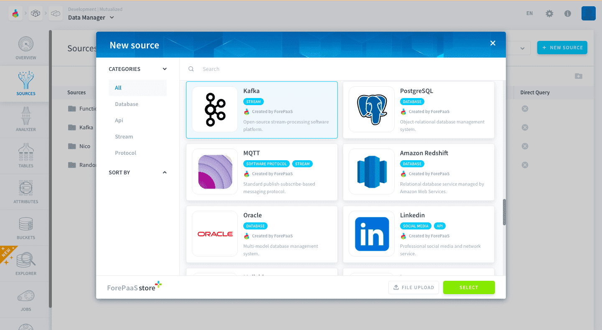
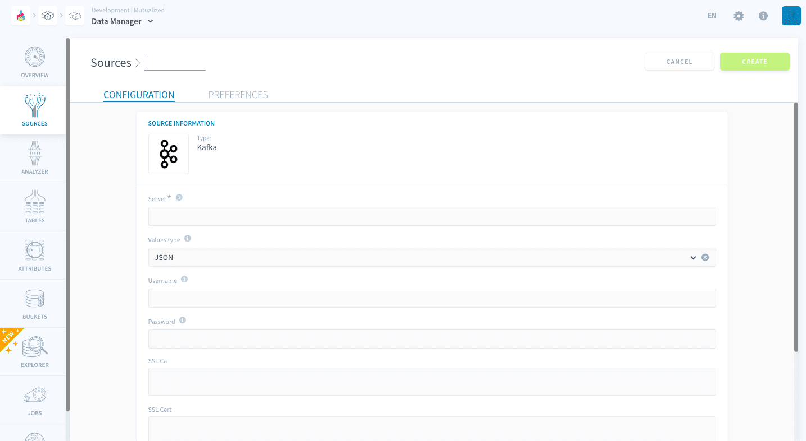
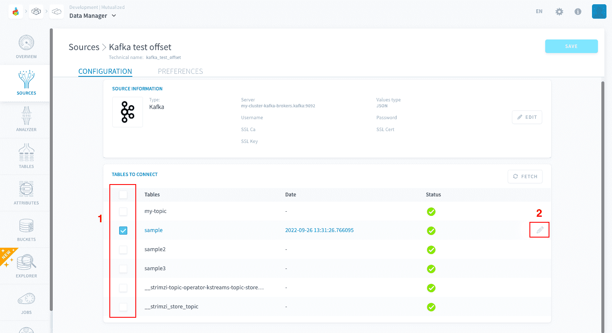
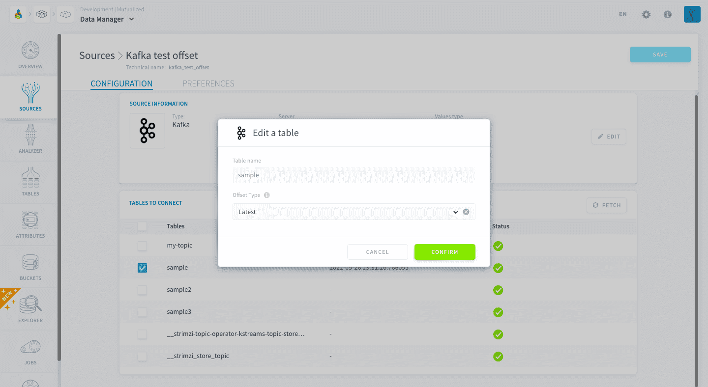

# Apache Kafka

Apache Kafka is a distributed event store and stream-processing platform developed by the Apache Software Foundation. Using the Kafka connector, you can connect to your Kafka server and integrate in real-time the data you receive on the server to your Project.



* [Add a Kafka source on the Platform](#add-a-kafka-source-on-the-platform)
  * [Configuration screen overview](#configuration-screen-overview)
  * [Configuring your topics](#configuring-your-topics)
  * [Supported message formats](#supported-message-formats)
  * [Unsupported message formats](#unsupported-message-formats)
* [Using data from Apache Kafka in the Platform](#using-data-from-apache-kafka-in-the-platform)


?> In this article, we assume that **you know the basic concepts of Apache Kafka**, such as messages and offsets. If you don't, just know that Apache Kafka servers store the data they receive in different topics and that this data comes in small chunks called messages. To keep track of the order of arrival of the messages, each one has an offset number, the lower it is, the earliest the message arrived.

---

## Add a Kafka source on the Platform 

### Configuration screen overview

Once you have found *Kafka* in the **Platform store**, click on *Select* and you will be able to see the configuration screen as shown below :



To connect to your server, you will have to give the server address and, if required by the server, username as well as password. 

### Configuring your topics

After successfully establishing the connection with your server, you can select which topics to get data from by checking the boxes to their left.



If a topic is checked, you can hover over it and click on the Pen Icon to configure how the data it receives will be transferred to the Platform (the default offset policy).



There are two default options of offset policy:
- **Latest**: reads data in real-time as it arrives. Older messages will be ignored.
- **Earliest**: start reading the data from the earliest message in the topic. Once all the messages in the topic have been read, all messages will read in real-time (similar to *latest*). 

?> You also have the possibility to **start reading from a custom offset**, but this option isn't configured at the connector level but at the processing job level. Therefore it is explained in the [Apache Kafka complete tutorial](/en/getting-further/kafka/index.md?id=execution-modes-and-other-options)

Whenever you load data from a Kafka source into [Lakehouse Manager](/en/product/lakehouse-manager/index) [table](/en/product/lakehouse-manager/tables/index) using [Data Processing Engine](/en/product/dpe/index), the latest read offset is stored in the destination table's metadata. This means:
- if you resume ingesting messages into this **same** table, the ingestion will start at the latest message read
- If you start ingesting messages into a **new** destination table, the ingestion will start at the default parameter configured either at the connector level (latest/earliest offset) or job level (custom offset)

### Supported message formats

The Platform supports the following types of input messages for metadata analysis and ingestion:

#### Flat JSON formats

```json
{
'key':'value',
'anotherkey':'anothervalue'
}
```

### Unsupported message formats


Currently, the Platform **doesn't support** the following formats:


#### Simple strings

```
'example message'
```

#### Nested messages

```
{
'key':'value',
'nestedkey':{
'a':'b'
}
}
```

> Feel free to reach out to us by sending us a request if the format you are using is not yet supported! 😊  


---
## Using data from Apache Kafka in the Platform

If you are interested in seeing how to use the Kafka connection in the rest of the of the platform, you may refer to our dedicated [Apache Kafka tutorial](/en/getting-further/kafka/index.md).


---
##  Need help? 🆘

> At any step, you can create a ticket to raise an incident or if you need support at the [OVHcloud Help Centre](https://help.ovhcloud.com/csm/fr-home?id=csm_index). Additionally, you can ask for support by reaching out to us on the Data Platform Channel within the [Discord Server](https://discord.com/channels/850031577277792286/1163465539981672559). There is a step-by-step guide in the [support](/en/support/index.md) section.