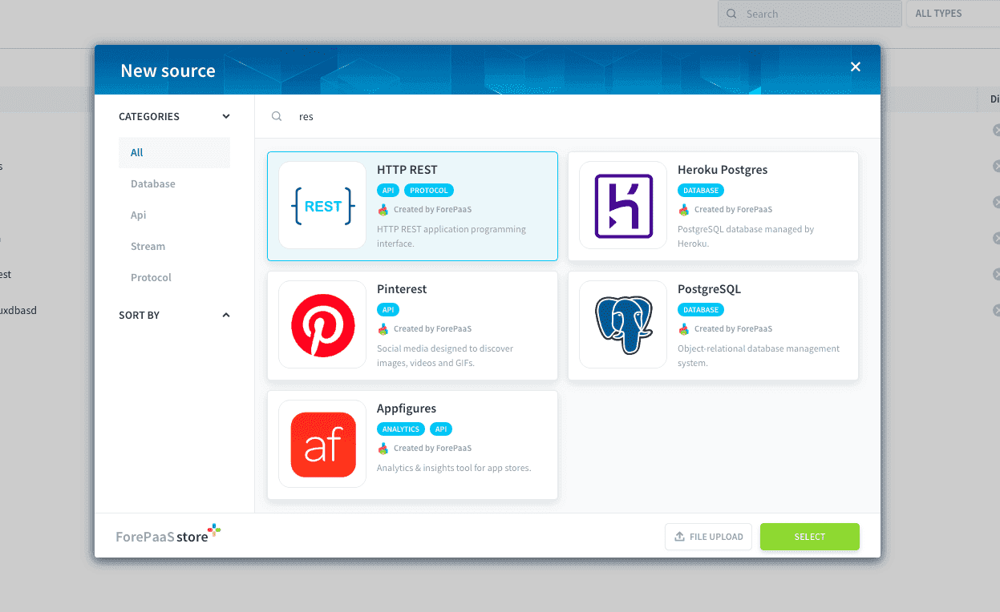
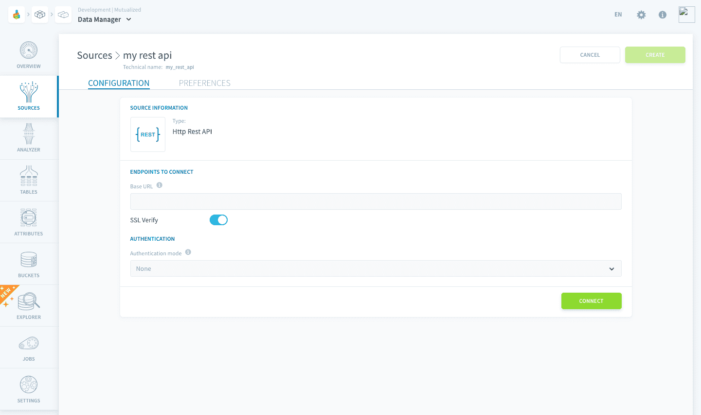
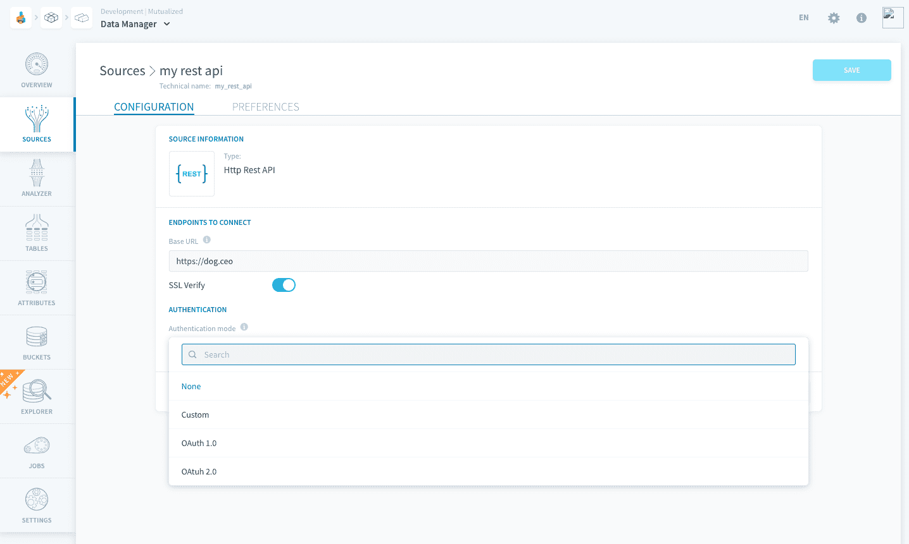
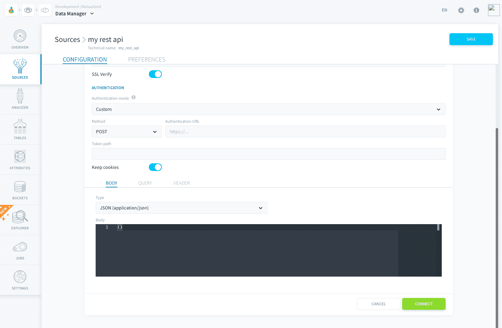
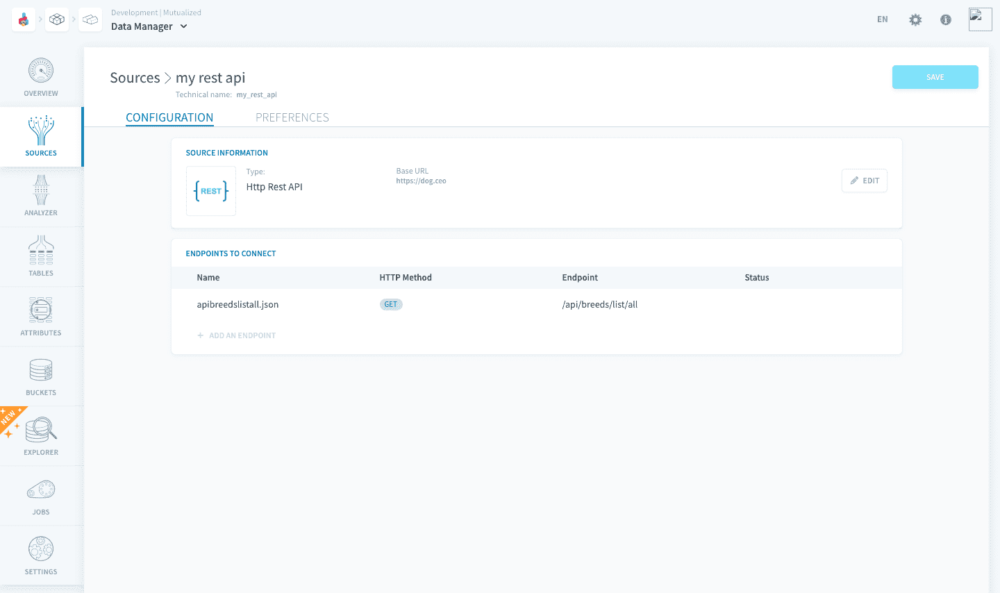
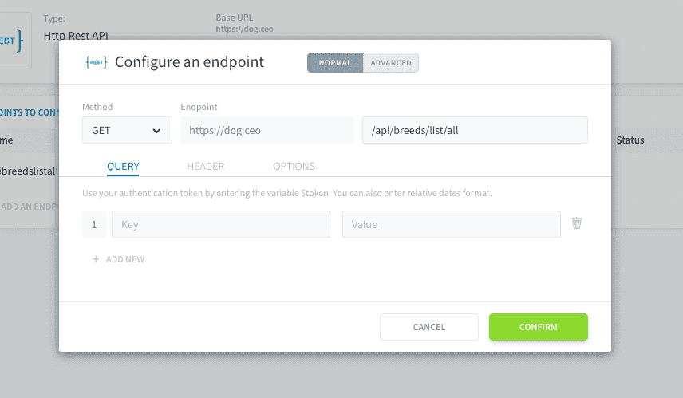
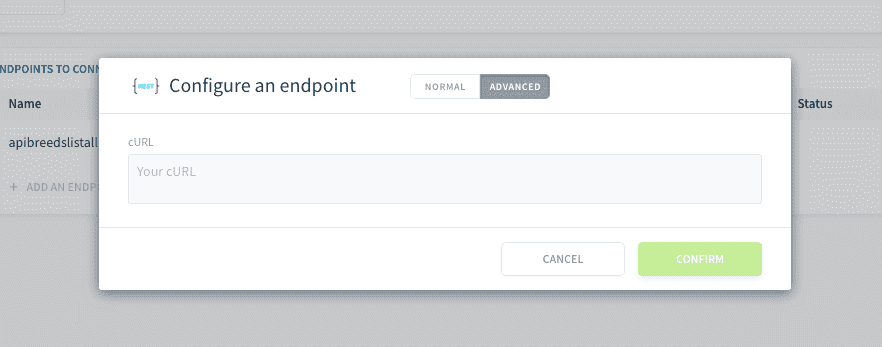

# HTTP REST

**REST** is a standard application protocol that allows you to request information from any compatible API and import data from the JSON response

- [Add an HTTP REST source on Data Platform](#add-an-http-rest-source-on-data-platform)
  - [Configuration screen overview](#configuration-screen-overview)
  - [Supported files and sizes](#supported-files-and-sizes)
  - [Configure your source](#configure-your-source)
  - [Specify endpoints to load data from](#specify-endpoints-to-load-data-from)

---
## Add an HTTP REST source on Data Platform
### Configuration screen overview

Once you have found *HTTP REST* in the **store**, click on *Select* and you will be able to see the configuration screen as shown below.

### Supported files and sizes

> The HTTP REST connector currently **only** supports response of type JSON.

Additionally, there are some file size limits when launching a [metadata extract job](/en/product/data-catalog/analyzer/index). 
In particular for a:
* Complete extract: ~900 MB
* Sample extract: ~2.5 GB

### Configure your source

When creating the source, you will be required to input the following information:

#### API information
**URL**: The base URL or address of the API you want to request (you will register the [endpoints](#specify-endpoints-to-load-data-from) later on)  
**SSL verify**: Activate if you want to setup a secure connection  
**Authentication mode**: Activate if your API requires to authenticate (see below) 

#### Authentication information

If your REST API requires authentication, configure it on the **Authentication** section by choosing an authentication mode. You can also skip this step if the API doesn't require any authentication.

Choose the method you want (POST or GET), followed by the URL on which you must authenticate (for instance `http://localhost/auth`).  

Then, enter the *token path* to use in the response and decide whether to keep the token in *cookies*, i.e. store authentication session in cookies.

Finally, configure the optional parameters below:
* **Body**: add an optional body of type json, form-data, form-urlencoded or inline
* **Query**: add your queries to the request
* **Header**: add the headers of your request

If you need to get a token from the authentication response, you must indicate in which key in the response JSON the token is stored. (commonly : `token`) 

Once you've added the above details, click on *Connect* to establish connection with your API and move on to endpoint registration.

### Specify endpoints to load data from

On Data Platform, each registered endpoint will correspond to a data source object, which you will be able to [load](/en/product/dpe/actions/load/index) into a distinct [table](/en/product/lakehouse-manager/tables/index). 

Endpoints from your API can be added from the **Endpoints to connect** section. By default, there are none and you must add them manually.

 
The following parameters can be configured for each endpoints:
* **Query**: add your queries to the request for this endpoint
* **Header**: add the headers of your request for this endpoint
* **Options**: configure additional options such as timeout, pagination, or setting a name for the table which will contain the data from this endpoint

?> Variables can be injected in the aforementioned options. Check out the [reference down below](#inject-variables) for further information.

You can import your preconfigured endpoint from a *Curl* request by using the **Advanced mode** in a new endpoint.

#### Inject variables

**Authentication token** 

If you activated the authentication endpoint and need to re-use the token previously obtained, you can enter `$token` in the value of the required key in the *Query* section, or in the *Header* section, *Body* section or URL.

**Segmentation values**

This section outlines how to use variable placeholders within endpoints for customization purposes. These placeholders allow users to specify values dynamically, enhancing the flexibility and adaptability of the system.

Variables are enclosed within percentage (%) signs and follow the format: `(%VARIABLE_TYPE|DEFAULT_VALUE%)`.

    VARIABLE_TYPE: Describes the type of variable.
    DEFAULT_VALUE: Represents the default value that the variable will be replaced with if not provided by the user.

Variable Types:

    segmentationValue: This variable type replaces the placeholder with the first value of segmentation.
        Format: Numeric or Text.
        Example: (%segmentationValue|1%)

    segmentationValues: This variable type replaces the placeholder with all values of segmentation, formatted as an array.
        Example: (%segmentationValues|[1,2,3]%)

Users can incorporate these variables in the following components of an endpoint:

    URL: Variables can be used within the URL to dynamically insert values.
        Example: GET /api/data/(%segmentationValue|1%)/details

    Body (Payload): When sending a payload in a request, variables can be used to include dynamic values.
        Example:

        json

         {
             "segmentationValue": "(%segmentationValue|1%)",
             "filter": "(%segmentationValues|[]%)"
         }

    Query Parameters: Variables can be included in query parameters to customize the request.
        Example: GET /api/data?segment=%segmentationValue|1%&filters=%segmentationValues|[]%

**Relative dates**

If you need to use a date parameter that is relative to the day of the query, you can use the following special joker composed by 2 parts separated by a pipe `|` : 
`(%now|date%)` will be replaced by the date when the query happens (formatted as YYYY-MM-DD)
 
Possible values before the pipe:
* `(%dateMin|`: will use the date min configured in the DPE workflow parameters
* `(%dateMax|`: will use the date max configured in the DPE workflow parameters
* `%now|`: will use the current date and time when running

Possible values after the pipe to indicate the date format:
* `|date%)`: as `YYYY-MM-DD`
* `|datetime%)`: as `YYYY-MM-DD HH:mm:SS`
* `|timestamp%)`: as a UNIX timestamp
* `|%Y-%m-%d%)`: as your custom formatter

> To learn more about the custom format, please refer to the [Python `datetime` documentation](https://docs.python.org/3/library/datetime.html#strftime-and-strptime-format-codes).

!> Don't forget to name your source before creating it. The technical name cannot be changed after creating the source and will be used when trying to open the source using the [ForePaaS SDK](/en/technical/sdk/dpe/index).

---
##  Need help? 🆘

> Feel free to reach out to us by sending us a request via *support* on the ForePaaS platform and we make sure to help you out with the best solution 😊  

{You can even send your questions directly by clicking here 👨🏻‍💻}(mailto:support.forepaas.com)
