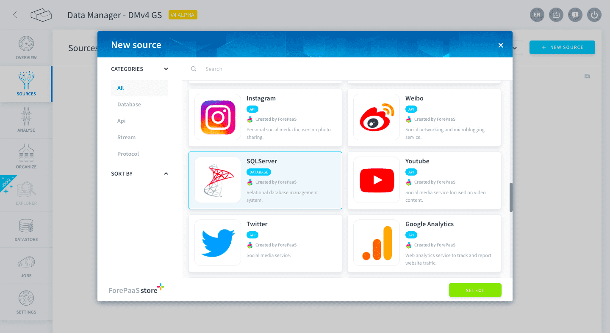
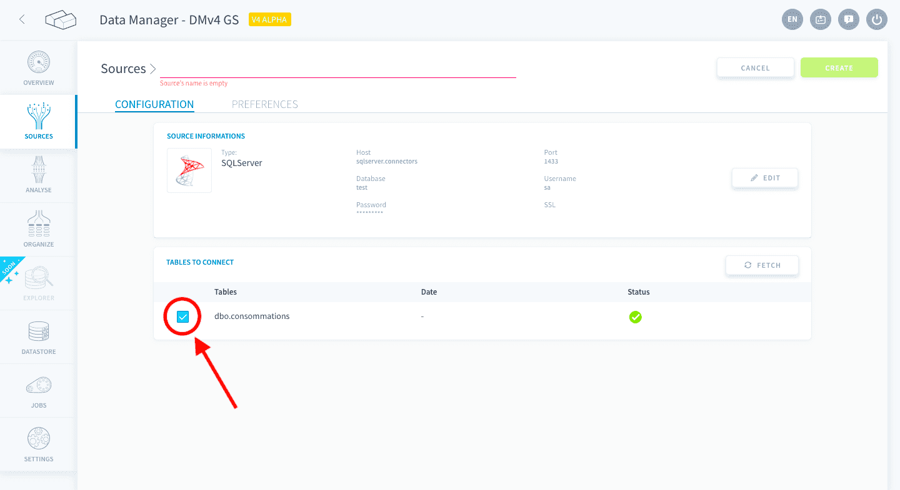

# SQL Server

Microsoft SQL Server is a relational database management system. The Platform allows you to use the tables in a SQL Server database as sources for your application.

* [Add a SQL Server source on the Platform](#add-a-SQL-Server-source-on-the-Platform)
  * [Configure your connection](#configure-your-connection)
  * [Select the tables you want](#select-the-tables-you-want)
---
## Add a SQL Server source on the Platform

### Configure your connection

When creating the source, you will be required to input the following information :

- **Host**: the host name of the SQL Server database.
- **Port**: the port address of the SQL Server database.
- **Database**: the name of the SQL Server database.
- **Username**: the user name for the SQL Server database.
- **Password**: the password for the Username you are using.
- **SSL**: if activated, encrypts the information exchanged between the browser and the database.

### Select the tables you want

After establishing a connection with your SQL Server database your tables will be fetched and displayed :

Select which tables you want to be included in the source by checking the boxes to the left of the table name, as indicated in the image above.

?> If the state of the database changes, you can use the *Fetch* button to refresh the tables displayed and include them in your source.

Once you follow the steps above, click on the *Create* button on the top right-hand corner.

!> Don't forget to name your source before creating it. The technical name cannot be changed after creating the source and will be used when trying to open the source using the [SDK](/en/technical/sdk/dpe/index).

---
##  Need help? 🆘

> At any step, you can create a ticket to raise an incident or if you need support at the [OVHcloud Help Centre](https://help.ovhcloud.com/csm/fr-home?id=csm_index). Additionally, you can ask for support by reaching out to us on the Data Platform Channel within the [Discord Server](https://discord.com/channels/850031577277792286/1163465539981672559). There is a step-by-step guide in the [support](/en/support/index.md) section.
