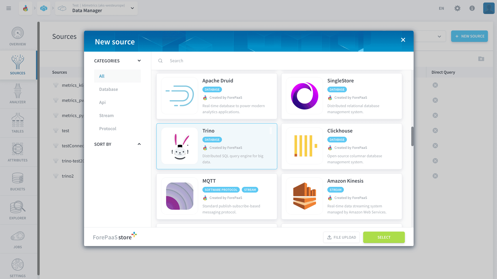
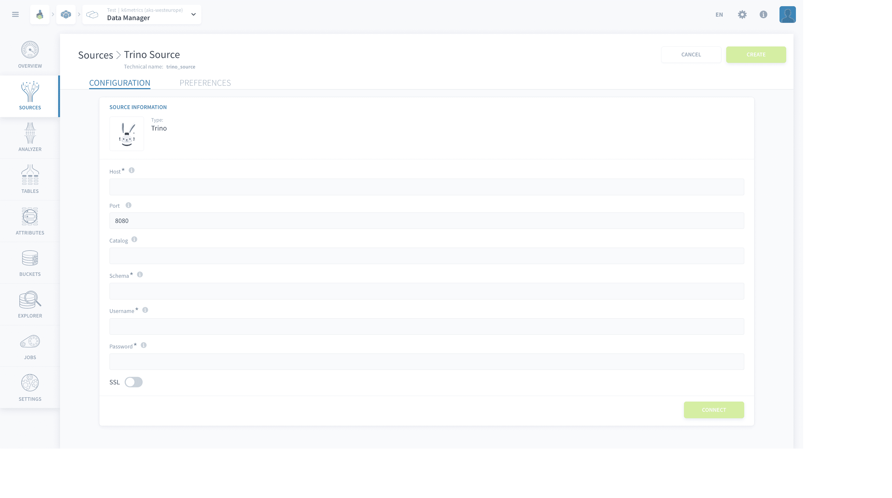
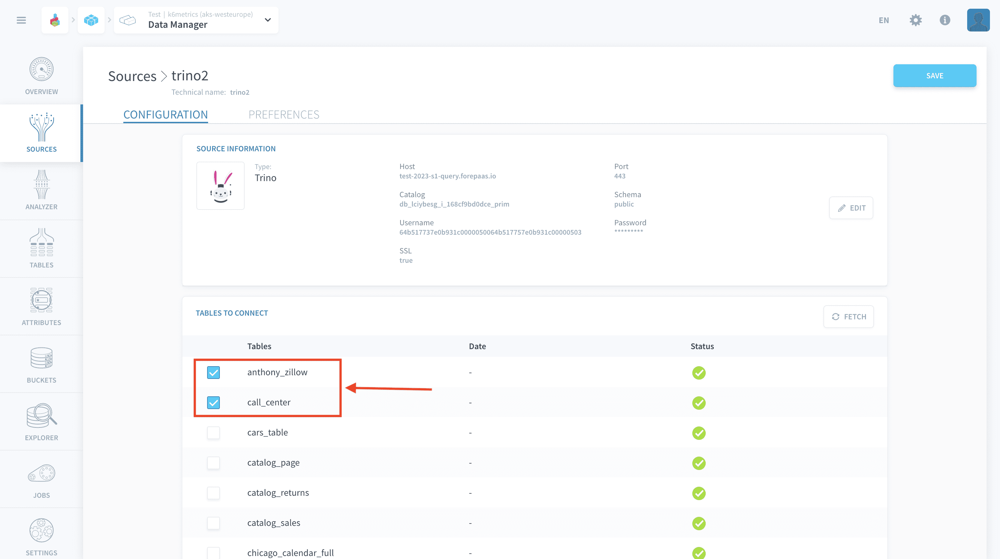

# Trino

Trino is an open-source distributed SQL query engine for adhoc and batch ETL queries against multiple types of data sources. The Platform allows you to use Trino to access the sources for your application.

* [Add a Trino source on the Platform](#add-a-trino-source-on-the-platform)
  * [Configure your connection](#configure-your-connection)
  * [Select the tables you want](#select-the-tables-you-want)
* [Connect Trino to an existing Platform Project](#connect-trino-to-an-existing-platform-project)
---

## Add a Trino source on the Platform

### Configure your connection

When creating the source, you will be required to input the following information :

- **Host**: the Host name of the Trino server.
- **Port**: the Port address of the Trino server *(8080 by default)*.
- **Catalog**: the name of the catalog from the Trino server.
- **Schema**: the name of the Schema from the Trino server.
- **Username**: the Username for the Trino server.
- **Password**: the Password for the Username you are using.
- **SSL**: if activated, encrypts the information exchanged between the browser and the database.

### Select the tables you want

After establishing a connection with your Trino Server your tables will be fetched and displayed :

Select which tables you want to be included in the source by checking the boxes to the left of the table name, as indicated in the image above.

?> If the state of the database changes, you can use the *Fetch* button to refresh the tables displayed and include them in your source.

Once you follow the steps above, click on the *Save* button on the top right-hand corner.

!> Don't forget to name your source before creating it. The technical name cannot be changed after creating the source and will be used when trying to open the source using the [SDK](/en/technical/sdk/dpe/index).

---
## Connect Trino to an existing Platform Project

You can use **Trino** as a connector to an existing project on the Platform. This will be useful in the scenario where there is a need to extract data from one project to another. The tutorial can be found [here](/en/getting-further/trino-connector/index).

---
##  Need help? 🆘

> At any step, you can create a ticket to raise an incident or if you need support at the [OVHcloud Help Centre](https://help.ovhcloud.com/csm/fr-home?id=csm_index). Additionally, you can ask for support by reaching out to us on the Data Platform Channel within the [Discord Server](https://discord.com/channels/850031577277792286/1163465539981672559). There is a step-by-step guide in the [support](/en/support/index.md) section.