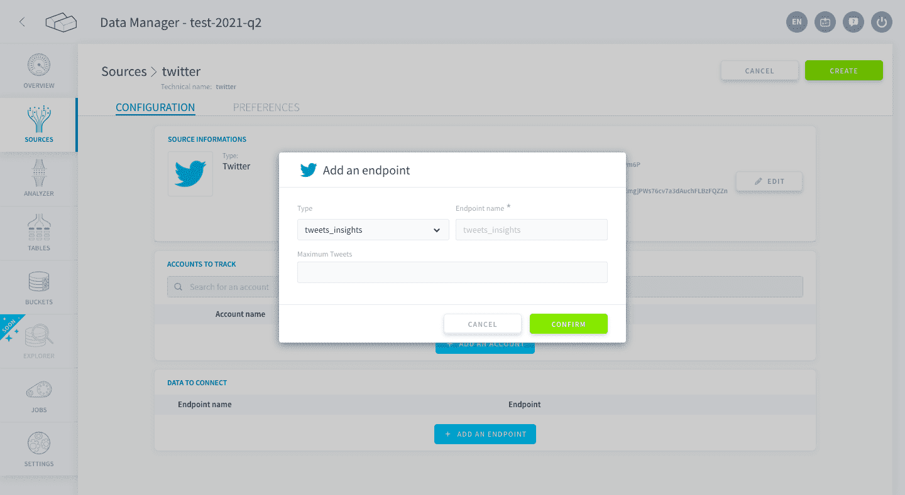

# X

The X connector is used to **consolidate insights from a given X account**. 
You can for instance get data from competitors' accounts. 

* [Available metrics](#Available-metrics)
* [Get your access credentials](#get-your-access-credentials)
* [Add a X source on the Platform](#add-a-X-source-on-the-Platform)
  * [Configuration screen overview](#configuration-screen-overview)
  * [Configuring your source](#configuring-your-source)
    * [Connect to X](#connect-to-facebook)
    * [Add the Accounts and Endpoints](#add-the-accounts-and-endpoints)

---
## Available metrics

Using the X connector, you can get information on:  
* A X account:
 * Date
 * Account name
 * Total number of followers
 * Total number of tweets (tweets, retweets, replies)
 * Total number of favorites
* A tweet:
 * Tweet ID
 * Account name
 * Creation date of the tweet
 * Tweet text
 * Total number of retweets, including retweets from the original tweet if it's a retweet itself
 * Total number of retweets, excluding retweets from the original tweet if it's a retweet itself
 * Number of retweets for the original tweet (if it's a retweet)
 * Number of users that added this tweet in their favorites
 * Type of tweet: quote of another tweet
 * Type of tweet: reply to another tweet
 * Type of tweet: retweet
 * Language

---
## Get your access credentials

To access the X API you will need first to create an application on X. Then the tokens will be generated from it.

As the connector is using X's public API, you don’t need to create this app from a specific account with specific rights.

### Step 1
Go on [X](https://apps.X.com/) and click on « Create New App ».

### Step 2
Fill the form with your own information all the mandatory fields.
*Do not forget the Developer Agreement*.

### Step 3
Go on the « Keys and Access Tokens » tab.

### Step 4
Go on « Your Access Token » and click on « Create my access token ».

### Step 5
Open a Text Editor software and copy/paste your Consumer Key, Consumer Secret, Access Token and Access Token Secret.

---
## Add a X source on the Platform

### Configuration screen overview

Once you have found *X* in the **Platform store**, click on *Select* and you will be able to see the configuration screen as shown below:

### Configuring your source

#### Connect to X

When creating the source, you will be required to input the following information :

- **Account**: your X Page ID.
- **Consumer key**: key provided by X (you copied it earlier).
- **Consumer secret**: secret associated to the Consumer key.
- **Access token**: your X API access token.
- **Access token secret**: the secret associated to the Access token.
- **Source default schema**: you can use this field to add columns to your data, if necessary. Use the following syntax *{"name":"value"}*, where *name* is the name of your column and *value* is the value to be filled in all rows.

Once you add the above details click on *Connect* to establish a connection with X's API.

#### Add the Accounts and Endpoints

Before moving on, you have to add accounts and endpoints.

* [Accounts](#how-to-add-an-account) are X pages referenced by the Page ID - just like in the previous screen - which you want to get data from.
* [Endpoints](#how-to-add-an-endpoint) are the **different types of data** about accounts that the Platform will get using the X API. Each endpoint corresponds to a final table, aggregating data for all selected *accounts*.

?> The Platform will use the credentials given to access the X API but **you can overwrite the credentials** to have multiple accounts and endpoints in the same source. Simply add the different accounts to the Source after the [Connect to X](#connect-to-X) step.

##### How to add an account?

To add an account, click on *Add an Account*. This will open the following window:

By default, it is using the same credentials you wrote previously when establishing the connection, which you can overwrite here. The *account name* is the internal display name.

##### How to add an Endpoint?

On the Platform, each registered endpoint will correspond to a data source object, which you will be able to [load](/en/product/dpe/actions/load/index) into a distinct [table](/en/product/lakehouse-manager/tables/index). 

To add an endpoint, click on *Add an Endpoint*. This will open the following window:

Next, select the type of Endpoint you wish to add. The team is always adding new types of Endpoints to the connectors. You can click on the scroll-down list under the *Type* field to see the ones available.  

Most common ones are:
- *tweet_insights*: general data about the page.
- *account_insights*: data about the page sorted by day.

To finish, click on the *Create* button on the top right-hand corner.

!> Don't forget to name your source before creating it. The technical name cannot be changed after creating the source and will be used when trying to open the source using the [SDK](/en/technical/sdk/dpe/index).

---
For more information about the X API, follow [this link](https://developer.X.com/en/docs/api-reference-index).

---
##  Need help? 🆘

> At any step, you can create a ticket to raise an incident or if you need support at the [OVHcloud Help Centre](https://help.ovhcloud.com/csm/fr-home?id=csm_index). Additionally, you can ask for support by reaching out to us on the Data Platform Channel within the [Discord Server](https://discord.com/channels/850031577277792286/1163465539981672559). There is a step-by-step guide in the [support](/en/support/index.md) section.