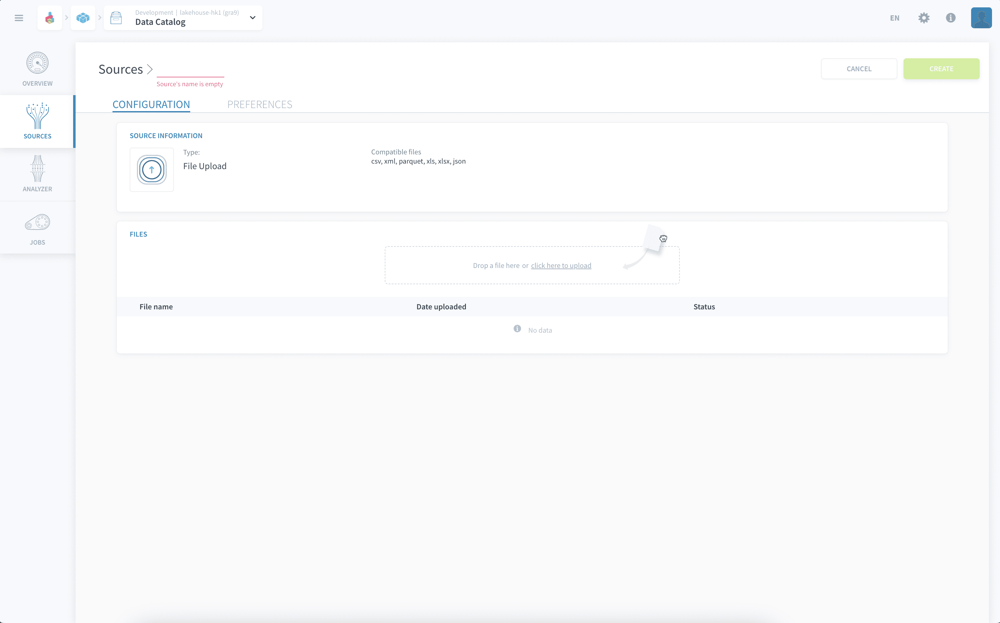

# File Upload

This simple connector allows you to upload your files as sources in the platform.

* [Add a File source on the Platform](#add-a-file-source-on-the-platform)
  * [Configuration screen overview](#configuration-screen-overview)
  * [Supported files and sizes](#supported-files-and-sizes)
  * [Configuring your source](#configuring-your-source)

---
## Add a File source on the Platform

### Configuration screen overview

Once you have found *File upload* in the **Platform store**, click on *Select* and you will be able to see the configuration screen as shown below:

### Supported files and sizes

This connector allows you to drag and drop files from the following types: `.csv`, `.xls`, `.xlsx`, `.xml`, `.json` and `.parquet`.

!> There is a **1GB size limit** on files handled by this tab. In order to process files larger than 1GB, you need to upload them through the [Lakehouse Manager Buckets](/en/product/lakehouse-manager/buckets/index.md).

### Configuring your source

To add a file just drag & drop it directly to the designated area in the middle of the screen or click on the indicated link to select the file from your computer.

Uploaded files will be displayed in the list below the drag & drop area, as in the picture below :

?> Note that you can add multiple files to a single *File Upload* source.

The encoding of the source file is automatically detected by the Platform. However, if the automatic detection fails, you have the ability to specify the file encoding by clicking on the **pen icon** next to each source object:

Select the encoding of your source object in the dropdown selection.

---
##  Need help? 🆘

> At any step, you can create a ticket to raise an incident or if you need support at the [OVHcloud Help Centre](https://help.ovhcloud.com/csm/fr-home?id=csm_index). Additionally, you can ask for support by reaching out to us on the Data Platform Channel within the [Discord Server](https://discord.com/channels/850031577277792286/1163465539981672559). There is a step-by-step guide in the [support](/en/support/index.md) section.