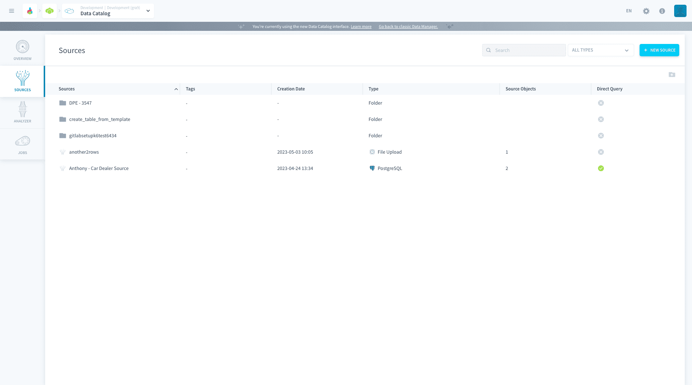
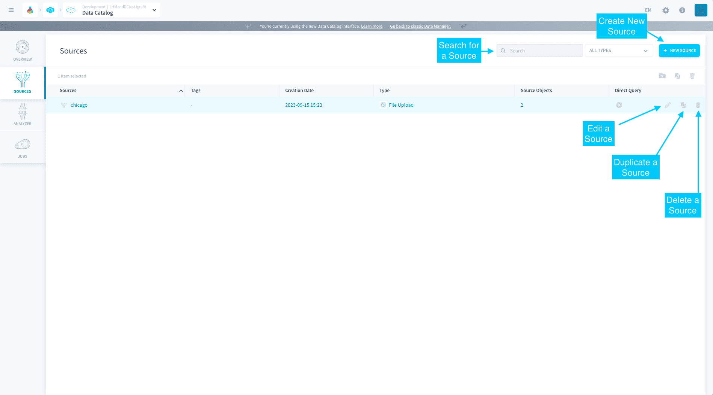
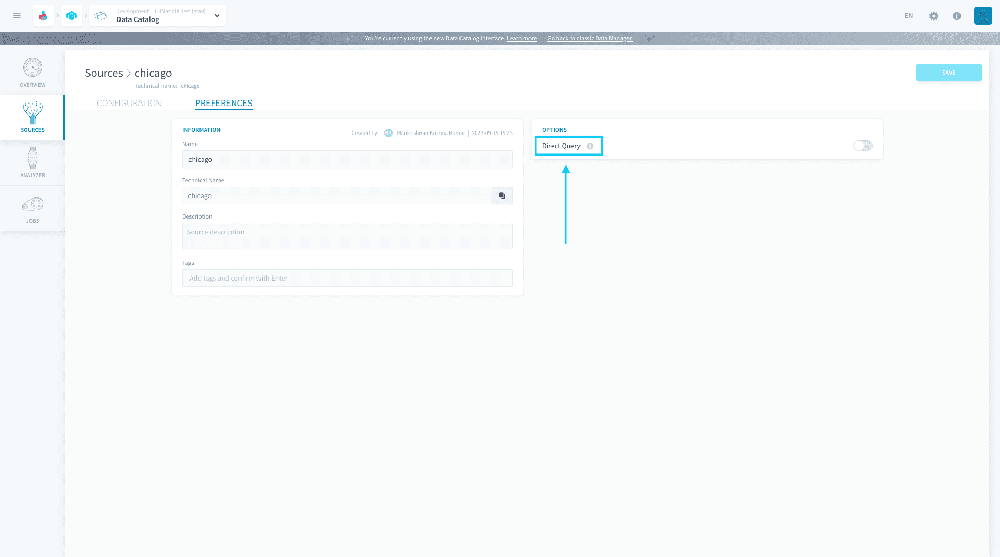

# Sources

Sources let you register external data sources to use for your Project by choosing from a variety of 60+ connectors available through our internal marketplace called the platform Store. 

{Learn how to setup your data source connector}(#/en/product/data-catalog/sources/connectors/index.md)

When you connect to your data source, it's always possible to import a copy of the data into your Project, by [creating](/en/product/lakehouse-manager/tables/canvas_view?id=create-a-new-table) and [loading](/en/product/dpe/actions/load/index) a [table](/en/product/lakehouse-manager/tables/index).

>The Platform separates the registration of connectors credentials (done on this page), and the analysis/load of its data (carried out downstream in the process) in order to allow a possible separation of [roles](/en/product/iam/users/roles) between teams.

For some data sources, an alternative approach is available: [connect directly](/en/product/data-catalog/sources/index?id=make-your-data-source-directly-queryable) to the data source for queries in the [Analytics Manager](/en/product/am/index).

* [Managing data sources](#managing-sources)
* [Creating a new data source](#creating-a-new-source)
  * [Make your data source directly queryable](#make-your-data-source-directly-queryable)

---
## Managing sources

Data sources are organized in a hierarchical way through a tree view consisting of:

* **Folders** for logical grouping of your sources

* **Sources** specifying the access to smaller **source objects** (which can be tables, files, or endpoints) 

?> 💡 For better readability, it is recommended to group sources into folders. 

Each time you add a source, a new line will be added to this dashboard. The basic actions that you can 
perform on the Source menu dashboard includes:

* [Creating](#creating-a-new-source) a new source
* **Searching** for an existing source
* **Grouping** sources by folder
* **Adding, duplicating, deleting** sources within an existing folder

---
## Creating a new source

Under Sources click on **New Source** and you will see all available connectors in the Platform Store. You can find a connector by either typing the name of the desired connector in the search bar, filtering by a specific category on the left-hand side of the Store or scrolling down the connector list

the platform currently supports the following sources:

!> Some of the connectors mentioned below have been deprecated and we are working on updating the list. Please reach out to the support team in case of any issues faced.

* **Files storage systems:** Amazon S3, Dropbox, Google Drive, Azure Blob Storage, Microsoft OneDrive, Google Cloud Storage, Shadow Drive

* **Database engines:** PostgreSQL, MySQL, SQLServer, MariaDB, Cassandra, Google BigQuery, Amazon Redshift, ElasticSearch, Heroku Postgres, Clickhouse, SingleStore, MongoDB, Oracle, Snowflake, Trino, OpenSearch, Prometheus, M3DB, CockroachDB, InfluxDB

* **Network protocols & Open Data:** FTP, HTTP Files, SFTP, HTTP REST, Open Weather

* **Real-time & IoT:** Apache Kafka, Amazon Kinesis, MQTT, RabbitMQ, Apache Druid

* **Social media:** Pinterest, Facebook, LinkedIn, Twitter, YouTube, Weibo, Instagram

* **Analytics:** Google Analytics, Appfigures, Hubspot, MailChimp

Once you have found it in the **the platform store**, click on it and then on *Select* to proceed to the connector configuration screen.

{Learn how to configure your connector}(#/en/product/data-catalog/sources/connectors/index.md)

### Make your data source directly queryable

In the **Preferences** of your source, you can activate the option *Direct Query* to mark it as directly queryable.

If you mark a source as directly queryable, you will be able to execute SQL queries on its source objects (for example, the tables in your Amazon Redshift source) from the [Analytics Manager](/en/product/am/index), without having to import the data in the Platform first.

!> This option is currently only available in [SQL queries](/en/product/am/queries/sql).

The following sources are compatible for direct queries:
* Amazon Redshift
* BigQuery
* Cassandra
* ClickHouse
* ElasticSearch
* Google Sheets
* Amazon Kinesis
* MongoDB
* MySQL
* Oracle
* PostgreSQL
* Redis
* SingleStore
* Snowflake
* SQL Server

---
###  Need help? 🆘

> At any step, you can create a ticket to raise an incident or if you need support at the [OVHcloud Help Centre](https://help.ovhcloud.com/csm/fr-home?id=csm_index). Additionally, you can ask for support by reaching out to us on the Data Platform Channel within the [Discord Server](https://discord.com/channels/850031577277792286/1163465539981672559). There is a step-by-step guide in the [support](/en/support/index.md) section.