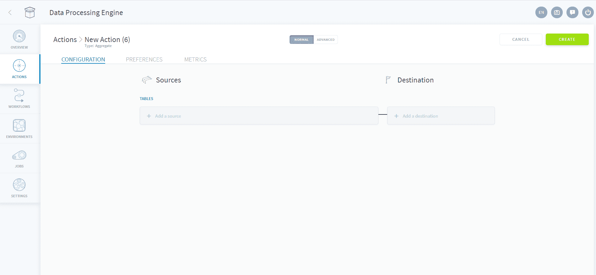
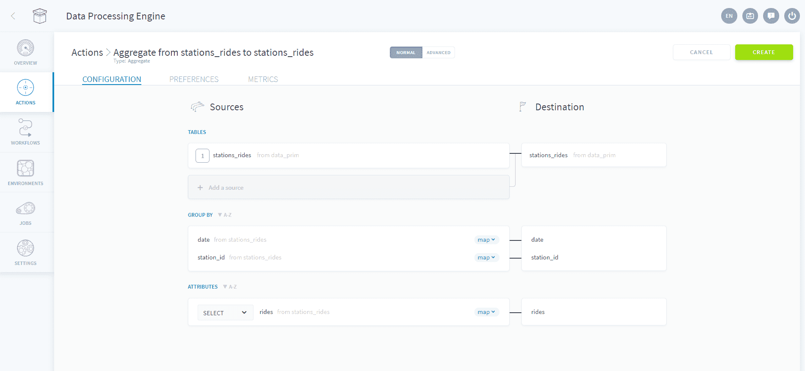
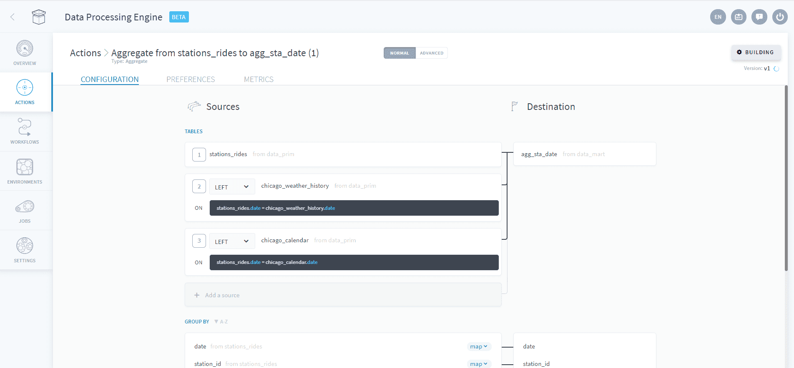
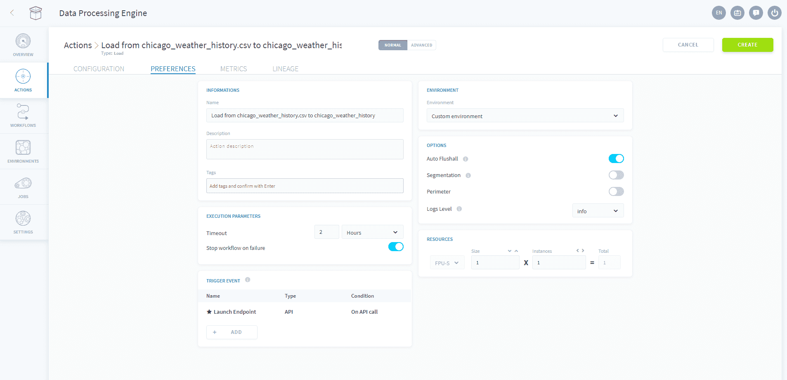

# Aggregate PySpark Action

The *Aggregate PySpark* action allows you to transfer data from any pre-existing table into any other table (including the same table), using [Apache Spark™](https://spark.apache.org/).

The Aggregate PySpark action's scope - which typically allows SQL handling as well as joining multiple tables and grouping results - is wide, making it one of the most used action in data processing workflows.

* [Configure an Aggregate PySpark action](/en/product/dpe/actions/aggregate-pyspark/index?id=configure-an-aggregate-pyspark-action)
  * [Transfer raw data into a primary table](/en/product/dpe/actions/aggregate-pyspark/index?id=transfer-raw-data-into-a-primary-table)
  * [Join a referential to a primary table](/en/product/dpe/actions/aggregate-pyspark/index?id=join-a-referential-to-a-primary-table)
  * [Configure the action's preferences](/en/product/dpe/actions/aggregate-pyspark/index?id=configure-the-action39s-preferences)
* [Use the Advanced mode](/en/product/dpe/actions/aggregate/index?id=use-the-advanced-mode)

---
## Configure an Aggregate PySpark action

An Aggregate PySpark action is composed of a list of one or more *source tables* from which the values will be extracted and placed into a single *destination table*. Each destination attribute needs to be mapped to a source attribute.

When multiple *source tables* are selected, it is necessary to specify a join condition, just like it's done in SQL.

!> Note that leaving a destination attribute unmapped in the Aggregate PySpark action configuration **will trigger an error** when the action is launched. If you'd rather leave the destination field empty, make sure to simply remove it from the list of mapped attributes.

When destination attributes are removed from the list of mapped attributes, the following behavior shall be expected:
* If the Aggregate PySpark action is **inserting new rows, it will simply fill the destination attribute column with NULL values**.
* If the Aggregate PySpark action is **updating existing rows (i.e. inserting over existing data), it will leave the previous value intact regardless of whether it was NULL or not**.

Use case examples for both single and multiple *source tables* are described below.

### Transfer raw data into a primary table

Create a new Aggregate PySpark action:

Select the source (left) and destination table. Matching attributes are automatically assigned where possible. It is possible to manually select which attributes are mapped between the source and destination.

If needed, you can change the mapping to either SQL or plain text by clicking on the **MAP** button and selecting either *SQL* or *txt*. 

In the attributes section, it is also possible to change the compute mode of each attribute. In the example above, *SELECT* has been chosen but other options are available.

Press *Create* at the top right to create the action.

### Join a referential to a primary table

To specify a join, click on **Add a source** located just below the source table, you will be prompted to select a table to join with. Select the type of join from the dropdown menu, and input the join conditions in the UI. Multiple source tables can be joined.

Attributes from all the joined tables can then be selected in the bottom attributes section either from the dropdown menus or using SQL.

### Configure the action's preferences

Once you're satisfied with the mapping of your attributes, use the [preferences tab to configure the action settings](/en/product/dpe/actions/settings/index).

!> Note that the **Always-up execution mode isn't available** with the PySpark action and that you must use the serverless mode with it.

---

## Use the Advanced Mode

If you need to access the JSON configuration file of the action, you can activate the Advanced mode by clicking on **Advanced** at the top of the page.

{Use the Advanced mode of an Aggregate action}(#/en/product/dpe/actions/aggregate/advanced-mode.md)

