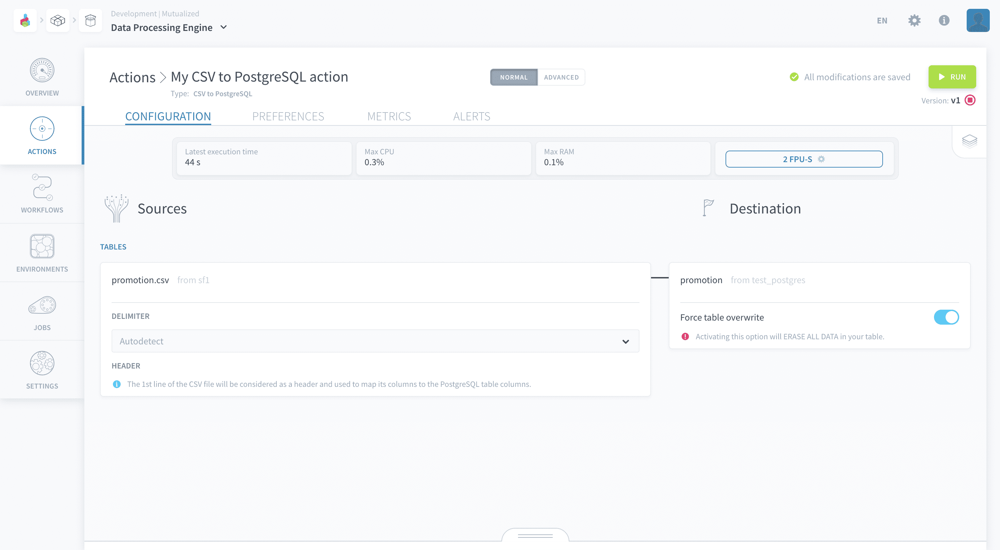

# CSV to PostgreSQL Action

The *CSV to PostgreSQL* action extracts data from a PostgreSQL database and puts it into a [Parquet file](https://parquet.apache.org/) in your Project bucket. You can choose the file format.

* [Configure a CSV to PostgreSQL action](#configure-a-csv-to-postgresql-action)
  * [Choose a source and a destination](#choose-a-source-and-a-destination)
* [Destination file](#destination-file)

---
## Configure a CSV to PostgreSQL action

To create a new action, navigate to the **Action tab** of the Data Processing Engine (DPE), click on **New Action** and select the *CSV to PostgreSQL* action.

### Choose a source and a destination

To set-up the action, start by selecting a source from the list that you have already set-up in the [Sources](/en/product/data-manager/sources/index) tab of the Data Manager.

Then, choose the *destination table* from the list of PostgreSQL [Data Manager Sources](/en/product/data-manager/sources/index.md). 

### CSV options

You can also choose a specific delimeter if you desire, as indicated in the screenshot below, or let ForePaaS automatically detect your delimeter.

!> The **1st line of the CSV should always contain the column header**. This is used by the platform to match the CSV file columns to the PostgreSQL table columns, so each column in the CSV header should have the same name as the respective PostgreSQL table column.

### Destination Table options

You can choose to overwrite the data in the PostgreSQL table with the data from your CSV file by switching on the *Force overwrite* option (indicated in the screenshot below). Doing so will **permanently erase all the data** in the destination so use this option wisely.

---
###  Need help? 🆘

> If you are logging-in with an OVHcloud account, you can create a ticket to raise an incident or if you need support at the [OVHcloud Help Centre](https://help.ovhcloud.com/csm/fr-home?id=csm_index). Additionally, you can ask for support by reaching out to us on the Data Platform Channel within the [Discord Server](https://discord.com/channels/850031577277792286/1163465539981672559). There is a step-by-step guide in the [support](/en/support/index.md).
