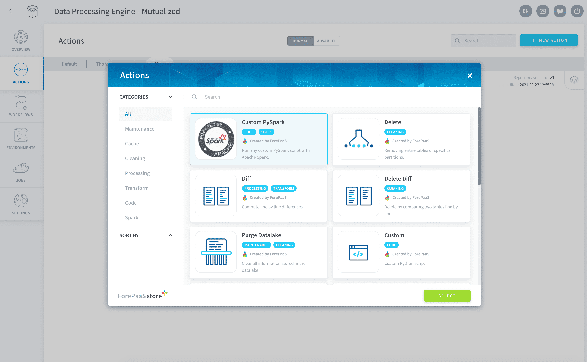
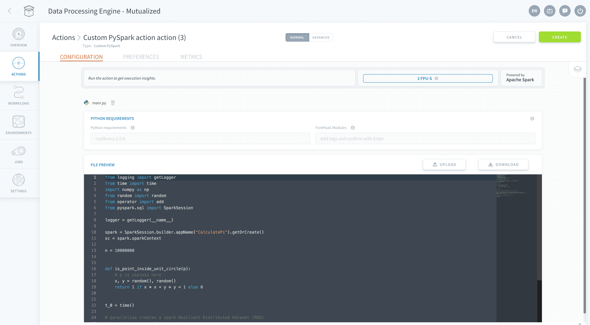
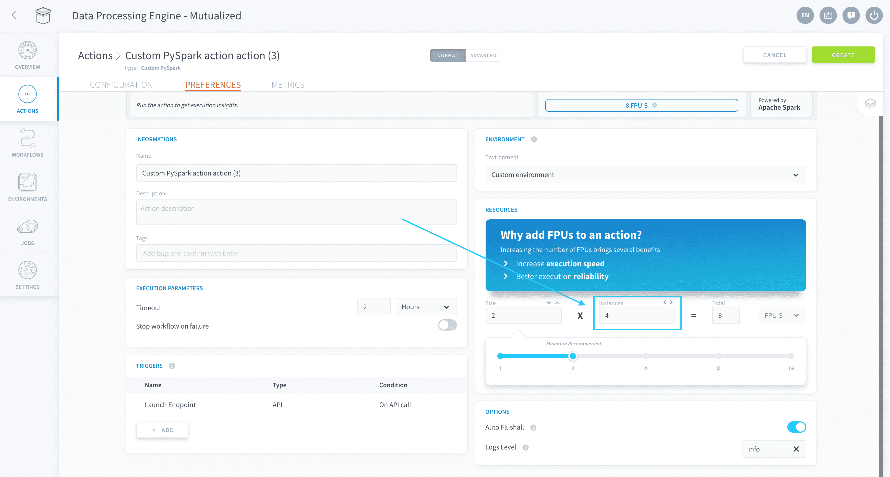
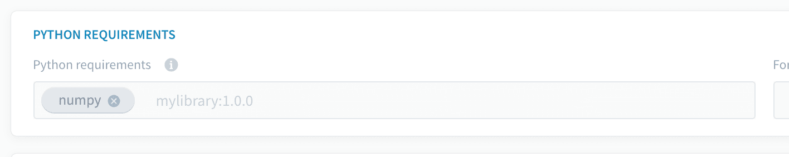

# Custom PySpark Action

A *Custom PySpark action* allows you to execute custom PySpark scripts in a scalable cloud cluster environment using [Apache Spark™](https://spark.apache.org/). 

Using our [Software Development Kit (SDK)](/en/technical/sdk/dpe/index) to easily interact with the different components of the platform, *Custom PySpark actions* can be used to implement a variety of use-cases such as: 
*  Execute a manipulation algorithm or ETL job on your data warehouse
*  Execute a simple data analysis or machine learning algorithm
*  Extract data from data sources not available on the Data Platform marketplace without having to create connectors for it
*  Extract real time data (like MQTT, Kafka, etc..) 

?> Custom PySpark actions can be orchestrated within [workflows](/en/product/dpe/workflows/index) and triggered immediately or on a scheduled basis. At the moment, a single workflow **cannot** contain both PySpark actions and normal actions.

* [Configure a Custom PySpark action](/en/product/dpe/actions/custom-pyspark/index?id=configure-a-custom-pyspark-action)
* [Manage parallelization in a Custom PySpark action](/en/product/dpe/actions/custom-pyspark/index?id=manage-parallelization)
* [Manage dependencies in a Custom PySpark action](/en/product/dpe/actions/custom-pyspark/index?id=manage-dependencies)

---
## Configure a Custom PySpark action

In the Data Processing Engine of your Project, go in the Actions tab and click on the **New Action** button. Choose the action type *Custom PySpark*.

 
Drag and drop your *.py* PySpark script onto the "Drag and drop" section.  
Alternatively, select the **Start with a boilerplate** option to get started directly on the Platform's Python interface with example code snippets.

You will be able to edit your source file directly in the editing interface (or drop a new file if needed). Check out the PySpark documentation below:

{PySpark Documentation Portal}(http://spark.apache.org/docs/latest/api/python/)

Note you can also use any function provided in the [Software Development Kit (SDK)](/en/technical/sdk/dpe/index) to easily interact with other components of the platform. To read more about all the available SDK functions check out the article below:

{Discover all SDK methods}(#/en/technical/sdk/dpe/index)

--- 
## Manage parallelization
Scale your job by adding more parallel worker instances in the action's [preferences](/en/product/dpe/actions/settings/index). 

Simply input the desired number of **instances**, which is the Spark executors number. The CPU and RAM size of each instance can be managed by changing the number of [FPU](/en/product/dpe/jobs/resources) allocated to each.

Specify how to split your job's workload on those different workers inside your PySpark script.

!> Contrary to actions that use the Platform's proprietary data processing engine, PySpark actions don't have settings for [segmentation](/en/product/dpe/actions/settings/index?id=segmentation-settings) and [perimeter](/en/product/dpe/actions/settings/index?id=perimeter-settings) in the action's preferences. These must be handled inside your PySpark code.

--- 
## Manage dependencies

### Installing Python packages

You might need to install specific packages not included by default. You can add them in the "Python Requirements" field respecting the format used in a basic requirements file for "pip" (Python package manager) then press "ENTER" on your keyboard.

This is what it should looks like once you pressed "ENTER":

 
### Default list of dependencies

!> Data Platform blocks the minors of the versions allowing bug fixes to be installed. If you need a more recent version of a library you can override it manually by adding the same package with the new version in the "Requirements" field.

Here is the list of all the packages and their version (as you could find them in a requirements file for pip) shipped with the Data Processing Engine workers:

{Discover all default Python packages}(/#/en/product/dpe/actions/custom/default-packages.md)
