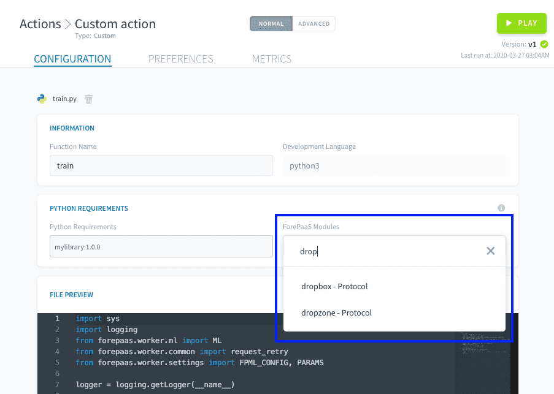

# Default Packages

All actions & workflows when launched are built and run in **containers which come with preloaded packages**. That way, especially in the case of custom actions, you don't have to always manually specify which librairies you need to run your code.

Currently ForePaaS jobs are only compatible with Python 3+, there is therefore only 2 default packages for you to manage:
* **Python Libraries**: If you're about to write your own custom action, no need to give you a lecture on Python libraries... in the background, we're simply running a *pip install* command.
* **ForePaaS Modules**: In order to keep a light weight image of the containers all ForePaaS connectors are not loaded automatically. To use a specific connector using the SDK, please specify the required modules from our internal supported list.

---
## Default Python Librairies

Below is the list of all the Python libraries and corresponding version number installed by default in the ForePaaS DPE containers:

```
nameko==2.12.0
pyopenssl==19.1.0
minio==5.0.8
bson==0.5.8
requests==2.22.0
timedelta==2019.4.13
coverage==4.5.4
pycryptodome==3.9.4
kubernetes==10.0.1
sqlalchemy==1.3.8
mysqlclient==2.0.1
prometheus_client==0.7.1
google-cloud-storage==1.36.2
pandas==1.0.0
```

!> **Note** that we don't allow users to override the default libraries installed with older versions to prevent incompatibility issues.

However, **you can absolutely install any other libraries on top of the list provided** above by adding them in "Requirements" field of your custom action configuration whether in the UI or in the JSON file. Simply use the same format as when using a *pip install* command to specify the version's library.

{Explore all Python libraries on Pypi's official website}(https://pypi.org/)

---
## ForePaaS Modules

When you create a new custom action using the ForePaaS Data Processing Engine you will certainly be connecting to external data sources and use a variety of file formats. **ForePaaS possesses a pre-existing list of modules to handle both data formats & connector types inside your code**. 

The list of modules preinstalled by default includes primarily support for generic file format & other component of the platform (data warehouse & data store): mySQL, S3, CSV, XML, XLS, XLSX, JSON. Parquet file formats are not installed by default because of the size of the module (approximately 400 MB) which would add latency for the build of the workers.

To install ForePaaS modules for your custom actions you can either do it via the Custom action configuration GUI under the *Requirements* section. For instance, if you use the SDK functions to connect to an external Dropbox source but have not installed the Dropbox module, your code will throw an error unless you configure your custom action as below:



Or you can directly input the list of the modules in the JSON configuration of the action under the key *modules*:

```
{
  "modules": [
    {
      "type": "action",
      "id": "aggregate",
      "version": "latest"
    },
    { ... }
  ],
```

> **Note** that by default in the UI dropdown, all modules will be installed to their latest version. If you are trying to install a specific version please specify it in directly in the JSON configuration of the action (see syntax above) in Advanced mode.

Below is the **exhaustive list of additional available ForePaaS modules** that can be installed in DPE workers (which corresponds to the list you can find in the Data Manager's source's marketplace):

| Module | Description | Type | Technical Name |
| --- | --- | --- | --- |
| Dropbox | Connector to Dropbox file storage system | protocol | dropbox |
| Dropzone | Connector to ForePaaS' dropzone protocol | protocol | dropzone |
| FTP | Module to support FTP protocols | protocol | ftp |
| Google Drive | Connector to Google Drive file storage system | protocol | google-drive |
| HTTP | Module to support HTTP protocols | protocol | http |
| HTTP REST | Module to support HTTP REST protocols | protocol | httprest |
| Microsoft One Drive | Connector to One Drive file storage system | protocol | onedrive |
| AWS S3 | Connector to AWS S3 file storage system | protocol | s3 |
| SFTP | Module to support SFTP protocols | protocol | sftp |
| App Figures | Connector to [appfigures](https://appfigures.com/) analytics & ASO tools | connector | appfigures |
| GCP BigQuery | Connector to Google's big data analytics platform | connector | bigquery |
| ForePaaS DataPlant | Connector to another ForePaaS' DataPlant | connector | dataplant |
| Facebook | Connector to Facebook analytics | connector | facebook |
| Google Analytics | Connector to Google Analytics | connector | ganalytics |
| Apache Impala | Connector to Apache Impala distributed SQL query engine | connector | impala |
| Instagram | Connector to Instagram analytics | connector | instagram |
| Intercom | Connector to Intercom analytics | connector | intercom |
| LinkedIn | Connector to LinkedIn analytics | connector | linkedin |
| Mailchimp | Connector to Mailchimp analytics | connector | mailchimp |
| Parquet | Module to support Parquet file formats | connector | parquet |
| PostgreSQL | Connector to PostgreSQL database engine | connector | postgresql |
| SQLServer | Connector to SQLServer database engine | connector | sqlserver |
| Twitter | Connector to Twitter analytics | connector | twitter |
| Weibo | Connector to Weibo analytics | connector | weibo |
| Youtube | Connector to Youtube account analytics | connector | youtube |
| Youtube Analytics | Connector to Youtube Analytics tool | connector | youtube-analytics |

> **Note** that ForePaaS is actively building & updating the modules list. If we are missing something critical for your Project, please reach-out by dropping us a line on our [Product Portal](https://hq.forepaas.io/#/features) 💡!