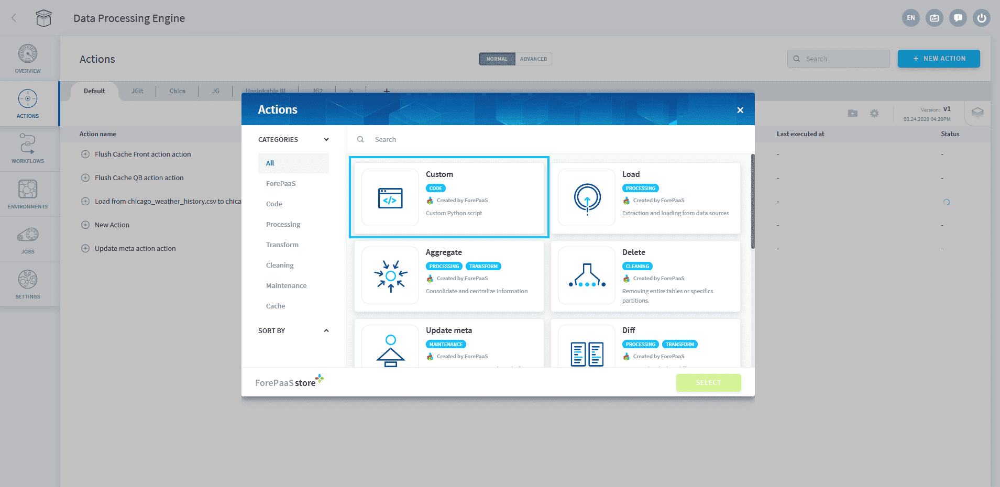
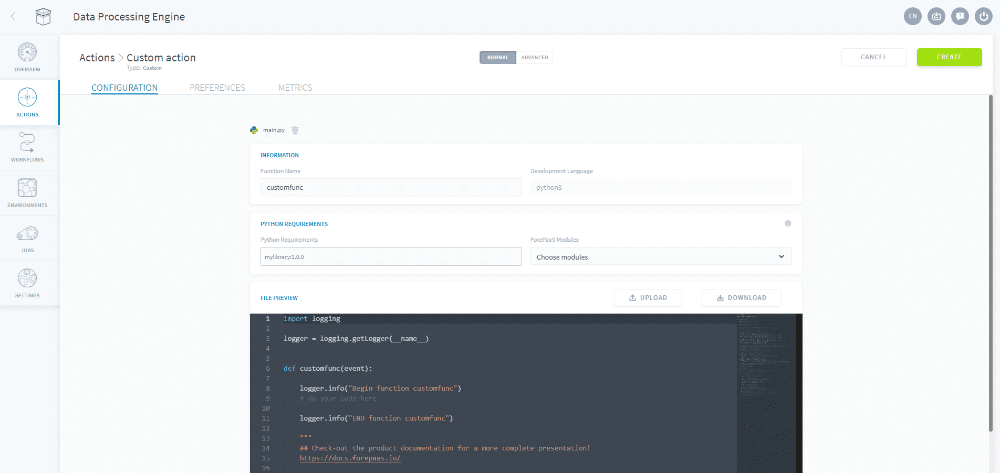
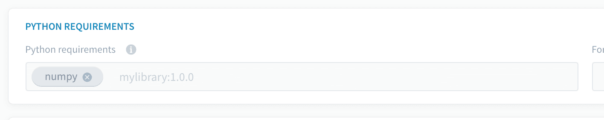

# Custom Action

?> This article is about actions that use ForePaaS' proprietary Python data processing engine. To use Apache Spark clusters, see [Custom PySpark action](/en/product/dpe/actions/custom-pyspark/index).

A *Custom action* allows you to execute custom Python scripts in a scalable cloud cluster environment.

Using our [Software Development Kit (SDK)](#/en/technical/sdk/dpe/index) to easily interact with the different components of the platform, *Custom actions* can be used to implement a variety of use-cases such as: 
*  Execute a manipulation algorithm or ETL job on your data warehouse
*  Execute a simple data analysis or machine learning algorithm
*  Extract data from data sources not available on the ForePaaS marketplace without having to create connectors for it
*  Extract real time data (like MQTT, Kafka, etc..) 

?> Custom actions benefit from the whole Data Processing Engine's feature-set, typically the power of the [segmentation to parallelize the execution](/en/product/dpe/actions/settings/segmentation) of your algorithm or the orchestration within [workflows](/en/product/dpe/workflows/index) triggered immediately or on a scheduled basis.

* [Configure a Custom action](#configure-a-custom-action)
* [Manage dependencies in a Custom action](#manage-dependencies)
* [Examples of sample scripts](#examples-of-sample-scripts)

---
## Configure a Custom action

In the Data Processing Engine of your Project, go in the Actions tab and click on the **New Action** button. Choose the action type *Custom*.



 
Drag and drop your *.py* script onto the "Drag and drop" section.  
Alternatively, select the **Start with a boilerplate** option to get started directly on the ForePaaS Python interface with example code snippets.



The name of the function to be executed **must be entered manually** at the top of the screen in the Information panel (here and by default: "customfunc").

You will be able to edit your source file directly in the editing interface or drop a new file if needed. When you are developing your own custom actions you can use any functions provided in the [Software Development Kit (SDK)](#/en/technical/sdk/dpe/index). to easily interact with other components of the platform.  
To read more about all the available SDK functions check out the article below:

{Discover all SDK methods}(#/en/technical/sdk/dpe/index)

--- 
## Manage dependencies

### Setting language version

You can choose the Python version of your custom action among the following:
- Python 3.11
- Python 3.9 *(default option)*

> [Workflows](/en/product/dpe/workflows/index) cannot be executed with multiple versions at once.

?> We are regularly updating the available versions to provide you with a best-practice development framework. Your existing work is not migrated to a new version as long as its language version is still supported. 

### Installing Python packages

You might need to install specific packages not included by default. You can add them in the "Python Requirements" field respecting the format used in a basic requirements file for "pip" (Python package manager) then press "ENTER" on your keyboard.

This is what it should looks like once you pressed "ENTER":


 
?> When working with a Custom Action in an [Always-up](en/product/dpe/actions/settings/index?id=execution-modes) execution environment, updating dependencies triggers a redeployment of the environment to put the changes into effect.

### Default list of dependencies

!> ForePaaS blocks the minors of the versions allowing bug fixes to be installed. If you need a more recent version of a library you can override it manually by adding the same package with the new version in the "Requirements" field.

Here is the list of all the packages and their version (as you could find them in a requirements file for pip) shipped with the Data Processing Engine workers:

{Discover all default Python packages}(/#/en/product/dpe/actions/custom/default-packages.md)


---
## Examples of sample scripts

### Example of the extraction of a file followed by load the in data_prim

```python
from forepaas.dwh import connect
from forepaas.dwh import bulk_insert

# connect to the source connector
connector = connect("dwh/dropbox_test/consommations.csv")

# upload raw file from the source connector
connection_str = get_raw(connector)

# connect to the source connect
source = connect(connection_str)

# connect to the destination connector
destination = connect("dwh/data_prim/consommations")

# extract dataframe from source and bulk insert into the connector
for df in extract(source):
  stats, error = bulk_insert(destination, "consommations", df)
```

### Example of a data transfer between the data prim & data mart

```python
import logging
from forepaas.dwh import connect
from forepaas.dwh import bulk_insert

logger = logging.getLogger(__name__)

# Connection to a source datastore
connector = connect("dwh/data_prim/prim_consommations")

# Data extraction from the source by a SELECT
lines = connector.select("prim_consommations",{"filter_attribute":"2018-01-01"})

del connector

# Treatment of each line of the data
for line in lines :
    line["new_insight"] = (line["factor1"] + line["factor2"] * 2) / 100

# Connection to the destination datastore
connector = connect("dwh/data_mart/agr_consommations")

# Bulk insert into the destination
stats,err = bulk_insert(connector, "agr_consommations", lines)
logger.info(stats)
logger.info(err)
del connector
```

### More examples

Custom actions can be used for a variety of cases including linking actions or workflows between each other. While all actions & workflows can be configured with external trigger event, check-out this next article to read about **how you can trigger a job using a custom action**.

{Triggering a job with a custom action}(#/en/product/dpe/actions/custom/start.md)