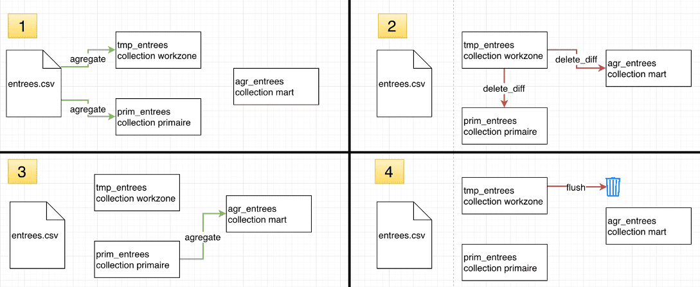

# Delete Diff Action

This action is used to delete obsolete entries that existed at one time but no longer exist. Compatible with all ForePaaS prim/mart data engines.

## Usecase example

An erroneous data entry was made to a source file. The DPE automatically inserted the entry into the primary and aggregate tables. Once the incorrect entry was discovered, it was deleted from the source, however, it still remains in the primary and aggregate tables.   

## How to use it

When you need to delete items that no longer exist, we recommend creating a temporary table that will serve as a work zone, containing only the data you wish to keep. This will allow you to set up a perimeter on the date field which allows you to act only for a given duration. If you have to act on all the data, then the easiest way is not to use delete diff, but to simply empty the tables beforehand with flush tmp and to fill it with the new data via the source. 

Create a delete diff action for each table you wish to remove the records from, using the temporary table as the reference table. Select the attribute you wish to preform the comparison on. Optionally, set a date perimeter via the preferences section. 

 

## Advanced mode example

```
{ 
	"diffToCheck" : [
      {
        "tablecheck": "dwh/data_prim/testfile",
        "tabletodelete": "dwh/data_prim/testfile2",
        "uniqFields": "attr1,attr2"
      }
   ]
}
```
