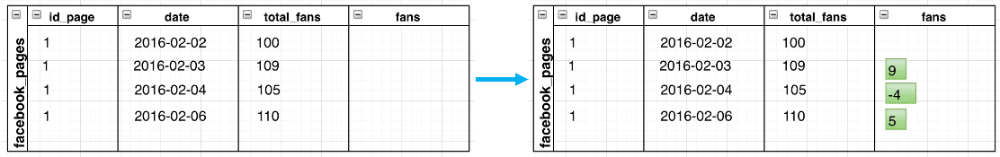
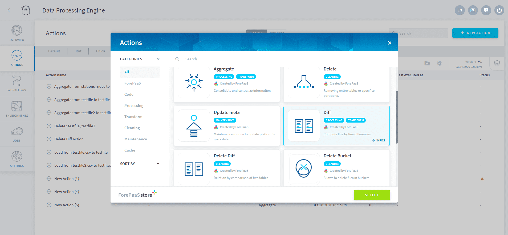

# Diff Action

## Introduction

When you have tables which contain dated attributes describing total values (total daily orders, total monthly revenue, etc.) at a given time, the diff action lets you compute the difference of these values between consecutive time increments.

For example, let's consider the *total_fans* attribute in the table below calculated each day for a certain social media profile page. Assuming the *total_fans* describes the total number of fans since the creation of this profile, the **diff** action will let you compute the number of new fans acquired or lost between each day.

 

Please note that first dates of each ids won't have their first incremental value computed, as the previous date is not known.
There is an optional advanced parameter if you have the date of creation so that the first incremental date will be computed as equal to the total attribute.

---

## Action Configuration

### Action's configuration interface

When configuring the **diff** action from the interface, you will be asked to specify:
* the **table name** which contains the total value
* the **timeline attribute** which will be used to get the time increments between 2 total values
* the **measure** to compute, there can be several of them for a given table, for each specify the **cummulative value attribute** and the **incremental value attribute**

The primary keys of the table are automatically assigned. 

 

### Action's example JSON configuration

Like any other DPE actions, you can also configure the action in "Advanced Mode" by editing its JSON configuration, a snippet of which is shown below.

```
{
    "table": "dwh/data_prim/posts",
    "attribute_timeline": "date",
    "attribute_total": ["total_impressions"],
    "attribute_diff": ["incr_impressions"],
    
    "table_attribute_created_at": "ref_posts",
    "attribute_created_at": "post_createdat",
}
```

### Action's Parameters

Below is a short description of all available attributes in the JSON configuration.

|                Parameter                | Description              | Example              | Required              | 
| :------------------------------: | -------------------------- | -------------------------- | -------------------------- | 
|             **table**              | Name of the table on which to run the diff action                   |Dwh/agr_site_date| Yes              | 
|            **attribute_timeline**             | Name of the attribute of timeline                 |    date      | Yes              | 
|            **attribute_total**             | List of attribute names with totals.    |    ["total_impressions"]      | Yes              | 
|            **attribute_diff**             | List of attribute names with incremental values. |    ["incr_impressions"] | Yes             | 
|            **table_attribute_created_at**             | Optional table containing date of creation of ids |    ref_posts | No             | 
|            **attribute_created_at**             | Optional attribute containing date of creation of ids |    post_createdat | No             | 

---


