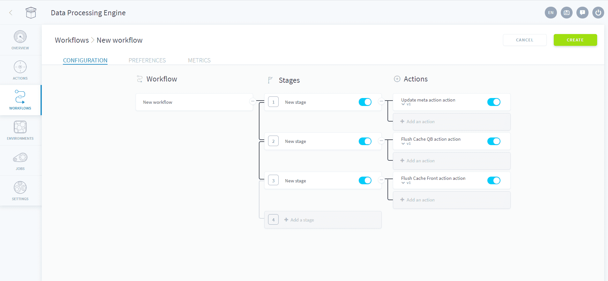
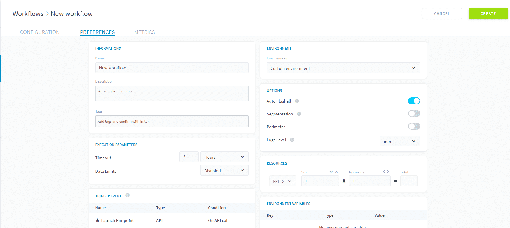

# Flushing Cache & Updating Metadata

Users want the data to load almost instantly in their final consumer endpoint whether an API or a visual dashboard application. For this purpose, ForePaaS works with caches to pre-compute the result of queries or pre-load the general information about the data model.

However, this also means that cache & metadata need to be managed and updated regularly during your processing procedures. Within the marketplace of actions in the ForePaaS Store, you will therefore find 3 types of **maintenance actions**:
* **Update Metadata**: which updates the metadata of the data model.
* **Flush Cache: Analytics Manager**: which updates the cache of the [Analytics Manager](/en/product/am/index) to display the latest data from the data model.
* **Flush Cache: App Services**: which updates the cache of the [deployed API](/en/product/api-manager/index) in your project to display the latest result of each queries.

---
## Automated Maintenance

While it can be useful to precisely choose when these actions are run during a workflow for optimisation purposes, we understand that it can be cumbersome to manage. We therefore suggest 2 simple ways you can append this maintenance routine to your processing procedures.

### Auto Flush-all Workflow

When you create a new Project, we advise you create a workflow *_flushall* which contains 4 actions that run sequentially in 4 stages: Update metadata, Flush Cache: Analytics Manager, Flush Cache: App Services and then Purge Buckets.

 

!> The **Purge Buckets** action should be deactivated by default (or not included if you foresee no immediate use) as it empties all the data currently stored in the object store. This action is to be used with caution as it will **permanently** delete all archived information.

### Auto Flush-all Options

Another way to run this maintenance routine is simply to activate the "Automatically flush all caches" option for your workflows, located in the preferences tab of your workflow. This will run the 3 actions: Update metadata, Flush Cache: Analytics Manager, Flush Cache: App Services.

 

{Learn more about the flush cache and update metas actions}(#/en/product/dpe/actions/flush-update-metas/flush-cache-api.md)