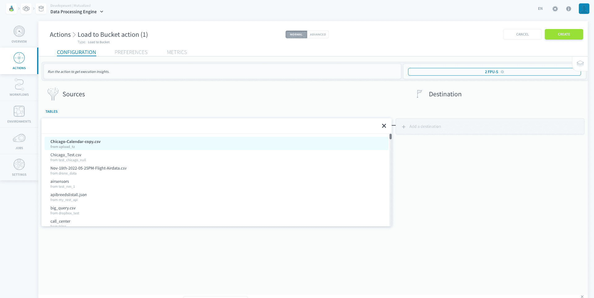
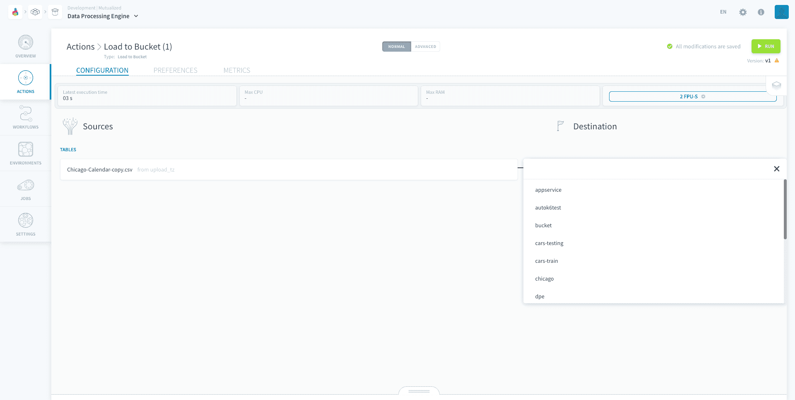
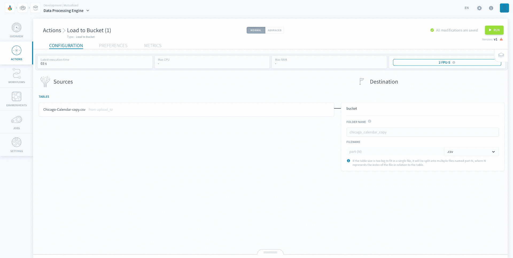

# Load to Bucket Action

The *Load to Bucket* action **extracts raw data from sources and puts it into a file** in your Project bucket. You can choose the file format.

* [Configure a Load to Bucket action](#configure-a-load-to-bucket-action)
  * [Choose a source and a destination](#choose-a-source-and-a-destination)
* [Destination file](#destination-file)

?> **Note:** This action supports the functionality to have customised date in the folder name. You can find the tutorial [here](/en/getting-further/date-in-folder-name/index.md).

---
## Configure a Load to Bucket action

To create a new action, navigate to the **Action tab** of the Data Processing Engine (DPE), click on **New Action** and select the *Load to Bucket* action.

### Choose a source and a destination

To set-up the action, start by selecting a source from the list that you have already set-up in the [Sources](/en/product/data-catalog/sources/index) tab of the Data Catalog.

Then, choose the *destination bucket* from the list of [Project buckets](/en/product/lakehouse-manager/buckets/index.md). 

You will then be prompted to choose the file format and the destination folder. If you leave the folder name empty, it will automatically be named as the source name.

!> Note that **the following sources are NOT supported** in this action: Azure Blob Storage, Data Store, Dropbox, FTP, Google Drive, HTTP Files, HTTP REST, One Drive, S3-compatible-storage, Amazon S3 and SFTP.

?> If you choose a **PostgreSQL source** your action will be have optimised performance similarly to the [PostgreSQL to Parquet action](en/product/dpe/actions/postgresql-to-parquet/index.md).

### Destination file

Your data will be put into the destination folder in a file named *part-1* with the format you specified. If your file is too big, it will be split into multiple files named *part-1*, *part-2*, *part-3* and so on. 

The order of your rows will be preserved in this process. Hence, the first rows will be in the *part-1* file and the following rows will be in the *part-2* file.

---
##  Need help? 🆘

> At any step, you can create a ticket to raise an incident or if you need support at the [OVHcloud Help Centre](https://help.ovhcloud.com/csm/fr-home?id=csm_index). Additionally, you can ask for support by reaching out to us on the Data Platform Channel within the [Discord Server](https://discord.com/channels/850031577277792286/1163465539981672559). There is a step-by-step guide in the [support](#en/support/index.md) section.
