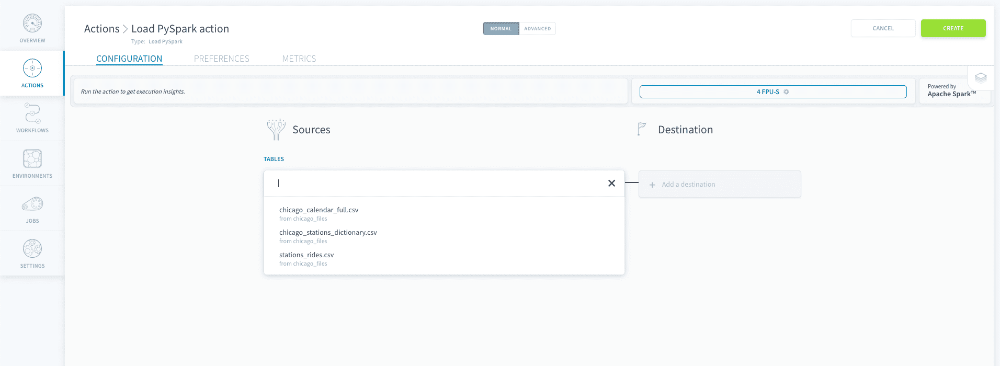
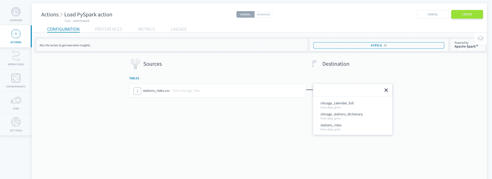
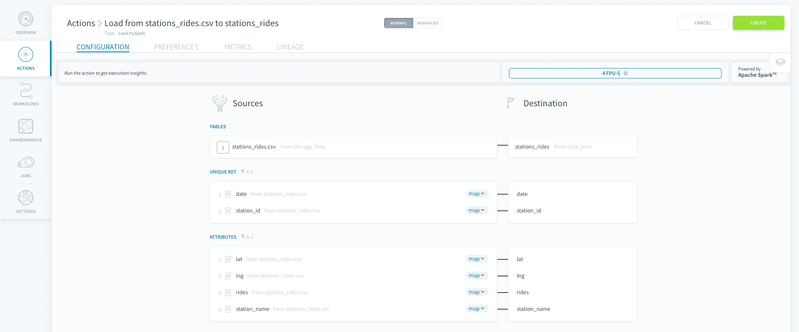
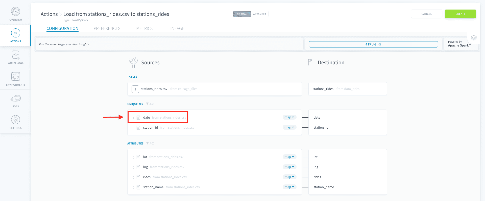
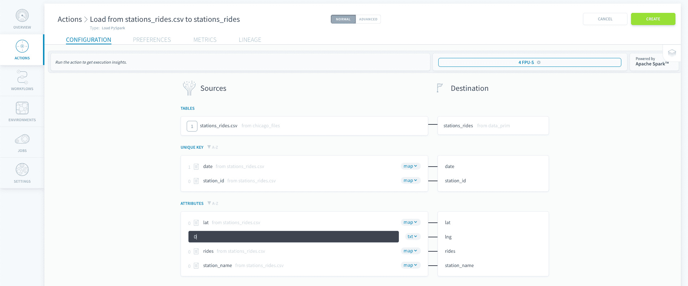
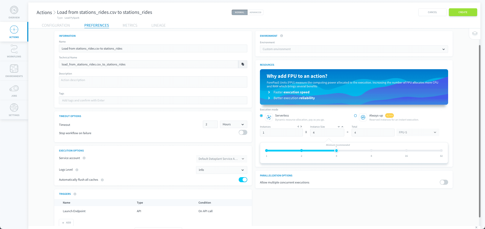

# Load PySpark Action

The *Load PySpark* action **extracts raw data from sources and inserts it into primary tables** in your data warehouse using [Apache Spark™](https://spark.apache.org/). It is usually the first step in any data processing system, necessary before running any other processes on data coming from connected sources.

> In other terms, if you've [set-up a connector through the Data Catalog](/en/product/data-catalog/sources/index), the Project has the information to connect to the source as well as its metadata, but won't contain the actual data until it is actually loaded using the *Load PySpark* action.

* [Configure a Load PySpark action](/en/product/dpe/actions/load-pyspark/index?id=configure-a-load-action)
  * [Choose a source and destination](/en/product/dpe/actions/load-pyspark/index?id=choose-a-source-and-destination)
  * [Map the attributes](/en/product/dpe/actions/load-pyspark/index?id=map-attributes)
  * [Configure the action's preferences](/en/product/dpe/actions/load-pyspark/index?id=configure-the-action39s-preferences)
* [Use the Advanced mode](/en/product/dpe/actions/load-pyspark/index?id=advanced-mode)

---
## Configure a Load PySpark action

To create a new *Load PySpark* action, navigate to the *Actions* tab of the Data Processing Engine (DPE), click on **New Action** and select the *Load PySpark* action. 

### Choose a source and destination

To set-up the *Load PySpark* action, start by selecting a **source** from the list that you have already set-up in the [Sources](/en/product/data-catalog/sources/index) tab of the Data Catalog. 

Then a **destination** table to send your data to. Similarly to the sources, the tables have to be configured ahead of time in the [Tables](/en/product/lakehouse-manager/tables/index) tab of the Lakehouse Manager. Make sure you've [built](/en/product/lakehouse-manager/tables/table-interactions) your data model otherwise the tables won't be accessible by other components in the platform.

### Map attributes

Once the source & destination have been selected, the system will **automatically map** the destination attributes of your destination table with the different columns that it has identified in the raw data source. 

> On the picture below, you can see that the *date* attribute has a a value of '1' beside the notepad icon. This indicates the number of **data validation rules, also called blueprint rules**, defined in the Data Catalog, that will be automatically applied when loading the data. [Blueprint rules](/en/product/data-catalog/analyzer/add-blueprint-rules) allow users to quickly filter out invalid data like nulls / empty cells or reformat values such as date or currencies.

Note that you might want to **insert raw text** directly inside your destination table. This might come in handy for instance when you want to count the number of data points or tag a certain source with a label that will be later used in an aggregate table. To do that, select *< txt >* which will set the source attribute to a raw text input field.

### Configure the action's preferences

Once you're satisfied with the mapping of your attributes, navigate to the [preferences tab to configure the action settings](/en/product/dpe/actions/settings/index).

When you are done editing your action, click on **Create** to validate the action. 

---
## Advanced Mode

If you need to access the JSON configuration file of the action, you can activate the Advanced mode by clicking on **Advanced** at the top of the page.

{Use the Advanced mode of a Load action}(#/en/product/dpe/actions/load/advanced-mode.md)

---
##  Need help? 🆘

> At any step, you can create a ticket to raise an incident or if you need support at the [OVHcloud Help Centre](https://help.ovhcloud.com/csm/fr-home?id=csm_index). Additionally, you can ask for support by reaching out to us on the Data Platform Channel within the [Discord Server](https://discord.com/channels/850031577277792286/1163465539981672559). There is a step-by-step guide in the [support](#en/support/index.md) section.
