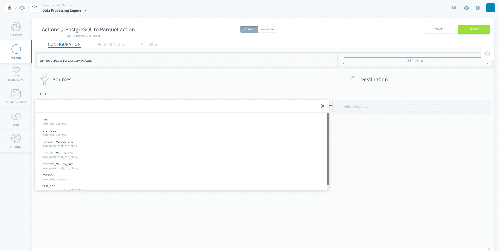
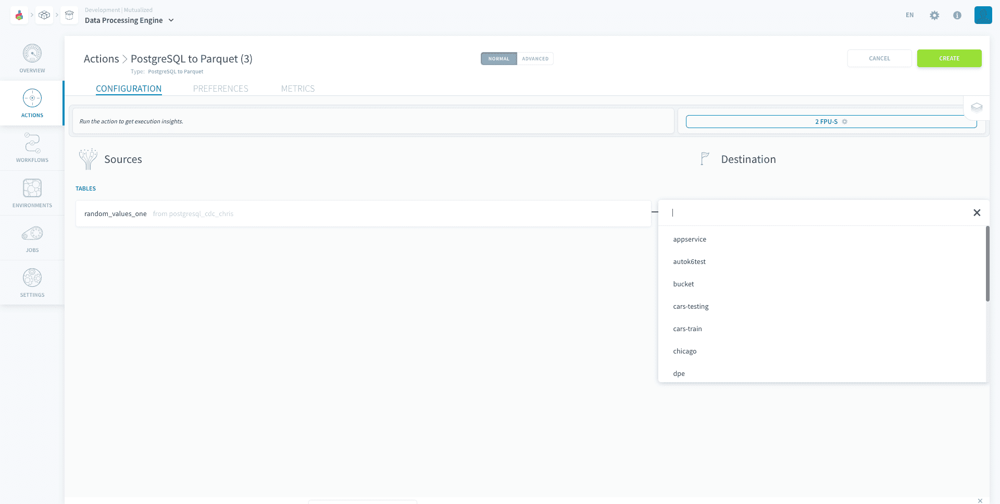
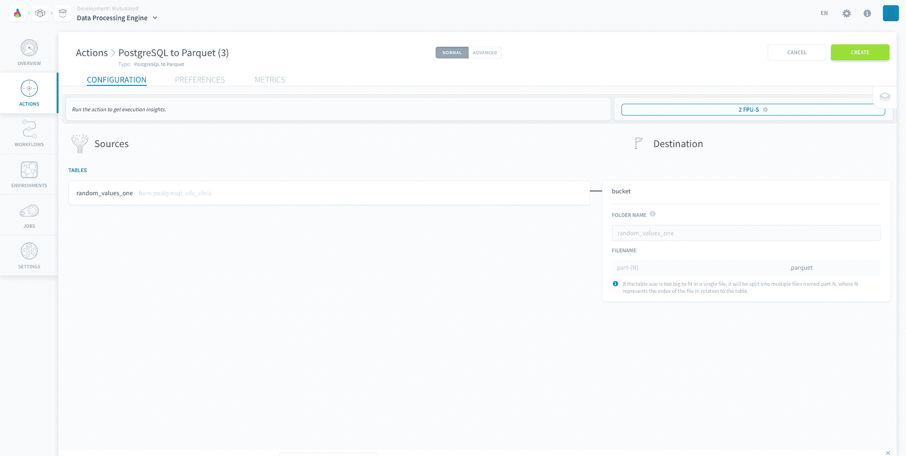

# PostgreSQL to Parquet Action

The *PostgreSQL to Parquet* action extracts data from a PostgreSQL database and puts it into a [Parquet file](https://parquet.apache.org/) in your Project bucket. You can choose the file format.

* [Configure a PostgreSQL to Parquet action](#configure-a-postgresql-to-parquet-action)
  * [Choose a source and a destination](#choose-a-source-and-a-destination)
* [Destination file](#destination-file)

?> **Note:** This action supports the functionality to have customised date in the folder name. You can find the tutorial [here](/en/getting-further/date-in-folder-name/index.md).

---
## Configure a PostgreSQL to Parquet action

To create a new action, navigate to the **Action tab** of the Data Processing Engine (DPE), click on **New Action** and select the *PostgreSQL to Parquet* action.

### Choose a source and a destination

To set-up the action, start by selecting a source from the list that you have already set-up in the [Sources](/en/product/data-manager/sources/index) tab of the Data Manager.

Then, choose the *destination bucket* from the list of [Project buckets](/en/product/data-manager/buckets/index.md). 

### Destination file

You will then be prompted to choose the destination folder. If you leave the folder name empty, it will automatically be named as the source name.

Your data will be put into the destination folder in a file named *part-1*. If your file is too big, it will be split into multiple files named *part-1*, *part-2*, *part-3* and so on. 

The order of your rows will be preserved in this process. Hence, the first rows will be in the *part-1* file and the following rows will be in the *part-2* file.

?> Note that this action has its **transfer speed optimised** for the PostgreSQL source.

---
##  Need help? 🆘

> You didn't find what you were looking for on this page? You can ask for help by sending a request directly from the platform, going to the *Support* page. You can also send us an email at support@forepaas.com.

{Send your questions to support 🤔}(https://support.forepaas.com/hc/en-us/requests)
